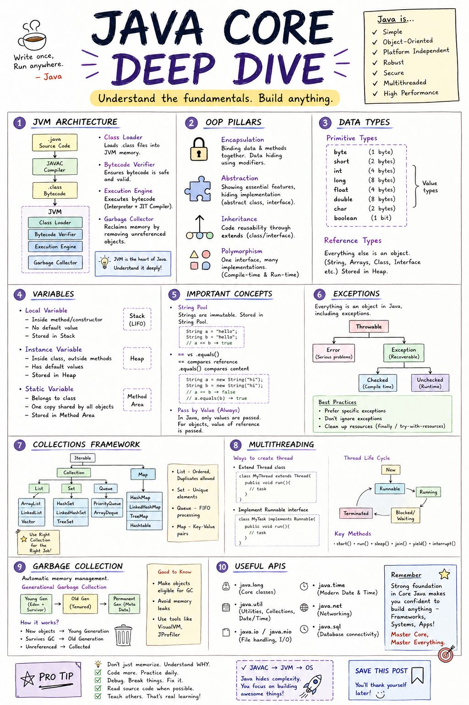
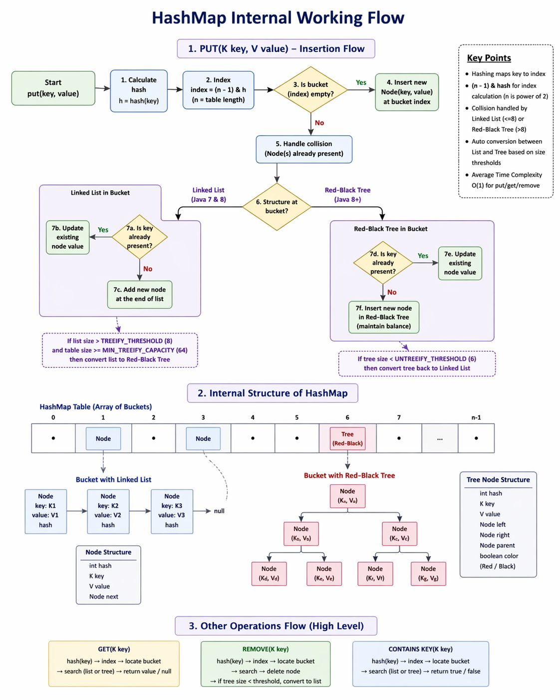

# Core Java (Java 8 – 21)

> 📌 **Visual References:**
>
> [](../assets/images/core-java-deep-dive.jpg)
>
> [](../assets/images/hashmap-internal-working.jpg)

---

## Q1: What are the most impactful features introduced from Java 8 to Java 21?

> **Theory:** Java has evolved through major releases from Java 8 to Java 21, each adding features that improved developer productivity, functional programming support, concurrency, and runtime performance. Java 8 introduced lambdas and streams as the foundation; Java 17 and Java 21 are the key LTS releases with sealed classes, pattern matching, and virtual threads.

**Answer:**

| Version | Feature | Impact |
|---------|---------|--------|
| Java 8 | Lambda expressions, Stream API, Optional, `java.time` | Foundation of modern Java. Functional programming in Java. |
| Java 9 | Modules (JPMS), JShell, `List.of()` factory methods | Encapsulation at module level. Immutable collections. |
| Java 11 | `var` (local type inference), `HttpClient`, String methods (`isBlank`, `lines`, `strip`) | Cleaner code, modern HTTP support. |
| Java 14 | Records, `switch` expressions | Boilerplate-free data carriers. |
| Java 15 | Sealed classes (preview), Text blocks | Controlled inheritance. Multi-line strings. |
| Java 17 | Sealed classes (final), Pattern matching for `instanceof` | LTS release. Type-safe instanceof without casting. |
| Java 21 | Virtual Threads, Record Patterns, Pattern matching for `switch`, Sequenced Collections | LTS. Game-changer for concurrent I/O-heavy services. |

---

## Q2: Explain the Stream API. How is it different from collections iteration?

> **Theory:** Stream API, introduced in Java 8, represents a sequence of elements supporting sequential and parallel aggregate operations. Unlike `Iterable`, a Stream is not a data structure — it carries values from a source (collection, array, I/O channel) through a pipeline of operations. Streams use internal iteration (the pipeline drives it), are lazy (intermediate ops execute only when terminal op is called), and are single-use.

**Answer:**

**Collections iteration** (external iteration):
```java
List<String> result = new ArrayList<>();
for (String s : names) {
    if (s.startsWith("A")) {
        result.add(s.toUpperCase());
    }
}
```

**Stream API** (internal iteration):
```java
List<String> result = names.stream()
    .filter(s -> s.startsWith("A"))
    .map(String::toUpperCase)
    .collect(Collectors.toList());
```

**Key differences:**
- **Lazy evaluation** : Intermediate operations (`filter`, `map`) don't execute until a terminal operation (`collect`, `forEach`) is called.
- **Pipelining** : Operations are chained. The stream processes elements one by one through the entire pipeline (not one operation at a time across all elements).
- **Parallelism** : `.parallelStream()` enables parallel processing with ForkJoinPool. Be cautious : not always faster; good for CPU-heavy operations on large datasets.
- **No side-effects** : Streams encourage pure transformations, not mutation.

**Common pitfalls:**
- Streams are single-use. You can't reuse a stream after a terminal operation.
- `parallelStream()` on small datasets adds overhead without benefit.
- `forEach` with side-effects defeats the purpose : prefer `collect`, `reduce`.

---

## Q3: Explain Virtual Threads (Java 21). How do they differ from platform threads?

> **Theory:** Virtual Threads (Project Loom), finalized in Java 21, are lightweight, JVM-managed threads that are not directly mapped to OS threads. They are designed to dramatically increase throughput of I/O-bound concurrent applications by allowing millions of threads without the memory and scheduling overhead of traditional platform (OS) threads. Virtual threads run on a small pool of carrier threads and are parked (unmounted) when blocking on I/O.

**Answer:**

| Aspect | Platform Threads | Virtual Threads |
|--------|-----------------|-----------------|
| Managed by | OS kernel | JVM |
| Memory | ~1MB stack per thread | ~few KB |
| Count | Hundreds to low thousands | Millions |
| Blocking I/O | Blocks OS thread | JVM unmounts, reuses carrier thread |
| Best for | CPU-bound work | I/O-bound work (HTTP calls, DB queries) |

**How they work:**
- Virtual threads are mounted on **carrier threads** (a small pool of platform threads)
- When a virtual thread blocks on I/O, the JVM **unmounts** it from the carrier and schedules another virtual thread
- The carrier thread is never blocked : it's always doing useful work

**Usage:**
```java
try (var executor = Executors.newVirtualThreadPerTaskExecutor()) {
    IntStream.range(0, 10_000).forEach(i ->
        executor.submit(() -> {
            // Each task gets its own virtual thread
            callDownstreamApi();
        })
    );
}
```

**Impact on microservices:** For services making many concurrent HTTP calls to downstream APIs, virtual threads eliminate thread pool tuning. No more calculating "how many threads do I need for X concurrent connections."

---

## Q4: What is the difference between `HashMap`, `ConcurrentHashMap`, and `Collections.synchronizedMap`?

> **Theory:** `HashMap` is a non-thread-safe hash table implementation allowing one null key. `Collections.synchronizedMap` wraps any map with a single mutex lock on every operation. `ConcurrentHashMap`, introduced in Java 5 and improved in Java 8, uses bucket-level locking and CAS operations to allow truly concurrent reads and fine-grained writes — making it the standard choice for thread-safe maps in modern Java.

**Answer:**

| Feature | HashMap | synchronizedMap | ConcurrentHashMap |
|---------|---------|----------------|-------------------|
| Thread-safe | No | Yes (full lock) | Yes (segment/bucket lock) |
| Locking | None | Single lock on entire map | Lock per bucket (Java 8+) |
| Null keys/values | 1 null key, any null values | Same as wrapped map | No nulls allowed |
| Performance (concurrent) | N/A (unsafe) | Poor (contention) | Excellent |
| Iterator | Fail-fast | Fail-fast | Weakly consistent |

**When to use:**
- **HashMap** : Single-threaded or externally synchronized access
- **ConcurrentHashMap** : Multi-threaded reads and writes (the default choice for concurrent maps)
- **synchronizedMap** : Rarely. Only if you need null keys or legacy compatibility

**ConcurrentHashMap internals (Java 8+):**
- Uses CAS (Compare-And-Swap) for most operations
- Bucket-level synchronization only when hash collision occurs
- `computeIfAbsent`, `merge`, `forEach` are atomic at the key level

---

## Q5: Explain the Java Memory Model and garbage collection basics.

> **Theory:** The Java Memory Model (JMM) defines the rules for how threads interact through shared memory — specifically, when writes by one thread are visible to reads by another. Garbage Collection (GC) is the JVM's automatic memory management mechanism that reclaims heap memory occupied by objects that are no longer reachable. The JVM uses a generational heap (Young + Old generations) because most objects die young, and has evolved from Serial GC to G1GC (default since Java 9) and ZGC (low-latency, Java 15+).

**Answer:**

**Memory areas:**
- **Heap** : Objects live here. Shared across threads. GC manages this.
- **Stack** : Method frames, local variables. Per thread. Automatic cleanup.
- **Metaspace** : Class metadata (replaced PermGen in Java 8+). Grows dynamically.

**GC basics:**
- **Young Generation** (Eden + Survivor) : Short-lived objects. Minor GC.
- **Old Generation** : Long-lived objects promoted from Young. Major GC.
- **GC algorithms:**
  - **G1GC** (default since Java 9) : Region-based, predictable pause times. Good general-purpose.
  - **ZGC** (Java 15+) : Sub-millisecond pauses. Great for large heaps (multi-GB).
  - **Shenandoah** : Similar to ZGC, concurrent compaction.

**Tuning for microservices:**
- Set `-Xms` = `-Xmx` (avoid heap resizing overhead in containers)
- Use G1GC for most workloads
- Monitor GC pause times, not just frequency
- In containers, ensure JVM respects container memory limits (`-XX:+UseContainerSupport`, default since Java 10)

---

## Q6: What are functional interfaces? Name the key ones in `java.util.function`.

> **Theory:** A Functional Interface in Java is an interface that contains exactly one abstract method (SAM — Single Abstract Method). Introduced in Java 8, they are the foundation of lambda expressions and method references. The `@FunctionalInterface` annotation enforces this contract at compile time. The `java.util.function` package ships with built-in functional interfaces covering the most common patterns: `Predicate`, `Function`, `Consumer`, `Supplier`, and their variants.

**Answer:**

A **functional interface** has exactly one abstract method. Can be used with lambda expressions.

| Interface | Method | Use Case |
|-----------|--------|----------|
| `Predicate<T>` | `boolean test(T)` | Filtering |
| `Function<T, R>` | `R apply(T)` | Transformation |
| `Consumer<T>` | `void accept(T)` | Side effects (logging, saving) |
| `Supplier<T>` | `T get()` | Factory / lazy initialization |
| `BiFunction<T, U, R>` | `R apply(T, U)` | Two-arg transformation |
| `UnaryOperator<T>` | `T apply(T)` | Same-type transformation |

**Custom functional interfaces:**
```java
@FunctionalInterface
public interface Validator<T> {
    boolean validate(T input);
}
```

Use `@FunctionalInterface` annotation : it's not required, but it prevents accidentally adding a second abstract method.

---

## Q7: Method Overloading vs Overriding

> **Theory:** Method Overloading is compile-time (static) polymorphism where multiple methods share the same name but differ in parameter type, count, or order within the same class. Method Overriding is runtime (dynamic) polymorphism where a subclass provides its own implementation of a method defined in the parent class with the same signature. Overloading is resolved at compile time by the compiler; overriding is resolved at runtime via dynamic dispatch through the vtable.

**Answer:**

| Aspect | Overloading | Overriding |
|--------|------------|-----------|
| Binding | Compile-time (static) | Runtime (dynamic) |
| Where | Same class | Subclass |
| Signature | Same name, different params | Same name, same params |
| Return type | Can differ | Same or covariant |
| Access modifier | Can differ | Cannot be more restrictive |
| `static` methods | Can overload | Cannot override (hidden) |
| `final` methods | Can overload | Cannot override |

---

## Q8: What is an Immutable Class? How do you create one?

> **Theory:** An Immutable class is a class whose objects cannot be modified after creation. Every field is set during construction and never changed. `String`, `Integer`, `BigDecimal`, and `LocalDate` are classic Java examples. Immutable objects are inherently thread-safe, safe to share as keys in maps, and eliminate an entire class of bugs caused by shared mutable state. Java 14+ `record` types provide immutability out of the box.

**Answer:**

An immutable object cannot be modified after creation. `String`, `Integer`, `LocalDate` are built-in examples.

**Rules to create:**
1. Declare class `final` (prevent subclassing)
2. All fields `private final`
3. No setters
4. Initialize all fields via constructor
5. Deep-copy mutable objects in constructor and getters

```java
public final class Employee {
    private final String name;
    private final List<String> skills;

    public Employee(String name, List<String> skills) {
        this.name = name;
        this.skills = List.copyOf(skills); // defensive copy
    }

    public String getName() { return name; }
    public List<String> getSkills() { return skills; } // already unmodifiable
}
```

**Java 14+ alternative:** `record` types are immutable by design.

---

## Q9: Association, Aggregation, and Composition

> **Theory:** Association, Aggregation, and Composition are three types of relationships between objects in OOP that differ in ownership and lifecycle dependency. Association is a general "uses-a" relationship with no ownership. Aggregation is a "has-a" relationship where the child can exist independently of the parent. Composition is the strongest form — a "contains-a" relationship where the child's lifecycle is fully controlled by the parent and cannot exist independently.

**Answer:**

| Relationship | Ownership | Lifecycle | Example |
|-------------|-----------|-----------|---------|
| **Association** | No ownership | Independent | Teacher has-a Student |
| **Aggregation** | Weak "has-a" | Independent | Department --> Employee (employee exists without dept) |
| **Composition** | Strong "has-a" | Dependent | House --> Room (room doesn't exist without house) |

```java
// Composition: Engine dies when Car is destroyed
class Car {
    private final Engine engine = new Engine(); // created inside
}

// Aggregation: Employee exists independently
class Department {
    private List<Employee> employees; // passed in, not created here
}
```

---

## Q10: Default Methods in Interfaces

> **Theory:** Default methods, introduced in Java 8, allow interfaces to provide a concrete method implementation using the `default` keyword. Their primary purpose was to enable backward-compatible evolution of the Java Collections API (e.g., adding `stream()` and `sort()` to `Collection` and `List`) without breaking the millions of existing implementations. They also enable limited multiple inheritance of behavior, though the diamond problem must be resolved explicitly by the implementing class.

**Answer:**

Introduced in Java 8 : allows interfaces to have method implementations.

```java
interface Sortable {
    default void sort() { System.out.println("Natural order"); }
}
```

**Why introduced:**
- **Backward compatibility** : Add methods to existing interfaces without breaking implementations (e.g., `List.sort()`, `Collection.stream()`)
- **Multiple inheritance of behavior** : A class can inherit defaults from multiple interfaces

**Diamond problem:** If two interfaces provide the same default method, the implementing class must override it explicitly.

```java
interface A { default void hello() { System.out.println("A"); } }
interface B { default void hello() { System.out.println("B"); } }

class C implements A, B {
    @Override
    public void hello() { A.super.hello(); } // must resolve explicitly
}
```

---

## Q11: Cohesion and Coupling

> **Theory:** Cohesion refers to how closely related the responsibilities of a single class or module are — high cohesion means the class does one focused thing. Coupling refers to how much one class depends on another — low coupling means classes are independent and changes in one don't ripple to others. The goal of good OOP design is **high cohesion + low coupling**, which directly supports the Single Responsibility Principle and makes code easier to test, maintain, and extend.

**Answer:**

| Concept | Good Practice | Bad Practice |
|---------|--------------|-------------|
| **Cohesion** | High : class does one thing well | Low : class handles unrelated tasks |
| **Coupling** | Low : classes are independent | High : changes in one class ripple everywhere |

**Goal:** High cohesion + Low coupling = maintainable, testable code.

**Example of improvement:**
```java
// Bad: Low cohesion (does too much)
class UserService {
    void saveUser() { }
    void sendEmail() { }
    void generateReport() { }
}

// Good: High cohesion (single responsibility)
class UserService { void saveUser() { } }
class EmailService { void sendEmail() { } }
class ReportService { void generateReport() { } }
```

---

<!-- Source: solid-principles.txt -->

## Q12: SOLID Principles in Java

> **Theory:** SOLID is an acronym for five object-oriented design principles introduced by Robert C. Martin (Uncle Bob): Single Responsibility, Open/Closed, Liskov Substitution, Interface Segregation, and Dependency Inversion. These principles guide class and interface design toward low coupling, high cohesion, and extensibility — making systems easier to test, refactor, and evolve without unintended side effects.

**Answer:**

**SOLID** — five design principles for writing maintainable, scalable, and flexible OOP code → guide class design, inheritance, and interfaces toward loose coupling and high cohesion → following them makes code easier to test, extend, and modify.

1. **S — Single Responsibility Principle (SRP):** A class should have only one reason to change.
2. **O — Open-Closed Principle (OCP):** Open for extension, closed for modification. Extend via inheritance/interfaces, not by editing.
3. **L — Liskov Substitution Principle (LSP):** Subtypes must be substitutable for their base types without breaking the program.
4. **I — Interface Segregation Principle (ISP):** Many client-specific interfaces are better than one large general-purpose interface.
5. **D — Dependency Inversion Principle (DIP):** High-level modules should not depend on low-level modules — both depend on abstractions.

```java
// SRP: Separate class per responsibility
class ReportGenerator { void generatePDF() { } }
class ReportPrinter { void print(Report r) { } }

// OCP: Extend via abstraction, don't modify
abstract class PaymentProcessor { abstract void process(Payment p); }
class CreditCardProcessor extends PaymentProcessor { public void process(Payment p) { } }
class PayPalProcessor extends PaymentProcessor { public void process(Payment p) { } }

// LSP: Subtype must honor base contract
interface Bird { void eat(); }
interface FlyingBird extends Bird { void fly(); }
class Penguin implements Bird { public void eat() {} }   // No fly() forced
class Eagle implements FlyingBird { public void eat(){} public void fly(){} }

// ISP: Split large interface
interface Worker { void work(); }
interface Eater { void eat(); }
class Human implements Worker, Eater { public void work(){} public void eat(){} }

// DIP: Depend on abstraction
interface MessageService { void send(String msg); }
class EmailService implements MessageService { public void send(String msg) {} }
class Notification {
    private final MessageService service;
    Notification(MessageService service) { this.service = service; } // injected
}
```

**Benefits / Trade-offs:** SOLID improves maintainability, testability, and extensibility. Code is less brittle to changes. Trade-off: requires upfront design discipline; over-engineering risk on small codebases.

---

<!-- Source: java-interview-questions.txt -->

## Q13: throw vs throws in Java

> **Theory:** `throw` is a Java statement used inside a method body to explicitly raise an exception object at a specific point in execution. `throws` is a keyword used in a method signature to declare that the method may propagate one or more checked exceptions to its caller, forcing the caller to either handle or re-declare them. `throw` is an action; `throws` is a declaration. Unchecked exceptions (`RuntimeException` subclasses) do not require `throws`.

**Answer:**

**`throw`** — explicitly raises an exception at a point in code → creates and throws an exception object → disrupts normal flow to nearest catch block or caller.

**`throws`** — declares in a method signature that the method may produce certain checked exceptions → informs callers they must handle or propagate → doesn't actually raise anything at runtime.

```java
// throw: raises exception at a specific point
public void divide(int dividend, int divisor) throws ArithmeticException {
    if (divisor == 0) {
        throw new ArithmeticException("Cannot divide by zero");
    }
    System.out.println(dividend / divisor);
}

// throws: caller is forced to handle or re-declare
public void performDivision(int a, int b) {
    try {
        divide(a, b);
    } catch (ArithmeticException e) {
        System.out.println("Error: " + e.getMessage());
    }
}
```

**Key differences:**

| Aspect | `throw` | `throws` |
|--------|---------|----------|
| Location | Inside method body | Method signature |
| Action | Actually raises the exception | Declares exception possibility |
| Usage | Creates one exception instance | Multiple exceptions via comma list |
| Target | Followed by exception object | Followed by exception class names |

**Benefits / Trade-offs:** `throws` makes method contracts explicit and forces callers to handle checked exceptions. Overuse of checked exceptions can lead to verbose exception wrapping chains; unchecked (RuntimeException) subclasses don't need `throws`.

---

## Q14: finalize() Method — Purpose and Deprecation

> **Theory:** `finalize()` is a protected method inherited from `java.lang.Object` that the Garbage Collector calls on an object before reclaiming its memory, intended to allow last-resort cleanup of native resources. It was deprecated in Java 9 and marked for removal because it is unreliable (no timing guarantee), causes performance issues (requires two GC cycles to collect finalizable objects), and enables accidental object resurrection. The recommended replacements are `try-with-resources` with `AutoCloseable` for deterministic cleanup, or the `java.lang.ref.Cleaner` API (Java 9+) for phantom-reference-based cleanup.

**Answer:**

**`finalize()`** — a protected method in `Object` called by GC before collecting an object → allows resource cleanup (files, connections) → not guaranteed to run promptly or at all → deprecated since Java 9.

When an object becomes unreachable, GC marks it. If it has a `finalize()` override, GC queues it for finalization before actual collection. The object can even "resurrect" itself (bad practice).

```java
class FileHandler {
    private FileInputStream stream;

    FileHandler(String path) throws Exception {
        stream = new FileInputStream(path);
    }

    @Override
    protected void finalize() throws Throwable {
        try {
            if (stream != null) stream.close(); // last-resort cleanup
        } finally {
            super.finalize();
        }
    }
}

// Better practice: use AutoCloseable + try-with-resources
class FileHandlerSafe implements AutoCloseable {
    private FileInputStream stream;
    FileHandlerSafe(String path) throws Exception { stream = new FileInputStream(path); }

    @Override
    public void close() throws Exception {
        if (stream != null) stream.close(); // deterministic, immediate cleanup
    }
}

// Usage: auto-closed even on exception
try (FileHandlerSafe fh = new FileHandlerSafe("file.txt")) {
    // use fh
}
```

**Problems with finalize():**
- No guaranteed timing — may never run before JVM shutdown
- Two GC cycles required to collect finalizable objects (performance hit)
- Object resurrection possible, confusing lifecycle
- Deprecated Java 9+; use `Cleaner` API (Java 9+) or `AutoCloseable` instead

**Benefits / Trade-offs:** Provides last-resort safety net. Trade-off: unreliable and expensive. Always prefer `try-with-resources` or explicit `close()` patterns for deterministic cleanup.

---

## Q15: Comparable vs Comparator Interfaces

> **Theory:** `Comparable` (`java.lang`) is an interface implemented by a class to define its natural ordering through the `compareTo(T)` method — the class itself knows how to compare its instances. `Comparator` (`java.util`) is an external strategy interface used to define custom or alternative orderings via `compare(T, T)` without modifying the class. `Comparable` gives one canonical order; `Comparator` provides flexibility for multiple sort strategies and is preferred when you can't or shouldn't modify the class being sorted.

**Answer:**

**`Comparable`** — implemented by the class itself to define its *natural ordering* → single sort order built into the class → `compareTo(T)` method → used by `Collections.sort()` and sorted collections by default.

**`Comparator`** — external comparator, defined outside the class → enables *custom/multiple sort orders* → `compare(T, T)` method → passed as argument to `sort()` or collection constructors.

```java
// Comparable: natural order in the class
class Student implements Comparable<Student> {
    String name;
    int age;

    @Override
    public int compareTo(Student other) {
        return this.name.compareTo(other.name); // natural: alphabetical by name
    }
}

List<Student> students = new ArrayList<>();
Collections.sort(students); // uses compareTo()

// Comparator: external, multiple strategies
Comparator<Student> byAge = Comparator.comparing(s -> s.age);
Comparator<Student> byAgeDescName = Comparator
    .comparingInt((Student s) -> s.age).reversed()
    .thenComparing(s -> s.name);

students.sort(byAge);
students.sort(byAgeDescName); // chained comparator
```

**Return value convention:** Negative → current/first is less; 0 → equal; Positive → current/first is greater.

| Feature | Comparable | Comparator |
|---------|-----------|-----------|
| Package | `java.lang` | `java.util` |
| Method | `compareTo(T)` | `compare(T, T)` |
| Location | In the class | External |
| Orderings | One (natural) | Many |
| Modifying class | Yes | No |

**Benefits / Trade-offs:** `Comparable` defines canonical sort order; `Comparator` enables ad-hoc, context-specific sorting without modifying the class. Use `Comparator` for multiple sort strategies or when you can't modify the class (3rd party).

---

## Q16: Deadlock — Conditions and Prevention

> **Theory:** A Deadlock is a concurrency situation where two or more threads are permanently blocked, each waiting indefinitely for a lock or resource that is held by another thread in the same wait cycle. Deadlock requires all four Coffman conditions to hold simultaneously: Mutual Exclusion, Hold-and-Wait, No Preemption, and Circular Wait. Prevention involves breaking at least one of these conditions — most commonly by enforcing a consistent global lock-acquisition order or using `tryLock()` with timeouts.

**Answer:**

**Deadlock** — two or more threads permanently blocked, each waiting for a resource held by another in a circular chain → no thread can proceed → system freezes on those threads.

**Coffman's 4 conditions** (all must hold for deadlock):
1. **Mutual Exclusion** — resource used by only one thread at a time
2. **Hold and Wait** — thread holds one resource while waiting for another
3. **No Preemption** — resource can't be forcibly taken; must be voluntarily released
4. **Circular Wait** — cycle of threads each waiting for the next one's resource

```java
// Classic deadlock: lock acquisition order differs between threads
Object lock1 = new Object();
Object lock2 = new Object();

// Thread 1: lock1 → lock2
new Thread(() -> {
    synchronized(lock1) {
        try { Thread.sleep(50); } catch(Exception e) {}
        synchronized(lock2) { System.out.println("T1 done"); }
    }
}).start();

// Thread 2: lock2 → lock1 (opposite order = deadlock!)
new Thread(() -> {
    synchronized(lock2) {
        try { Thread.sleep(50); } catch(Exception e) {}
        synchronized(lock1) { System.out.println("T2 done"); }
    }
}).start();

// Prevention: consistent lock ordering
// Thread 1 and 2 both acquire lock1 first, then lock2 — no circular wait

// Or use tryLock with timeout
ReentrantLock l1 = new ReentrantLock(), l2 = new ReentrantLock();
if (l1.tryLock(100, TimeUnit.MILLISECONDS)) {
    try {
        if (l2.tryLock(100, TimeUnit.MILLISECONDS)) {
            try { /* work */ } finally { l2.unlock(); }
        }
    } finally { l1.unlock(); }
}
```

**Prevention strategies:**
- **Consistent ordering** — always acquire locks in the same order
- **tryLock with timeout** — avoid indefinite waiting
- **Reduce lock scope** — hold locks for minimum time
- **High-level concurrency** — prefer `java.util.concurrent` (ConcurrentHashMap, BlockingQueue)

**Benefits / Trade-offs:** Preventing deadlock requires careful lock discipline. Trade-off: strict ordering reduces flexibility; timeouts add retry complexity but prevent system freezes.

---

## Q17: ArrayList vs LinkedList

> **Theory:** `ArrayList` and `LinkedList` are two implementations of the `java.util.List` interface with fundamentally different internal structures. `ArrayList` is backed by a resizable array offering O(1) random access but O(n) middle insertions/deletions due to element shifting. `LinkedList` is a doubly-linked list offering O(1) insertions/deletions at known positions but O(n) random access due to pointer traversal. In practice, `ArrayList` is the default choice because it has better cache locality and lower memory overhead per element.

**Answer:**

**ArrayList** — backed by a resizable array → elements in contiguous memory → O(1) random access, O(n) insert/delete in middle (requires shifting).

**LinkedList** — doubly-linked node chain → O(n) random access (traverse from head), O(1) insert/delete at known position → higher memory overhead (two pointers per node).

```java
List<Integer> arrayList = new ArrayList<>();
arrayList.add(1); arrayList.add(2); arrayList.add(3);
int val = arrayList.get(1); // O(1) — array index lookup

List<Integer> linkedList = new LinkedList<>();
linkedList.add(1); linkedList.add(2); linkedList.add(3);
int val2 = linkedList.get(1); // O(n) — traverses from head
```

| Operation | ArrayList | LinkedList |
|-----------|-----------|------------|
| Random access | O(1) | O(n) |
| Add/Remove at end | O(1) amortized | O(1) |
| Add/Remove at start | O(n) | O(1) |
| Add/Remove in middle | O(n) | O(n) traverse + O(1) splice |
| Memory per element | Low (just value) | High (+2 pointers) |
| Iterator traversal | Excellent cache locality | Poor (pointer chasing) |

**Benefits / Trade-offs:** ArrayList is the default choice — better cache performance, less memory, and faster in most cases. Choose LinkedList only when you frequently insert/delete at head or during active iteration (via `ListIterator`). In practice, ArrayList outperforms LinkedList for most use cases.

---

## Q18: PriorityQueue — Heap-Based Ordered Processing

> **Theory:** `PriorityQueue` in Java is an unbounded queue implementation backed by a binary min-heap that orders elements according to their natural ordering (via `Comparable`) or a supplied `Comparator`. Unlike a regular queue (FIFO), it always dequeues the highest-priority (lowest-value by default) element first in O(log n) time. It is not thread-safe — use `PriorityBlockingQueue` for concurrent use cases. Common applications include task scheduling, top-K algorithms, and graph algorithms like Dijkstra's.

**Answer:**

**PriorityQueue** — unbounded queue backed by a binary heap → elements dequeued in priority order (not insertion order) → min-heap by default (smallest first); max-heap via reverse comparator → O(log n) insert/remove, O(1) peek.

```java
// Default min-heap
PriorityQueue<Integer> minPQ = new PriorityQueue<>();
minPQ.offer(5); minPQ.offer(1); minPQ.offer(3);
System.out.println(minPQ.poll()); // 1 (min first)
System.out.println(minPQ.poll()); // 3

// Max-heap via reversed comparator
PriorityQueue<Integer> maxPQ = new PriorityQueue<>(Comparator.reverseOrder());
maxPQ.offer(5); maxPQ.offer(1); maxPQ.offer(3);
System.out.println(maxPQ.poll()); // 5 (max first)

// Custom object priority (by deadline)
class Task implements Comparable<Task> {
    String name;
    LocalDate deadline;
    @Override
    public int compareTo(Task other) {
        return this.deadline.compareTo(other.deadline); // earliest deadline first
    }
}
PriorityQueue<Task> taskQueue = new PriorityQueue<>();
// Most urgent task is always taskQueue.poll()
```

**Key behaviors:**
- `offer()` / `add()` — insert in O(log n)
- `poll()` — remove and return highest-priority in O(log n)
- `peek()` — view highest-priority without removing in O(1)
- Not globally sorted; only head is guaranteed min/max
- Not thread-safe → use `PriorityBlockingQueue` for multi-threading
- Null elements not allowed (Comparable comparison would fail)

**Benefits / Trade-offs:** Efficient for priority scheduling, top-K problems, event simulation, Dijkstra's algorithm. Trade-off: iteration order is unspecified (not sorted from front to back); random access is O(n); needs `Comparable` or `Comparator`.

---

## Q19: static Keyword and Method Hiding

> **Theory:** The `static` keyword in Java marks a member (field, method, nested class, initializer block) as belonging to the class rather than to any instance — it is loaded once at class load time and shared across all objects. Static methods cannot be overridden in the OOP sense; when a subclass defines a static method with the same signature as a parent's static method, this is called **method hiding** — the binding is resolved at compile time based on the reference type, not the runtime object type, so polymorphism does not apply.

**Answer:**

**`static`** — marks members (variables, methods) as class-level, not instance-level → shared across all instances → accessible without object creation → static methods cannot access non-static (instance) members.

Static methods cannot be truly overridden. A subclass can redefine a static method with same signature, but this is **method hiding**, not overriding — binding is compile-time (based on reference type), not runtime polymorphism.

```java
class Animal {
    static String sound() { return "Generic sound"; } // class-level
    String move() { return "Moving"; } // instance-level
}

class Dog extends Animal {
    static String sound() { return "Woof"; } // HIDES, not overrides
    @Override
    String move() { return "Running"; } // TRUE override
}

Animal a = new Dog();
System.out.println(a.sound()); // "Generic sound" — compile-time type (Animal)
System.out.println(a.move());  // "Running" — runtime type (Dog) — polymorphism

// Static variable: shared
class Counter {
    static int count = 0;
    Counter() { count++; }
}
Counter c1 = new Counter(); // count = 1
Counter c2 = new Counter(); // count = 2
System.out.println(Counter.count); // 2
```

**Static vs Instance:**

| Aspect | Static | Instance |
|--------|--------|----------|
| Binding time | Compile-time | Runtime |
| Access | `ClassName.member` | `object.member` |
| `this` | Not available | Available |
| Can access | Static only | Static + instance |
| Polymorphism | No (method hiding) | Yes (overriding) |

**Benefits / Trade-offs:** Static is useful for utility methods, constants, factory methods, and shared counters. Trade-off: static state creates hidden global dependencies — harder to test and mock; avoid mutable static state in multi-threaded code.

---

## Q20: HashMap vs Hashtable vs LinkedHashMap vs TreeMap

> **Theory:** Java provides multiple `Map` implementations for different use cases. `HashMap` is the general-purpose, unordered, non-thread-safe map. `Hashtable` is the legacy synchronized map (avoid in modern code). `LinkedHashMap` extends `HashMap` and maintains insertion or access order via a doubly-linked list — ideal for LRU caches. `TreeMap` stores keys in a Red-Black tree providing sorted order and O(log n) operations — essential for range queries and sorted iteration. `ConcurrentHashMap` is the modern thread-safe choice over `Hashtable`.

**Answer:**

**HashMap** — unordered key-value map → O(1) average get/put via hashing → allows one null key and multiple null values → NOT thread-safe → best general-purpose choice.

**Hashtable** — legacy synchronized map → no null keys/values → thread-safe but uses coarse-grained lock → deprecated; prefer `ConcurrentHashMap` for thread safety.

**LinkedHashMap** — extends HashMap, maintains insertion order → slightly more memory (linked list overhead) → good for LRU cache, ordered processing.

**TreeMap** — sorted by key order (natural or Comparator) → O(log n) operations (Red-Black tree) → implements NavigableMap → useful for range queries.

```java
// HashMap: fast, unordered
Map<String, Integer> hashMap = new HashMap<>();
hashMap.put("banana", 2); hashMap.put("apple", 1);
// Order not guaranteed on iteration

// LinkedHashMap: insertion-ordered
Map<String, Integer> linked = new LinkedHashMap<>();
linked.put("banana", 2); linked.put("apple", 1);
linked.forEach((k, v) -> System.out.print(k + " ")); // banana apple (in order)

// TreeMap: sorted by key
Map<String, Integer> treeMap = new TreeMap<>();
treeMap.put("banana", 2); treeMap.put("apple", 1);
treeMap.forEach((k, v) -> System.out.print(k + " ")); // apple banana (sorted)

// TreeMap range queries
((TreeMap<String,Integer>) treeMap).headMap("b").forEach((k, v) -> {}); // keys before "b"

// Thread-safe: ConcurrentHashMap (not Hashtable)
Map<String, Integer> concurrent = new ConcurrentHashMap<>();
```

| Map | Order | Null key | Thread-safe | Get/Put |
|-----|-------|----------|-------------|---------|
| HashMap | None | 1 allowed | No | O(1) avg |
| Hashtable | None | Not allowed | Yes (coarse) | O(1) avg |
| LinkedHashMap | Insertion | 1 allowed | No | O(1) avg |
| TreeMap | Sorted | Not allowed | No | O(log n) |
| ConcurrentHashMap | None | Not allowed | Yes (fine) | O(1) avg |

**Benefits / Trade-offs:** HashMap for general use; LinkedHashMap for ordered iteration (LRU cache); TreeMap for sorted keys + range operations; ConcurrentHashMap for thread-safe concurrent access.

---

## Q21: Volatile Keyword and Memory Visibility

> **Theory:** The `volatile` keyword in Java is a field modifier that instructs the JVM and CPU to always read and write the variable directly from/to main memory, bypassing thread-local CPU caches or registers. This guarantees **visibility** — changes made by one thread are immediately visible to all other threads. However, `volatile` does NOT guarantee **atomicity** for compound operations (like `counter++`), which require `AtomicInteger` or `synchronized`. It is most effective for simple boolean flags or reference assignments.

**Answer:**

**`volatile`** — tells JVM that a variable's value may change by multiple threads → every read/write goes directly to main memory (bypasses CPU cache) → guarantees visibility across threads but not atomicity for compound operations.

Without `volatile`, the JVM and CPU may cache variable values in thread-local registers/caches, causing one thread to see a stale value written by another.

```java
// Without volatile: infinite loop possible (thread sees cached value)
class Worker {
    private boolean running = true; // might be cached
    
    void stop() { running = false; }  // main thread sets false
    void run() {
        while (running) { // worker thread may never see the change!
            doWork();
        }
    }
}

// With volatile: guaranteed visibility
class Worker {
    private volatile boolean running = true; // always from main memory
    
    void stop() { running = false; }
    void run() {
        while (running) { // always reads fresh value
            doWork();
        }
    }
}

// volatile doesn't guarantee atomicity for compound ops
private volatile int counter = 0;
counter++; // NOT atomic! read-increment-write — use AtomicInteger instead

// When volatile is enough
private volatile boolean flag = false;
flag = true; // single write — atomic for boolean/reference/int/long
```

**When to use volatile:**
- Simple boolean/reference flag written by one thread, read by others
- Double-checked locking pattern (singleton)
- Lightweight visibility without synchronization overhead

**When NOT to use:**
- Counter increments (non-atomic) → use `AtomicInteger`
- Multiple variables that must be consistent together → use `synchronized`

**Benefits / Trade-offs:** Volatile is cheaper than `synchronized` — no locking or context switching. Trade-off: only ensures visibility, not atomicity or ordering for multi-step operations.

---

## Q22: fail-fast vs fail-safe Iterators

> **Theory:** Fail-fast iterators detect structural modifications (add/remove of elements) to a collection during iteration and immediately throw `ConcurrentModificationException` — they use an internal `modCount` counter checked on every `next()` call. Fail-safe iterators operate on a cloned snapshot of the collection, so modifications during iteration do not affect the traversal and no exception is thrown, though the iterator may reflect stale data. Most standard Java collections (`ArrayList`, `HashMap`) are fail-fast; concurrent collections (`CopyOnWriteArrayList`, `ConcurrentHashMap`) are fail-safe.

**Answer:**

**fail-fast** — throws `ConcurrentModificationException` immediately when collection is modified during iteration → uses a `modCount` counter compared per-iteration → most standard Java collections (ArrayList, HashMap, HashSet).

**fail-safe** — operates on a snapshot/copy of the collection → modification during iteration doesn't affect the iterator → no exception but may iterate over stale data → `CopyOnWriteArrayList`, `ConcurrentHashMap`.

```java
// fail-fast: ConcurrentModificationException on structural modification
List<Integer> list = new ArrayList<>(Arrays.asList(1, 2, 3));
for (Integer i : list) {
    if (i == 2) list.remove(i); // THROWS ConcurrentModificationException
}

// Safe removal during iteration: use Iterator.remove()
Iterator<Integer> it = list.iterator();
while (it.hasNext()) {
    if (it.next() == 2) it.remove(); // safe — removes via iterator
}

// fail-safe: CopyOnWriteArrayList (copies on each write)
List<Integer> cowList = new CopyOnWriteArrayList<>(Arrays.asList(1, 2, 3));
for (Integer i : cowList) {
    cowList.add(4); // OK — no exception, iterates over original snapshot
}
// cowList now has original + added elements

// fail-safe: ConcurrentHashMap
Map<String, Integer> chm = new ConcurrentHashMap<>();
chm.put("a", 1); chm.put("b", 2);
for (String key : chm.keySet()) {
    chm.put("c", 3); // OK — no exception during iteration
}
```

| Feature | fail-fast | fail-safe |
|---------|-----------|-----------|
| Exception on modify | Yes (`ConcurrentModificationException`) | No |
| Data visibility | Always current | Snapshot (may be stale) |
| Memory overhead | Low | High (copy) |
| Examples | ArrayList, HashMap, HashSet | CopyOnWriteArrayList, ConcurrentHashMap |

**Benefits / Trade-offs:** fail-fast catches bugs early (modification during iteration is often a programming error). fail-safe is safe for concurrent environments but has memory/staleness trade-offs.

---

## Q23: JVM Memory Structure and Garbage Collection

> **Theory:** The JVM runtime data areas consist of the Heap (shared, GC-managed object storage), per-thread Stack (method frames and local variables), Metaspace (class metadata, replaced PermGen in Java 8), PC Register (current bytecode instruction pointer per thread), and Native Method Stack (JNI calls). The Heap is divided into Young Generation (Eden + Survivor spaces) and Old Generation (Tenured), enabling generational GC — the hypothesis that most objects die young makes frequent, fast minor GCs on Young Gen far more efficient than collecting the entire heap.

**Answer:**

**JVM memory** has 5 runtime areas: Heap (shared, GC-managed), Stack (per-thread), Method Area/Metaspace (class metadata), PC Register (instruction pointer), and Native Method Stack (JNI). Heap is the main GC area, structured generationally.

**Generational hypothesis:** Most objects die young → segregate short-lived (Young Gen) from long-lived (Old Gen) → GC young frequently (fast, low pause), old rarely (slow, full GC).

```
JVM Process
├── Heap (Shared — GC-managed)
│   ├── Young Generation
│   │   ├── Eden Space (new objects born here)
│   │   ├── Survivor S0 (from)
│   │   └── Survivor S1 (to)
│   └── Old Generation (Tenured) — survived many GC cycles
├── Metaspace (Non-heap, native memory — class metadata, since Java 8)
├── Code Cache (Non-heap — JIT compiled code)
├── Stack (per-thread — method frames, local vars, return values)
├── PC Register (per-thread — current bytecode instruction pointer)
└── Native Method Stack (per-thread — JNI calls)
```

**GC Evolution:**

| Java | Change | Impact |
|------|--------|--------|
| Java 8 | PermGen → Metaspace | Eliminated PermGen OOM errors |
| Java 9 | G1GC becomes default | Better large-heap management |
| Java 11 | ZGC introduced | Sub-millisecond pause target |
| Java 15 | ZGC production-ready | Multi-TB heap support |
| Java 21 | Generational ZGC | Combines low latency + GC efficiency |

```java
// JVM heap tuning flags
// -Xms512m -Xmx4g          (initial/max heap)
// -XX:+UseG1GC             (G1 for general workloads)
// -XX:+UseZGC              (ZGC for low latency)
// -XX:MaxGCPauseMillis=200 (target GC pause)
// -XX:+UseContainerSupport (respect Docker/K8s memory limits)

// Check heap stats at runtime
Runtime rt = Runtime.getRuntime();
System.out.println("Max: " + rt.maxMemory() / 1024 / 1024 + " MB");
System.out.println("Total: " + rt.totalMemory() / 1024 / 1024 + " MB");
System.out.println("Free: " + rt.freeMemory() / 1024 / 1024 + " MB");
```

**Benefits / Trade-offs:** Generational GC is efficient for typical object lifecycles. Trade-off: GC pauses impact latency — ZGC minimizes this for real-time systems; tuning requires understanding heap layout and application object lifecycle.

---

<!-- Source: java-clean-code.txt -->

## Q24: Command Design Pattern

> **Theory:** The Command Design Pattern is a behavioral pattern that encapsulates a request or action as a standalone object containing all information needed to execute it. This decouples the sender (Invoker) from the receiver (the object that performs the action), enabling request queuing, logging, scheduling, undo/redo operations, and macro commands. The four key roles are: Command (interface), ConcreteCommand (wraps action + receiver), Invoker (triggers execute), and Receiver (contains actual business logic). `Runnable` and `Callable` in Java are examples of the Command pattern.

**Answer:**

**Command pattern** — encapsulates a request as an object → decouples the invoker (who triggers) from the receiver (who executes) → enables queuing, logging, undo/redo, and macro operations.

Four roles: **Command** (interface), **ConcreteCommand** (wraps action + receiver), **Invoker** (calls execute), **Receiver** (has actual business logic).

```java
// Receiver: actual business logic
class Light {
    void turnOn()  { System.out.println("Light ON"); }
    void turnOff() { System.out.println("Light OFF"); }
}

// Command interface
interface Command { void execute(); void undo(); }

// ConcreteCommand: binds receiver to action
class TurnOnCommand implements Command {
    private Light light;
    TurnOnCommand(Light light) { this.light = light; }
    public void execute() { light.turnOn(); }
    public void undo()    { light.turnOff(); }
}

// Invoker: has no knowledge of Light details
class RemoteControl {
    private Stack<Command> history = new Stack<>();
    void press(Command cmd) { cmd.execute(); history.push(cmd); }
    void undoLast() { if (!history.isEmpty()) history.pop().undo(); }
}

// Usage
Light light = new Light();
RemoteControl remote = new RemoteControl();
remote.press(new TurnOnCommand(light)); // Light ON
remote.undoLast();                      // Light OFF (undo)

// Macro command: composite of multiple commands
class MacroCommand implements Command {
    List<Command> commands;
    MacroCommand(Command... cmds) { commands = Arrays.asList(cmds); }
    public void execute() { commands.forEach(Command::execute); }
    public void undo()    { Collections.reverse(commands); commands.forEach(Command::undo); }
}
```

**Benefits / Trade-offs:** Command pattern enables undo/redo, audit logging, command queuing (job queues), and macro recording. Used in Spring's `@Transactional` (unit of work), Java's `Runnable`/`Callable`, GUI toolkits. Trade-off: class explosion — one class per command operation; overhead for simple cases.

---

<!-- Source: java-good-practices.txt -->

## Q25: AtomicBoolean and Lock-Free Synchronization

> **Theory:** `AtomicBoolean` is a thread-safe boolean wrapper in the `java.util.concurrent.atomic` package that uses low-level CPU **CAS (Compare-And-Swap)** hardware instructions to perform atomic check-and-update operations without locks or blocking. CAS atomically reads the current value, compares it with an expected value, and writes a new value only if they match — all in a single uninterruptible CPU instruction. The `atomic` package also provides `AtomicInteger`, `AtomicLong`, `AtomicReference`, and `LongAdder` for high-throughput counters.

**Answer:**

**AtomicBoolean** — thread-safe boolean wrapper using CPU-level CAS (Compare-And-Swap) → no locks, no blocking → guarantees atomic check-and-set for boolean flags in concurrent code.

CAS atomically reads current value, compares with expected, and only writes new value if they match — all in one CPU instruction. If another thread changed it, CAS fails (returns false) without blocking.

```java
// Problem: race condition with plain boolean
class Processor {
    private boolean running = false;
    void start() {
        if (!running) { running = true; process(); } // NOT atomic — two threads can both enter!
    }
}

// Solution: AtomicBoolean with compareAndSet
class Processor {
    private final AtomicBoolean running = new AtomicBoolean(false);
    
    void start() {
        if (running.compareAndSet(false, true)) { // atomic: checks AND sets in one op
            try { process(); }
            finally { running.set(false); }
        } else {
            System.out.println("Already running");
        }
    }
}

// Double-checked locking with volatile (singleton pattern)
class Singleton {
    private static volatile Singleton instance;
    static Singleton getInstance() {
        if (instance == null) {
            synchronized(Singleton.class) {
                if (instance == null) instance = new Singleton(); // volatile ensures visibility
            }
        }
        return instance;
    }
}

// AtomicInteger for counters
AtomicInteger counter = new AtomicInteger(0);
counter.incrementAndGet(); // atomic increment — safe for concurrent use
counter.getAndAdd(5);      // atomic add

// AtomicReference for object swapping
AtomicReference<Config> config = new AtomicReference<>(new Config("v1"));
Config old = config.get();
Config newConfig = new Config("v2");
config.compareAndSet(old, newConfig); // atomic reference swap
```

**Atomic classes vs synchronized:**

| Scenario | Use |
|----------|-----|
| Simple counter/flag | `AtomicInteger`/`AtomicBoolean` |
| Multiple related variables | `synchronized` block |
| High-contention counter | `LongAdder` (Java 8+) |
| Complex state transitions | `synchronized` or `ReentrantLock` |

**Benefits / Trade-offs:** Atomic classes are faster than `synchronized` in low-to-medium contention. Trade-off: only works for isolated variable operations; under very high contention, CAS spinning can degrade performance — use `LongAdder` for high-throughput counters.

---

## Q26: OOP Four Pillars — Lead-Level Explanation

> **Theory:** Object-Oriented Programming (OOP) is built on four fundamental pillars: **Encapsulation** (binding data and behavior, restricting direct state access), **Abstraction** (exposing only essential behavior through interfaces/abstract classes, hiding implementation), **Inheritance** (deriving a new class from an existing one via `extends`/`implements` for code reuse and is-a relationships), and **Polymorphism** (the ability of a reference to behave differently based on the runtime object type — achieved via method overriding and dynamic dispatch). Together, these enable modular, reusable, and maintainable software systems.

**Answer:**

**Encapsulation** — binding data and behavior together while restricting direct access to internal state → in Java: `private` fields + controlled public methods that enforce business rules → example: `updateTelemetry()` validates sensor data before updating tractor state, preventing corrupt readings from entering the system → benefit: protects invariants, reduces coupling, makes refactoring safer → trade-off: more boilerplate, requires upfront method design → **lead insight:** encapsulation scales to service boundaries in microservices — direct DB access from multiple services IS broken encapsulation.

**Abstraction** — exposing only essential behavior, hiding implementation details → in Java: interfaces and abstract classes define what, not how → `PaymentProcessor` interface with `StripePaymentProcessor`, `PayPalPaymentProcessor`, `MockPaymentProcessor` implementations → caller only interacts with the interface → benefit: reduced complexity, supports Open/Closed Principle, enables testability → trade-off: poorly designed abstractions leak details or become too generic → **senior insight:** knowing when NOT to abstract is as important as abstracting.

**Inheritance** — acquiring properties of another class via `extends` → models "is-a" relationship → creates **strong coupling** and fragile hierarchies if misused → **lead-level:** prefer composition over inheritance unless modeling a true is-a relationship; Strategy Pattern replaces deep class hierarchies.

**Polymorphism** — same method call behaves differently based on object's actual type → compile-time (overloading) + runtime (overriding via dynamic dispatch) → benefit: enables pluggable systems, supports Open/Closed → trade-off: excessive polymorphism makes code harder to trace.

```java
// Encapsulation: controlled state transition in Order domain
public class Order {
    private OrderStatus status;

    public void markAsShipped() {
        if (status != OrderStatus.PAID) {
            throw new IllegalStateException("Order must be paid before shipping");
        }
        this.status = OrderStatus.SHIPPED;
    }
}

// Abstraction: PaymentProcessor interface
public interface PaymentProcessor {
    void process(Payment payment);
}

// Polymorphism: runtime dispatch
PaymentProcessor processor = new StripePaymentProcessor();  // OR PayPalPaymentProcessor
processor.process(payment);   // dispatched at runtime
```

**OOP → system design mapping:**
| OOP Concept | Distributed System Equivalent |
|-------------|-------------------------------|
| Private fields | Service internal state |
| Public methods | API contracts |
| Interface | Service contract / port |
| Composition | Microservice composition |


## Q27: ACID Properties — Database Transaction Guarantees

> **Theory:** ACID is an acronym representing four properties that guarantee reliable processing of database transactions: **Atomicity** (all operations in a transaction succeed or all are rolled back), **Consistency** (a transaction brings the database from one valid state to another, honoring all constraints), **Isolation** (concurrent transactions execute as if they were serial, hiding intermediate states from each other), and **Durability** (once committed, data persists even through system failures via Write-Ahead Logging). ACID is implemented by relational databases using locks, MVCC, and WAL.

**Answer:**

**ACID** — four properties ensuring reliable, consistent database transactions → implemented by DB engines via locking, MVCC, transaction logs, and WAL (Write-Ahead Logging).

| Property | Guarantee | Mechanism | Example |
|----------|-----------|-----------|---------|
| **Atomicity** | All-or-nothing | Rollback logs | Transfer: debit + credit both succeed or neither |
| **Consistency** | Valid state transitions only | Schema constraints, triggers | Balance can't go negative |
| **Isolation** | Concurrent transactions don't interfere | Locks, MVCC | Two users booking last seat |
| **Durability** | Committed data survives failure | WAL, fsync | Data survives server crash |

**Isolation levels (weakest → strongest):**
```
READ UNCOMMITTED → READ COMMITTED → REPEATABLE READ → SERIALIZABLE
     dirty reads       lost most            phantom          no         
       allowed         anomalies            reads ok       anomalies
```

```java
// Spring Boot: isolation + propagation
@Transactional(
    isolation = Isolation.READ_COMMITTED,     // prevents dirty reads
    propagation = Propagation.REQUIRED         // join existing or create new
)
public void transferFunds(Long from, Long to, BigDecimal amount) {
    accountRepository.debit(from, amount);
    accountRepository.credit(to, amount);
    // If credit fails → entire transaction rolls back (Atomicity)
}
```

**Benefits / Trade-offs:** ACID guarantees correctness and reliability. Trade-off: higher isolation levels = lower concurrency throughput → `SERIALIZABLE` is safest but slowest. NoSQL databases often trade ACID for availability (BASE: Basically Available, Soft state, Eventually consistent).


## Q28: Limited Instance Pool — Fixed Number of Singleton Objects

> **Theory:** The Limited Instance Pool pattern is a controlled variation of the Singleton pattern where, instead of allowing exactly one instance, the system pre-creates a fixed pool of N instances and returns them in round-robin rotation. This pattern is used when the cost of creating new objects is high (e.g., DB connections, thread resources) and the system can safely operate with a bounded, reusable set. It is the conceptual foundation of **connection pooling** (HikariCP, C3P0) and **thread pooling** in the Executor framework.

**Answer:**

A variation of Singleton that returns one of N fixed instances in round-robin, reusing them once the pool is exhausted.

```java
public class LimitedSingletonClass {
    private static final int MAX_INSTANCES = 4;
    private static final LimitedSingletonClass[] pool = new LimitedSingletonClass[MAX_INSTANCES];
    private static int callCount = 0;
    private final int id;

    static {
        for (int i = 0; i < MAX_INSTANCES; i++) {
            pool[i] = new LimitedSingletonClass(i + 1);
        }
    }

    private LimitedSingletonClass(int id) { this.id = id; }

    public static synchronized LimitedSingletonClass getInstance() {
        // Returns new instance for first 4 calls; round-robins after that
        int index = callCount % MAX_INSTANCES;
        callCount++;
        return pool[index];
    }

    public int getId() { return id; }
}

// Usage
LimitedSingletonClass a = LimitedSingletonClass.getInstance(); // id=1
LimitedSingletonClass b = LimitedSingletonClass.getInstance(); // id=2
LimitedSingletonClass c = LimitedSingletonClass.getInstance(); // id=3
LimitedSingletonClass d = LimitedSingletonClass.getInstance(); // id=4
LimitedSingletonClass e = LimitedSingletonClass.getInstance(); // id=1 (reuses)
```

**Use case:** Thread pool simulation, database connection pool mock, fixed resource management where creating unlimited instances is too costly.

---

## Q29: Immutability — Definition, How to Break It, Mutable vs Immutable

> **Theory:** Immutability means an object's observable state cannot change after construction. All fields are `private final`, no setters exist, and mutable fields are defensively copied on both input and output. Immutable objects are inherently thread-safe (no synchronization needed), safe to use as `HashMap` keys, cacheable, and free from a class of bugs caused by shared mutable state. In Java, `String`, `Integer`, `BigDecimal`, `LocalDate` are immutable; `StringBuilder`, `ArrayList`, `Date` are mutable. Java `record` types (Java 14+) provide immutability with minimal boilerplate.

**Answer:**

An **immutable object** cannot change its state after construction. All fields are `final`, no setters, defensive copies for mutable fields.

```java
// Immutable class
public final class Money {
    private final BigDecimal amount;
    private final String currency;
    private final List<String> tags;

    public Money(BigDecimal amount, String currency, List<String> tags) {
        this.amount = amount;
        this.currency = currency;
        this.tags = List.copyOf(tags); // defensive copy — prevents external mutation
    }

    public BigDecimal getAmount() { return amount; }
    public List<String> getTags() { return Collections.unmodifiableList(tags); }
}
```

**Built-in immutable types:** `String`, `Integer`, `Long`, `Double`, `BigDecimal`, `LocalDate`, `LocalDateTime`, `UUID`

**Built-in mutable types:** `StringBuilder`, `ArrayList`, `HashMap`, `Date`, `byte[]`

**Ways to break immutability (interview trap questions):**

```java
// 1. Reflection
Field f = ImmutableClass.class.getDeclaredField("value");
f.setAccessible(true);
f.set(instance, newValue); // bypasses final!

// 2. Mutable field reference leak
public final class BadImmutable {
    private final int[] data;
    public BadImmutable(int[] data) { this.data = data; } // no copy!
    public int[] getData() { return data; }               // returns reference!
}
int[] arr = {1, 2, 3};
BadImmutable b = new BadImmutable(arr);
arr[0] = 99; // mutates "immutable" object's data!

// 3. Serialization/Deserialization — creates new instance bypassing constructor
// 4. Cloning — if clone() not properly overridden
```

**Fix:** Always copy mutable inputs in constructor (`Arrays.copyOf`, `List.copyOf`). Return defensive copies from getters. Declare class `final` to prevent subclass mutation.

---

## Q30: Stream API — Complete Taxonomy

> **Theory:** The Java Stream API (`java.util.stream`, Java 8+) provides a declarative, pipeline-based model for processing sequences of elements. A stream pipeline consists of a **source** (collection, array, generator), zero or more **intermediate operations** (lazy — return a new stream, e.g., `filter`, `map`, `sorted`), and a single **terminal operation** (eager — triggers execution and produces a result, e.g., `collect`, `reduce`, `count`). Streams are single-use: once a terminal operation is called, the stream is consumed. `parallelStream()` distributes processing across the ForkJoinPool for CPU-bound workloads on large data.

**Answer:**

The Java Stream API (`java.util.stream`) processes collections in a pipeline: **Source → Intermediate Operations → Terminal Operation**.

```java
List<String> names = List.of("Alice", "Bob", "Charlie", "Alice", "David");

// Full pipeline example
Map<Integer, List<String>> byLength = names.stream()
    .filter(n -> n.length() > 3)        // intermediate: keep names > 3 chars
    .map(String::toUpperCase)            // intermediate: transform
    .distinct()                          // intermediate: remove duplicates
    .sorted()                            // intermediate: sort
    .collect(Collectors.groupingBy(String::length)); // terminal: group by length
```

**Intermediate Operations (lazy — only execute when terminal is called):**

| Method | Purpose |
|--------|---------|
| `filter(Predicate)` | Keep elements matching condition |
| `map(Function)` | Transform each element |
| `flatMap(Function)` | Transform + flatten nested streams |
| `distinct()` | Remove duplicates |
| `sorted()` / `sorted(Comparator)` | Sort elements |
| `peek(Consumer)` | Inspect elements without changing (debug) |
| `limit(n)` | Take first n elements |
| `skip(n)` | Skip first n elements |

**Terminal Operations (eager — trigger pipeline execution):**

| Method | Purpose |
|--------|---------|
| `collect(Collector)` | Gather into List, Map, Set |
| `forEach(Consumer)` | Process each element (side effect) |
| `reduce(BinaryOperator)` | Fold to single value |
| `count()` | Count elements |
| `min(Comparator)` / `max(Comparator)` | Find min/max |
| `findFirst()` / `findAny()` | Return Optional of first/any element |
| `anyMatch` / `allMatch` / `noneMatch` | Predicate checks |
| `toArray()` | Convert to array |

```java
// Parallel stream — uses ForkJoinPool
long count = names.parallelStream()
    .filter(n -> n.startsWith("A"))
    .count();

// Collectors examples
List<String> list = stream.collect(Collectors.toList());
String joined = stream.collect(Collectors.joining(", ", "[", "]"));
Map<Boolean, List<String>> partitioned = stream.collect(Collectors.partitioningBy(n -> n.length() > 4));
```

**Key:** Streams are single-use — once a terminal operation runs, the stream is consumed. Create a new stream for another operation.


---

## Q31: Java 21 Key Features — Virtual Threads, Pattern Matching, Records

> **Theory:** Java 21 is the LTS release (September 2023) that finalizes several major features: **Virtual Threads** (Project Loom — JVM-managed lightweight threads for I/O-bound scalability), **Pattern Matching for switch** (type-safe dispatching without cast boilerplate), **Record Patterns** (deconstruction of record fields inline in pattern matching), and **Sequenced Collections** (new interfaces `SequencedCollection`/`SequencedMap` providing uniform `getFirst()`/`getLast()` API). Virtual threads are the most impactful: they allow millions of concurrent blocking I/O operations with simple, readable code — without reactive programming.

**Answer:**

Java 21 is an LTS release with major improvements in concurrency, code expressiveness, and productivity.

**1. Virtual Threads (Project Loom) — most important for senior roles:**

```java
// Old model — limited by OS thread pool
ExecutorService pool = Executors.newFixedThreadPool(200);

// Java 21 virtual threads — millions of threads, I/O-bound scaling
ExecutorService vt = Executors.newVirtualThreadPerTaskExecutor();
vt.submit(() -> orderRepository.findByCustomerId(id)); // blocking DB call, no waste

// Direct creation
Thread.startVirtualThread(() -> callExternalAPI());
```

**How virtual threads work internally:**
- Virtual threads are JVM-managed, not OS threads
- When a virtual thread blocks on I/O (DB call, HTTP call), the JVM suspends it and frees the carrier (OS) thread for other work
- Once I/O completes, virtual thread resumes on any available carrier thread
- **Key insight:** Not faster I/O — better resource utilization (same as reactive, but with simple blocking code)

**Parallel API calls with Structured Concurrency (Java 21):**
```java
// Call 4 external APIs in parallel, collect all results
try (var scope = new StructuredTaskScope.ShutdownOnFailure()) {
    Future<Weather> weather = scope.fork(() -> weatherService.get(fieldId));
    Future<Soil>    soil    = scope.fork(() -> soilService.get(fieldId));
    Future<Crop>    crop    = scope.fork(() -> cropService.get(fieldId));
    Future<Parts>   parts   = scope.fork(() -> partsService.get(fieldId));

    scope.join();          // wait for all
    scope.throwIfFailed(); // propagate first error

    return new FieldReport(weather.get(), soil.get(), crop.get(), parts.get());
}
```
Each fork runs in its own virtual thread; `join()` waits for all, `ShutdownOnFailure` cancels siblings if one fails.

**2. Pattern Matching for switch (standard in Java 21):**
```java
// Eliminates instanceof + cast boilerplate
Object event = getEvent();
switch (event) {
    case TractorAlert alert -> handleAlert(alert);
    case SensorReading reading -> handleReading(reading);
    case null -> log.warn("null event");
    default -> log.info("unknown: {}", event);
}
```

**3. Record Patterns (deconstruction):**
```java
record TractorAlert(String tractorId, String type, Instant ts) {}

// Extract fields inline during pattern match
if (event instanceof TractorAlert(String id, String type, _)) {
    notifyDealer(id, type);
}
```

**4. Sequenced Collections — new interfaces for ordered collections:**
```java
SequencedCollection<Order> orders = new LinkedList<>();
orders.getFirst(); // O(1) — previously no clean API
orders.getLast();
orders.reversed(); // view in reverse order
```

**Trade-offs:**

| Feature | When to use | Caveat |
|---------|-------------|--------|
| Virtual threads | I/O-bound (DB, HTTP, files) | NOT for CPU-heavy tasks |
| Structured concurrency | Coordinated parallel tasks | Still preview; needs JVM flag |
| Pattern matching | Type-dispatching logic | Requires Java 21+ |

**Interview one-liner:** "Java 21's most impactful feature is virtual threads — they allow simple blocking code to scale to millions of concurrent I/O operations without reactive programming complexity."


---

## Q32: Java Concurrency — Deadlock Prevention and Thread-Safe Patterns

> **Theory:** Java concurrency revolves around safely sharing data across multiple threads using synchronization primitives (`synchronized`, `volatile`, `Lock`) and high-level utilities (`ConcurrentHashMap`, `BlockingQueue`, `AtomicInteger`). Deadlock prevention is a critical concern: it requires enforcing consistent lock ordering, using `tryLock()` with timeouts, minimizing lock scope, and preferring higher-level concurrent data structures that handle locking internally. Java 21 virtual threads and Structured Concurrency (`StructuredTaskScope`) further simplify safe concurrent programming.

**Answer:**

A **deadlock** occurs when two or more threads are permanently blocked, each waiting for a lock held by the other (circular dependency).

**The four Coffman conditions — all must hold for deadlock:**
1. Mutual exclusion (one thread holds lock exclusively)
2. Hold and wait (thread holds a lock while waiting for another)
3. No preemption (locks can't be forcibly released)
4. Circular wait (T1 waits for T2's lock, T2 waits for T1's lock)

**Breaking deadlocks — prevention strategies:**

*Strategy 1: Lock ordering (most important):*
```java
// ❌ Deadlock risk — Thread A acquires lock1→lock2, Thread B acquires lock2→lock1
synchronized(lock1) { synchronized(lock2) { /* */ } }
synchronized(lock2) { synchronized(lock1) { /* */ } }

// ✅ Always acquire locks in consistent order (by identity hash or domain key)
Object first  = System.identityHashCode(lock1) < System.identityHashCode(lock2) ? lock1 : lock2;
Object second = first == lock1 ? lock2 : lock1;
synchronized(first) { synchronized(second) { /* safe */ } }
```

*Strategy 2: `tryLock()` with timeout (ReentrantLock):*
```java
ReentrantLock lock1 = new ReentrantLock();
ReentrantLock lock2 = new ReentrantLock();

boolean success = false;
try {
    if (lock1.tryLock(1, TimeUnit.SECONDS)) {
        try {
            if (lock2.tryLock(1, TimeUnit.SECONDS)) {
                try {
                    // critical section
                    success = true;
                } finally { lock2.unlock(); }
            }
        } finally { lock1.unlock(); }
    }
} catch (InterruptedException e) { Thread.currentThread().interrupt(); }

if (!success) { /* retry or backoff */ }
```

*Strategy 3: Use higher-level concurrent utilities (preferred):*
```java
// ConcurrentHashMap — no explicit locking needed
ConcurrentHashMap<String, Order> cache = new ConcurrentHashMap<>();
cache.putIfAbsent("order-123", order);

// BlockingQueue — producer/consumer without deadlock risk
BlockingQueue<TractorEvent> queue = new LinkedBlockingQueue<>(1000);
queue.put(event);          // blocks if full
TractorEvent e = queue.take(); // blocks if empty

// AtomicInteger — lock-free counter
AtomicInteger counter = new AtomicInteger(0);
counter.incrementAndGet(); // thread-safe without synchronized
```

*Strategy 4: Minimize lock scope:*
```java
// ❌ Holding lock during I/O — blocks other threads too long
synchronized(this) {
    database.save(order); // long operation inside lock
}

// ✅ Lock only for state update, not I/O
Order result = database.save(order); // outside lock
synchronized(this) {
    orderCache.put(result.getId(), result); // only critical state update
}
```

**Detecting deadlocks in production:**
```bash
# JVM thread dump — look for "waiting to lock" chains
jstack <pid>
# Or enable JMX monitoring: look for ThreadMXBean.findDeadlockedThreads()
```

**Virtual threads (Java 21) reduce deadlock risk:**
```java
// Virtual threads with structured concurrency — no manual locking needed
try (var scope = new StructuredTaskScope.ShutdownOnFailure()) {
    scope.fork(() -> fetchTractorData(tractorId));
    scope.fork(() -> fetchFieldData(fieldId));
    scope.join();
}
```

**Trade-offs:**

| Strategy | Complexity | Scalability | Use When |
|----------|------------|-------------|----------|
| Lock ordering | Low | Medium | Multiple locks same thread |
| tryLock with timeout | Medium | Good | Can retry on failure |
| ConcurrentHashMap/Queue | Low | High | Data structure access |
| Avoid nested locks | Low | Best | Design-time prevention |

**Interview one-liner:** "Prevent deadlocks by enforcing global lock ordering, using `tryLock()` with timeouts, minimizing lock scope, and preferring concurrent collections over manual synchronization."


## Q33: Lock Striping — High-Concurrency Locking Strategy

> **Theory:** Lock Striping is a concurrency optimization technique where a shared data structure is partitioned into multiple independent segments (stripes), each protected by its own lock instead of a single global lock. This allows multiple threads to operate on different segments simultaneously, dramatically reducing lock contention and improving throughput. It is the core mechanism behind the pre-Java 8 `ConcurrentHashMap` (16 segments by default), and the concept underpins modern fine-grained locking in all high-throughput concurrent collections.

**Answer:**

**Lock striping** divides a data structure into segments, each with its own lock, allowing multiple threads to operate in parallel on different segments instead of blocking on a single global lock.

**Problem with single lock:**
```java
// ❌ All threads contend on one lock — bottleneck
private final ReentrantLock lock = new ReentrantLock();

public void update(String key) {
    lock.lock();
    try { map.put(key, value); }
    finally { lock.unlock(); }
}
```

**Lock striping solution:**
```java
private static final int STRIPE_COUNT = 16;
private final ReentrantLock[] stripes = new ReentrantLock[STRIPE_COUNT];
private final Map<String, String> map = new HashMap<>();

public LockStripedCache() {
    for (int i = 0; i < STRIPE_COUNT; i++) {
        stripes[i] = new ReentrantLock();
    }
}

private ReentrantLock getLock(String key) {
    // consistent hash → same key always goes to same stripe
    int index = Math.abs(key.hashCode() % STRIPE_COUNT);
    return stripes[index];
}

public void put(String key, String value) {
    ReentrantLock lock = getLock(key);
    lock.lock();
    try { map.put(key, value); }
    finally { lock.unlock(); }
}
```

**How ConcurrentHashMap uses lock striping (pre-Java 8):**
- Divided internal array into 16 segments by default
- Each segment had its own `ReentrantLock`
- 16 threads could write simultaneously to different segments

**Java 8+ ConcurrentHashMap — improved:**
- Uses `synchronized` on individual bucket nodes (even finer granularity)
- Uses CAS (Compare-And-Swap) for non-contended updates — lock-free

**Comparison:**

| Strategy | Concurrency | Complexity | Use When |
|----------|-------------|------------|----------|
| Single lock | Low | Simple | Low traffic |
| Lock striping | High | Medium | High throughput data structures |
| ConcurrentHashMap | Highest | None (library) | Maps in production |

**Trade-offs:**
- Too few stripes → still high contention; too many → lock management overhead
- Doesn't help if all operations hit the same key (hot key problem)

**Interview one-liner:** "Lock striping partitions data into segments with independent locks, enabling parallel writes and reducing contention — the core technique behind `ConcurrentHashMap`."

## Q34: Thread Pool and Executor Framework

> **Theory:** The Executor Framework, introduced in Java 5 via `java.util.concurrent`, provides a high-level abstraction for asynchronous task execution that decouples task submission from execution policy (thread reuse, scheduling, lifecycle). The central interface is `Executor` (execute a `Runnable`), extended by `ExecutorService` (submit/shutdown), implemented by `ThreadPoolExecutor`. Thread pools reuse a fixed set of worker threads to avoid the overhead of thread creation/destruction per task. For production use, prefer `ThreadPoolExecutor` directly with a bounded queue over the `Executors` factory shortcuts, which can create unbounded queues or threads.

**Answer:**

The **Executor Framework** (`java.util.concurrent`) provides high-level APIs to manage thread pools, task submission, and lifecycle — replacing manual thread creation.

**Why thread pools:**
```
Without pool: create thread → run → destroy → repeat (expensive)
With pool:    create threads once → reuse → efficient ✓
```

**Core types:**
```java
// 1. Fixed pool — bounded, good for CPU-intensive tasks
ExecutorService fixed = Executors.newFixedThreadPool(4);

// 2. Cached pool — unbounded, creates threads as needed (risky for spiky load)
ExecutorService cached = Executors.newCachedThreadPool();

// 3. Single-threaded — sequential execution guarantee
ExecutorService single = Executors.newSingleThreadExecutor();

// 4. Scheduled — run after delay or periodically
ScheduledExecutorService scheduler = Executors.newScheduledThreadPool(2);
scheduler.scheduleAtFixedRate(task, 0, 5, TimeUnit.SECONDS);
```

**Submitting tasks:**
```java
ExecutorService executor = Executors.newFixedThreadPool(3);

// Runnable (no return value)
executor.submit(() -> System.out.println("task"));

// Callable (returns Future)
Future<String> future = executor.submit(() -> "result");
String result = future.get(); // blocks until done

// Always shutdown to release threads
executor.shutdown();
executor.awaitTermination(5, TimeUnit.SECONDS);
```

**Custom `ThreadPoolExecutor` — production recommended:**
```java
ExecutorService executor = new ThreadPoolExecutor(
    2,                          // corePoolSize: always-alive threads
    10,                         // maxPoolSize: max threads under load
    60, TimeUnit.SECONDS,       // keepAliveTime: idle thread expiry
    new ArrayBlockingQueue<>(100),  // bounded queue — prevents OOM
    new ThreadPoolExecutor.CallerRunsPolicy()  // rejection: caller executes task
);
```

**Rejection policies when queue is full:**
| Policy | Behavior |
|--------|----------|
| AbortPolicy (default) | Throws RejectedExecutionException |
| CallerRunsPolicy | Caller thread executes the task (backpressure) |
| DiscardPolicy | Silently drops new task |
| DiscardOldestPolicy | Drops oldest queued task |

**Java 21 — Virtual threads (preferred for I/O-bound):**
```java
// Virtual thread per task executor — no pool needed
ExecutorService vExecutor = Executors.newVirtualThreadPerTaskExecutor();
vExecutor.submit(() -> callExternalAPI());
```

**Interview one-liner:** "Use `ThreadPoolExecutor` with a bounded queue and `CallerRunsPolicy` for production — it prevents OOM under load while providing backpressure."

---

## Q35: Callback vs Future vs CompletableFuture

> **Theory:** These three patterns represent the evolution of asynchronous programming in Java. A **Callback** is a function passed to an async operation and invoked on completion (push model, event-driven). A **Future** (`java.util.concurrent.Future`) represents the result of an async computation that can be retrieved later via a blocking `get()` call (pull model). `CompletableFuture` (Java 8+, `java.util.concurrent`) combines both: it is non-blocking, composable via chained stages (`thenApply`, `thenCompose`, `thenCombine`), supports error handling (`exceptionally`), and can represent either manually-completed values or async computations on a thread pool.

**Answer:**

Three mechanisms for async computation, each with different control and composability tradeoffs.

**Callback — push model, event-driven:**
```java
// Task notifies caller when done
public void fetchOrder(String id, Consumer<Order> callback) {
    CompletableFuture.runAsync(() -> {
        Order order = db.findById(id);
        callback.accept(order); // fires when ready
    });
}

// Usage
fetchOrder("123", order -> System.out.println(order.getStatus()));
```
- Non-blocking, event-driven
- Problem: "callback hell" with nested callbacks hard to read

**Future — pull model, caller controls when to retrieve:**
```java
ExecutorService executor = Executors.newFixedThreadPool(2);
Future<Order> future = executor.submit(() -> db.findById("123"));

// Do other work here...
Order order = future.get(); // blocks until result ready
```
- Problem: `get()` is blocking; hard to chain multiple async steps; no built-in timeout on completion

**CompletableFuture — non-blocking + composable (preferred):**
```java
// Chain operations without blocking
CompletableFuture.supplyAsync(() -> orderRepo.findById("123"))
    .thenApply(order -> enrichWithCustomer(order))     // transform
    .thenApply(order -> calculateShipping(order))
    .thenAccept(order -> notificationService.send(order))
    .exceptionally(ex -> { log.error("Failed", ex); return null; });

// Parallel execution
CompletableFuture<Order> orderFuture   = CompletableFuture.supplyAsync(() -> fetchOrder(id));
CompletableFuture<Customer> custFuture = CompletableFuture.supplyAsync(() -> fetchCustomer(id));

CompletableFuture.allOf(orderFuture, custFuture).join();
Order order = orderFuture.get();
Customer cust = custFuture.get();
```

**Comparison:**

| Feature | Callback | Future | CompletableFuture |
|---------|----------|--------|-------------------|
| Model | Push | Pull | Push + Pull |
| Blocking | No | Yes (`get()`) | No (`thenXxx`) |
| Composable | Poor | Poor | Yes (chain) |
| Error handling | Ad-hoc | `ExecutionException` | `exceptionally()` |
| Timeout | Manual | `get(timeout)` | `orTimeout()` |
| Use case | Event handlers | Simple tasks | Microservice orchestration |

**Production example — parallel microservice calls:**
```java
CompletableFuture<TractorData> tractorFuture =
    CompletableFuture.supplyAsync(() -> tractorService.getData(id));
CompletableFuture<FieldData> fieldFuture =
    CompletableFuture.supplyAsync(() -> fieldService.getData(id));

CompletableFuture<DashboardData> dashboard =
    tractorFuture.thenCombine(fieldFuture,
        (tractor, field) -> new DashboardData(tractor, field));

// Non-blocking — continues on another thread when both complete
dashboard.thenAccept(data -> response.complete(data));
```

**Interview one-liner:** "Prefer `CompletableFuture` for modern async code — it combines the non-blocking nature of callbacks with the composability needed for microservice orchestration without callback hell."


---

