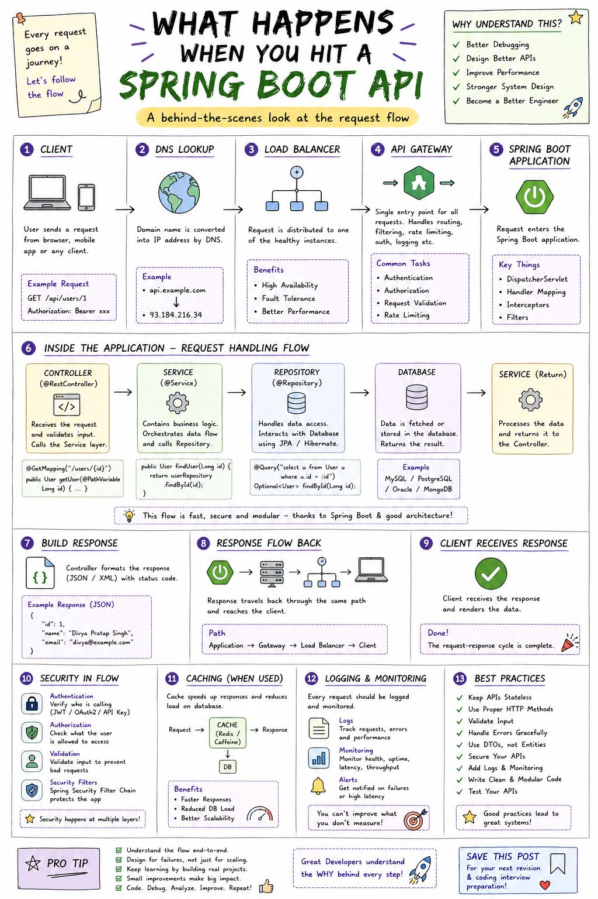
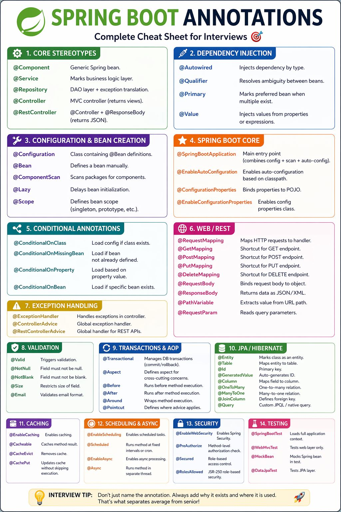

# Java & Spring Boot

> 📌 **Visual References:**
>
> [](../assets/images/spring-boot-api-flow.jpg)
>
> [](../assets/images/springboot-annotations.jpg)

---

## Q1: What are the key features in Java 21 that you find most impactful?

**Answer:**

- **Virtual Threads (Project Loom)** : Lightweight threads managed by the JVM, not the OS. Ideal for I/O-bound services. You can spawn millions of virtual threads without the overhead of platform threads. This is a game-changer for microservices handling many concurrent HTTP calls.
- **Pattern Matching for switch** : Cleaner, more expressive code when handling different types. Eliminates cascading `instanceof` checks.
- **Record Patterns** : Deconstruct record values directly in pattern matching, reducing boilerplate.
- **Sequenced Collections** : `SequencedCollection`, `SequencedSet`, `SequencedMap` : unified API to access first/last elements across collection types.
- **Sealed Classes (finalized)** : Restrict which classes can extend/implement a type. Great for domain modeling where you want a closed set of subtypes.

**Follow-up : How have you used these?**
Virtual Threads are the most impactful in production services. For a high-throughput export service handling concurrent downstream API calls, virtual threads reduce thread pool tuning complexity and improve throughput without increasing memory footprint.

---

## Q2: How does Spring Boot 3.x differ from 2.x? What migration challenges have you seen?

**Answer:**

Key changes:
- **Jakarta EE (javax --> jakarta)** : All `javax.*` packages moved to `jakarta.*`. This is the biggest migration effort : affects every import, every dependency that uses servlet, persistence, validation APIs.
- **Java 17 baseline** : Spring Boot 3 requires Java 17+. Older codebases need a JDK upgrade first.
- **Native compilation (GraalVM)** : First-class support for ahead-of-time compilation. Faster startup, lower memory : useful for serverless/container workloads.
- **Observability** : Micrometer Observation API replaces ad-hoc metrics. Built-in tracing support via Micrometer Tracing.
- **Security changes** : `WebSecurityConfigurerAdapter` removed. Component-based security config with `SecurityFilterChain` beans.

**Migration challenges:**
- Third-party libraries lagging on Jakarta namespace
- Custom security configurations needing rewrite
- Flyway/Liquibase compatibility with newer Spring Boot autoconfiguration

---

## Q3: How do you handle distributed transactions in a microservices architecture?

**Answer:**

I avoid distributed transactions where possible. Instead:

1. **Saga Pattern** : Choreography (event-driven) or Orchestration (central coordinator). Each service executes its local transaction and publishes an event. Compensating transactions handle rollbacks.
2. **Idempotency** : Every operation is idempotent so retries are safe. Use idempotency keys in APIs and message deduplication IDs in SQS FIFO queues.
3. **Outbox Pattern** : Write the event to a local outbox table in the same DB transaction as the business data. A separate process publishes events from the outbox. Guarantees at-least-once delivery without 2PC.
4. **Eventual Consistency** : Accept that services will be temporarily inconsistent and design the UX and error handling around it.

**Real example:** In an export pipeline, the submitter service saves the request to MySQL and sends an SQS message. If the SQS send fails, the request is still in DB and a reconciliation process retries. This avoids distributed transaction complexity.

---

## Q4: Explain how you'd design a REST API for a high-throughput system.

**Answer:** Designing a REST API for a high-throughput system requires shifting from purely functional design to a performance-first approach, prioritizing minimal latency, horizontal scalability, and efficient resource utilization.

Designing a REST API for high throughput is less about the "REST" part (the URLs and JSON) and more about how you handle the massive volume of traffic hitting your servers. You have to move away from a simple "request-response" mindset and start thinking about efficiency, concurrency, and reliability.

Key principles:
- **Async where possible** : Accept requests with 202 and process in background (SQS + workers). Don't block the client.
- **Pagination** : Use cursor-based pagination for large datasets. Offset-based breaks at scale.
- **Rate limiting** : API Gateway or WAF-level rate limiting to protect backend services.
- **Caching** : Cache-aside with Redis for read-heavy endpoints. Define TTL based on data freshness requirements.
- **Bulk endpoints** : Support batch operations to reduce HTTP overhead (e.g., export up to 250 operations in one call, chunked into batches of 50).
- **FIFO queues** : Use SQS FIFO with message group IDs to ensure ordered processing per entity while allowing parallelism across entities.
- **Circuit breakers** : Protect against cascading failures from downstream services (Resilience4j or similar).
- **Observability** : Structured logging, distributed tracing (X-Ray or OpenTelemetry), and metrics on every endpoint.


```
                          [ Clients ]
                     (Mobile, Web, IoT)
                             │
                             ▼
                   [ CDN / Edge Layer ]
            (Static assets, Global Cache, TLS)
                             │
                             ▼
                  [ WAF / DDoS Protection ]        ← Rate Limiting (L1)
               (Block malicious IPs, Throttle)
                             │
                             ▼
                  [ Cloud Load Balancer ]
             (L7 — Round Robin / Least Conn)
                             │
                             ▼
                     [ API Gateway ]               ← Rate Limiting (L2)
       (Auth JWT/OAuth, Rate Limiting, Validation, ← Bulk Endpoints
        Routing, Bulk Requests up to 250 ops)
                             │
          ┌──────────┬───────┴────────┬──────────┐
          ▼          ▼                ▼          ▼
    [Service A]  [Service B]   [Service C]  [Service D]   ← Stateless
    +Circuit     +Circuit      +Circuit     +Circuit       ← Circuit Breakers
     Breaker      Breaker       Breaker      Breaker         (Resilience4j)
          └──────────┴───────┬────────┴──────────┘
                             │
             ┌───────────────┼──────────────────┐
             ▼               ▼                  ▼
   [ Cache-Aside ]   [ SQS FIFO Queue ]   [ Read Replica ]  ← Pagination
   [ Redis + TTL ]   (202 Async Accept,   [ Postgres/MySQL]   (Cursor-based)
   (Read-heavy ops)   MessageGroupId,          │
                      Ordered/Parallel)        ▼
             │               │          [ Search Index ]
             │               ▼            (Elastic/Solr)
             │         [ Workers ]
             │      (Batch chunks of 50,
             │       Idempotent processing)    ← Async + FIFO
             │               │
             └───────────────▼
                    [ Primary DB ]
                    (SQL / NoSQL)
                             │
                             ▼
              [ Observability & Monitoring ]    ← Observability
       (Structured Logs, X-Ray / OpenTelemetry,
        Metrics per endpoint, Distributed Tracing)
```
---

## Q5: What is your approach to exception handling in Spring Boot microservices?

**Answer:**

- **Global exception handler** : `@ControllerAdvice` with `@ExceptionHandler` methods. Map domain exceptions to proper HTTP status codes.
- **Custom exception hierarchy** : Business exceptions (e.g., `ResourceNotFoundException`, `ValidationException`) extend a base exception. Infrastructure exceptions are handled separately.
- **Don't catch and swallow** : Log with context (request ID, entity ID) and re-throw or return a meaningful error response.
- **Validation at boundaries** : Use `@Valid` / Bean Validation at controller layer. Don't scatter validation across service layers.
- **Error response contract** : Consistent error response format: `{ "error": "...", "message": "...", "timestamp": "...", "path": "..." }`. Clients can parse errors reliably.

**Example Implementation:**

```java
// Exception hierarchy
public class AppException extends RuntimeException {
    private final String code;
    public AppException(String code, String msg) { super(msg); this.code = code; }
    public String getCode() { return code; }
}
public class ResourceNotFoundException extends AppException {
    public ResourceNotFoundException(String msg) { super("NOT_FOUND", msg); }
}

// Error response contract
public record ErrorResponse(String error, String message, String timestamp, String path) {}

// Controller — validation at boundary
@RestController
@RequestMapping("/api/orders")
public class OrderController {
    @GetMapping("/{id}")
    public Order get(@PathVariable String id) {
        return orderService.findById(id)
            .orElseThrow(() -> new ResourceNotFoundException("Order not found: " + id));
    }

    @PostMapping
    public ResponseEntity<Order> create(@Valid @RequestBody OrderRequest req) {
        return ResponseEntity.status(201).body(orderService.create(req));
    }
}

// Global handler — single place for all exceptions
@RestControllerAdvice @Slf4j
public class GlobalExceptionHandler {

    @ExceptionHandler(AppException.class)
    public ResponseEntity<ErrorResponse> handleApp(AppException ex, HttpServletRequest req) {
        return ResponseEntity.status(NOT_FOUND)
            .body(new ErrorResponse(ex.getCode(), ex.getMessage(),
                Instant.now().toString(), req.getRequestURI()));
    }

    @ExceptionHandler(Exception.class)
    public ResponseEntity<ErrorResponse> handleGeneral(Exception ex, HttpServletRequest req) {
        log.error("Unhandled error [path={}]", req.getRequestURI(), ex); // don't swallow
        return ResponseEntity.status(500)
            .body(new ErrorResponse("INTERNAL_ERROR", "Something went wrong",
                Instant.now().toString(), req.getRequestURI()));
    }
}
```

---

## Q6: @PathVariable vs @RequestParam : when to use which?

**Theory:**
- **@PathVariable** extracts values from URI path segments; used for identifying resources
- **@RequestParam** extracts values from query string; used for filtering, pagination, optional parameters

**Answer:**

| Annotation | URL Part | Example |
|-----------|----------|---------|
| `@PathVariable` | Path segment | `GET /users/{id}` --> `/users/42` |
| `@RequestParam` | Query string | `GET /users?role=admin` |

**Guidelines:**
- **PathVariable** for resource identification (`/orders/{orderId}`)
- **RequestParam** for optional filtering, sorting, pagination (`?page=2&size=20&sort=date`)
- Both can be `required=false` with defaults

```java
@GetMapping("/users/{id}")
public User getUser(@PathVariable Long id) { }

@GetMapping("/users")
public List<User> search(
    @RequestParam(defaultValue = "0") int page,
    @RequestParam(required = false) String role) { }
```

---

## Q7: @Transactional deep dive : common pitfalls

**Answer:**

**Short definition:** `@Transactional` marks a method to execute within a database transaction; Spring automatically commits on success or rolls back on exceptions, ensuring ACID properties.

**Propagation types (most used):**

| Type | Behavior |
|------|----------|
| `REQUIRED` (default) | Join existing or create new |
| `REQUIRES_NEW` | Always create new, suspend existing |
| `NESTED` | Savepoint within existing transaction |

**Common pitfalls:**

1. **Self-invocation bypass:** Calling `this.methodB()` from `methodA()` in the same class : `@Transactional` on `methodB` is ignored because Spring proxies intercept only external calls.

```java
// BAD : @Transactional on processItem is ignored
@Service
public class OrderService {
    public void processAll() {
        items.forEach(this::processItem); // self-invocation
    }
    @Transactional
    public void processItem(Item item) { } // proxy bypassed!
}
```

**Fix:** Extract to a separate bean, or inject self via `@Lazy`.

2. **Checked exceptions don't trigger rollback by default.** Use `@Transactional(rollbackFor = Exception.class)`.

3. **Read-only optimization:** `@Transactional(readOnly = true)` on read methods : Hibernate skips dirty checking, improving performance.

---

## Q8: @RestControllerAdvice : centralized exception handling

**Answer:**

```java
@RestControllerAdvice
public class GlobalExceptionHandler {

    @ExceptionHandler(ResourceNotFoundException.class)
    @ResponseStatus(HttpStatus.NOT_FOUND)
    public ErrorResponse handleNotFound(ResourceNotFoundException ex) {
        return new ErrorResponse("NOT_FOUND", ex.getMessage());
    }

    @ExceptionHandler(MethodArgumentNotValidException.class)
    @ResponseStatus(HttpStatus.BAD_REQUEST)
    public ErrorResponse handleValidation(MethodArgumentNotValidException ex) {
        String errors = ex.getBindingResult().getFieldErrors().stream()
            .map(e -> e.getField() + ": " + e.getDefaultMessage())
            .collect(Collectors.joining(", "));
        return new ErrorResponse("VALIDATION_ERROR", errors);
    }

    @ExceptionHandler(Exception.class)
    @ResponseStatus(HttpStatus.INTERNAL_SERVER_ERROR)
    public ErrorResponse handleGeneral(Exception ex) {
        log.error("Unexpected error", ex);
        return new ErrorResponse("INTERNAL_ERROR", "Something went wrong");
    }
}
```

**Advantages over per-controller `@ExceptionHandler`:**
- Single place for all error handling
- Consistent error response format across all APIs
- Can be tested independently

---

<!-- Source: spring-boot-pro-answers.txt, spring-boot-competitors.txt, hibernate-spring-ejb.txt -->

## Q9: Spring AOP — @Aspect, @Advice, and Cross-Cutting Concerns

**Answer:**

**Spring AOP (Aspect-Oriented Programming)** — separates cross-cutting concerns (logging, security, transactions) from business logic → an **Aspect** encapsulates the concern, **Advice** is the code that executes, **Pointcut** defines where it applies → implemented via proxies at runtime.

Key AOP terms: **Join Point** (where advice can apply — method execution), **Pointcut** (filter selecting which join points), **Advice** (what to do: @Before, @After, @Around, @AfterReturning, @AfterThrowing), **Aspect** (class containing advice).

```java
@Aspect
@Component
public class LoggingAspect {

    // @Before: executes before matched methods
    @Before("execution(* com.example.service.*.*(..))")
    public void logBefore(JoinPoint jp) {
        log.info("Calling: {}", jp.getSignature().getName());
    }

    // @Around: wraps method execution (most powerful)
    @Around("execution(* com.example.service.*.*(..))")
    public Object measureTime(ProceedingJoinPoint pjp) throws Throwable {
        long start = System.currentTimeMillis();
        Object result = pjp.proceed(); // actual method call
        log.info("{} took {}ms", pjp.getSignature().getName(), System.currentTimeMillis() - start);
        return result;
    }

    // @AfterThrowing: runs when exception is thrown
    @AfterThrowing(pointcut = "execution(* com.example.service.*.*(..))", throwing = "ex")
    public void logException(JoinPoint jp, Exception ex) {
        log.error("Exception in {}: {}", jp.getSignature().getName(), ex.getMessage());
    }
}
```

**Benefits / Trade-offs:** Centralizes cross-cutting logic, removing duplication across service methods. Trade-off: adds proxy overhead; `this.method()` calls bypass the proxy (self-invocation issue); only works on Spring-managed beans; complex pointcuts can be hard to debug.

---

## Q10: @Transactional — Propagation, Isolation, and Rollback Rules

**Answer:**

**`@Transactional`** — declarative annotation that wraps a method in a database transaction managed by Spring's AOP proxy → begins a transaction before the method, commits on success, rolls back on unchecked exceptions.

By default: `propagation=REQUIRED` (join existing or create new), `isolation=DEFAULT` (DB default), rollback on `RuntimeException`, no rollback on checked exceptions.

```java
@Service
public class OrderService {

    @Transactional  // default: REQUIRED propagation, rollback on RuntimeException
    public Order createOrder(OrderRequest req) {
        Order order = orderRepository.save(new Order(req));
        paymentService.charge(req.getPayment()); // if this throws RuntimeEx → full rollback
        inventoryService.deduct(req.getItems());
        return order;
    }

    // Read-only optimization (skips dirty-checking overhead)
    @Transactional(readOnly = true)
    public List<Order> getOrdersByUser(Long userId) {
        return orderRepository.findByUserId(userId);
    }

    // Rollback checked exceptions too
    @Transactional(rollbackFor = Exception.class)
    public void processWithCheckedEx() throws IOException { ... }

    // Propagation options
    @Transactional(propagation = Propagation.REQUIRES_NEW) // always new transaction
    public void auditLog(String action) { ... }

    @Transactional(propagation = Propagation.NEVER) // fail if called in transaction
    public void exportReport() { ... }
}
```

**Common gotcha — self-invocation:**
```java
@Service
class ReportService {
    public void generate() {
        this.save(); // BUG: bypasses Spring proxy → @Transactional on save() has no effect
    }
    @Transactional
    public void save() { ... }
}
```

**Benefits / Trade-offs:** Eliminates manual `try/catch/rollback` boilerplate; clean separation of transaction from business logic. Trade-off: proxy-based — self-invocation bypasses it; lazy-loading outside transaction causes `LazyInitializationException`; long transactions can cause DB lock contention.

---

## Q11: Spring Dependency Injection — XML vs Annotation vs Java Config

**Answer:**

**Dependency Injection (DI)** — Spring manages object creation and injects dependencies rather than the object creating its own → three configuration styles: XML (legacy), annotation-based (`@Autowired`), Java config (`@Bean` + `@Configuration`).

```java
// Modern: Java Configuration (recommended)
@Configuration
public class AppConfig {
    @Bean
    public UserRepository userRepository(DataSource ds) {
        return new JdbcUserRepository(ds);
    }
    @Bean
    public UserService userService(UserRepository repo, MailService mail) {
        return new UserService(repo, mail); // constructor injection
    }
}

// Annotation-based (most common)
@Service
public class UserService {
    private final UserRepository repository;
    private final MailService mailService;

    // Constructor injection (recommended — immutable, testable)
    @Autowired
    public UserService(UserRepository repository, MailService mailService) {
        this.repository = repository;
        this.mailService = mailService;
    }
}

// XML (legacy, still used in enterprise)
// <bean id="userService" class="com.example.UserService">
//     <property name="userRepository" ref="userRepository"/>
// </bean>
```

**Injection types:**

| Type | How | When to use |
|------|-----|-------------|
| Constructor | `@Autowired` on constructor | Preferred — enforces required deps, immutable |
| Setter | `@Autowired` on setter | Optional dependencies |
| Field | `@Autowired` on field | Convenient but hides dependencies, hard to test |

**Benefits / Trade-offs:** Constructor injection is testable without Spring context (just `new UserService(mockRepo, mockMail)`). Field injection requires Spring in tests. Java config is type-safe and IDE-friendly vs XML.

---

## Q12: Spring Boot Auto-Configuration and spring.factories

**Answer:**

**Auto-configuration** — Spring Boot automatically configures beans based on classpath dependencies + properties → no manual `@Bean` configuration for common setups → driven by `@EnableAutoConfiguration` and `spring.factories` (or `AutoConfiguration.imports` in Boot 3.x).

When Boot starts, it scans META-INF/spring.factories for `EnableAutoConfiguration` entries, loads each `@Configuration` class conditionally (`@ConditionalOnClass`, `@ConditionalOnMissingBean`, etc.).

```java
// Spring Boot auto-configures DataSource if H2/MySQL is on classpath
// application.properties:
// spring.datasource.url=jdbc:postgresql://localhost/mydb
// spring.datasource.username=user
// spring.datasource.password=pass

// Auto-config equivalent (what Boot does for you):
// @Configuration
// @ConditionalOnClass(DataSource.class)
// public class DataSourceAutoConfiguration {
//     @Bean @ConditionalOnMissingBean
//     public DataSource dataSource(...) { ... }
// }

// Override auto-config by providing your own bean:
@Configuration
public class MyDbConfig {
    @Bean
    public DataSource dataSource() {
        HikariConfig config = new HikariConfig();
        config.setJdbcUrl("jdbc:postgresql://localhost/db");
        config.setMaximumPoolSize(20);
        return new HikariDataSource(config);
    }
}

// Exclude specific auto-config
@SpringBootApplication(exclude = {DataSourceAutoConfiguration.class})
public class MyApp { ... }
```

**Benefits / Trade-offs:** Massively reduces boilerplate for standard setups. Trade-off: magic behavior can be confusing — use `--debug` flag to see auto-configuration report; overly eager auto-config may load beans you don't need.

---

## Q13: Spring Boot Competitors — Quarkus, Micronaut, Vert.x

**Answer:**

**Spring Boot's competitors** address specific weaknesses: slow startup, high memory footprint, and reflection-heavy DI → each trade-off breadth of ecosystem for targeted performance or paradigm improvements.

| Framework | Approach | Startup | Memory | Best For |
|-----------|----------|---------|--------|----------|
| **Spring Boot** | Runtime DI + classpath scan | ~2-5s | ~200-500MB | Full-featured enterprise apps |
| **Quarkus** | Compile-time + GraalVM native | ~50ms native | ~50MB native | Kubernetes/serverless, fast scale-up |
| **Micronaut** | Compile-time DI (no reflection) | ~100ms | ~80MB | Low-latency APIs, microservices |
| **Vert.x** | Reactive, event-driven, polyglot | ~50ms | ~30MB | High-throughput I/O, reactive systems |
| **Jakarta EE** | Standard specification (multi-vendor) | Varies | Varies | Enterprise compliance, portability |

```java
// Quarkus: Kubernetes-native, GraalVM-ready
@Path("/hello")
@ApplicationScoped
public class GreetingResource {
    @GET @Produces(MediaType.TEXT_PLAIN)
    public String hello() { return "Hello from Quarkus"; }
}
// mvn package -Pnative → single binary, boots in <50ms

// Micronaut: no reflection, compile-time DI
@Singleton
public class UserService {
    private final UserRepository repo;
    public UserService(UserRepository repo) { this.repo = repo; } // compile-time
}
```

**When to stay with Spring Boot:**
- Large team familiar with Spring ecosystem
- Need extensive integrations (Spring Data, Spring Security, Spring Cloud)
- Startup time is not a constraint

**Benefits / Trade-offs:** Spring Boot wins on ecosystem and developer familiarity. Quarkus/Micronaut win on cloud-native performance. Vert.x wins for high-concurrency reactive workloads.

---

## Q14: Hibernate JPA — Entity Lifecycle, Lazy Loading, N+1 Problem

**Answer:**

**Hibernate entity lifecycle** — four states: Transient (no DB, no session), Persistent (tracked by session, dirty-checking active), Detached (was persistent, session closed), Removed (scheduled for DELETE) → understanding states prevents `LazyInitializationException` and N+1 problems.

**N+1 problem** — one query loads N entities, then N additional queries load each entity's association individually → catastrophic for performance.

```java
// Entity lifecycle states
Customer c = new Customer("Alice"); // Transient — no DB identity
session.persist(c);                 // Persistent — tracked by session
session.close();                    // Detached — no longer tracked
session.merge(c);                   // Persistent again

// LazyInitializationException: accessing lazy collection outside session
@Entity class Order {
    @OneToMany(fetch = FetchType.LAZY)
    List<Item> items; // loaded on demand
}

Order order = orderRepository.findById(1L).get(); // session closed after
order.getItems(); // EXCEPTION: session is closed, can't lazy load

// Fix: use EAGER or JOIN FETCH in query
@Query("SELECT o FROM Order o JOIN FETCH o.items WHERE o.id = :id")
Order findWithItems(@Param("id") Long id); // loads in one query

// N+1 problem: 1 query for orders + N queries for each order's items
List<Order> orders = orderRepository.findAll(); // 1 query
for (Order o : orders) {
    o.getItems().size(); // N more queries! (one per order)
}

// Fix N+1: batch fetching or JOIN FETCH
@BatchSize(size = 20) // Hibernate loads 20 items at once
@OneToMany(fetch = FetchType.LAZY)
List<Item> items;

// Or: JPQL JOIN FETCH
@Query("SELECT DISTINCT o FROM Order o JOIN FETCH o.items")
List<Order> findAllWithItems();
```

**Benefits / Trade-offs:** Lazy loading reduces initial query overhead; JOIN FETCH prevents N+1 at cost of larger result sets. Use `@EntityGraph` for flexible, reusable fetch strategies without modifying queries.

---

## Q15: REST API Design — Best Practices for Spring Boot REST Controllers

**Answer:**

**Spring Boot REST controller** — `@RestController` combines `@Controller` + `@ResponseBody` → maps HTTP requests to Java methods → returns JSON by default via Jackson serialization → status codes via `ResponseEntity`.

```java
@RestController
@RequestMapping("/api/v1/orders")
@RequiredArgsConstructor
public class OrderController {

    private final OrderService orderService;

    // GET collection
    @GetMapping
    public ResponseEntity<List<OrderResponse>> getOrders(
            @RequestParam(defaultValue = "0") int page,
            @RequestParam(defaultValue = "20") int size) {
        return ResponseEntity.ok(orderService.getOrders(page, size));
    }

    // GET single resource
    @GetMapping("/{id}")
    public ResponseEntity<OrderResponse> getOrder(@PathVariable Long id) {
        return orderService.findById(id)
            .map(ResponseEntity::ok)
            .orElse(ResponseEntity.notFound().build());
    }

    // POST create
    @PostMapping
    public ResponseEntity<OrderResponse> createOrder(
            @Valid @RequestBody OrderRequest req) {
        OrderResponse created = orderService.create(req);
        URI location = URI.create("/api/v1/orders/" + created.getId());
        return ResponseEntity.created(location).body(created);
    }

    // PUT update
    @PutMapping("/{id}")
    public ResponseEntity<OrderResponse> updateOrder(
            @PathVariable Long id, @Valid @RequestBody OrderRequest req) {
        return ResponseEntity.ok(orderService.update(id, req));
    }

    // DELETE
    @DeleteMapping("/{id}")
    public ResponseEntity<Void> deleteOrder(@PathVariable Long id) {
        orderService.delete(id);
        return ResponseEntity.noContent().build();
    }
}

// Global exception handler
@RestControllerAdvice
public class GlobalExceptionHandler {
    @ExceptionHandler(EntityNotFoundException.class)
    public ResponseEntity<ErrorResponse> handleNotFound(EntityNotFoundException e) {
        return ResponseEntity.status(HttpStatus.NOT_FOUND)
            .body(new ErrorResponse("NOT_FOUND", e.getMessage()));
    }
}
```

**Benefits / Trade-offs:** `@RestController` + `ResponseEntity` gives full control over HTTP status/headers. Use `@Valid` + `@RestControllerAdvice` for clean validation and error handling. Versioning via URL path (`/v1/`) or header is recommended for public APIs.

---

## Q16: @Configuration vs @Component in Spring Boot

**Answer:**

Both are Spring-managed annotations, but they serve different purposes:

`@Configuration` marks a class as a **source of bean definitions** --> contains `@Bean` methods --> processed by Spring's CGLIB proxy so inter-`@Bean` calls return the same singleton. Use for: DataSource, SecurityConfig, app-wide beans.

`@Component` is a **general-purpose stereotype** for component scanning. Specialized variants: `@Service`, `@Repository`, `@Controller`.

**Key difference:** `@Configuration` ensures full `@Bean` singleton semantics via CGLIB proxy. `@Component` with `@Bean` is "lite mode" : no proxy, inter-bean calls create new instances.

```java
@Configuration
public class AppConfig {
    @Bean
    public DataSource dataSource() { return new HikariDataSource(); }

    @Bean
    public JdbcTemplate jdbcTemplate() {
        return new JdbcTemplate(dataSource()); // same instance via proxy
    }
}

@Component
public class OrderService {
    private final OrderRepository repo;
    public OrderService(OrderRepository repo) { this.repo = repo; }
}
```

---

## Q17: @Primary vs @Qualifier in Spring Boot

**Answer:**

Both resolve bean ambiguity when multiple beans of the same type exist.

`@Primary` : default bean injected when no qualifier given. `@Qualifier("name")` : explicitly selects a specific bean at the injection point. If both present, `@Qualifier` wins.

```java
@Component @Primary
public class StripePaymentProcessor implements PaymentProcessor {}

@Component @Qualifier("paypal")
public class PayPalPaymentProcessor implements PaymentProcessor {}

@Service
public class CheckoutService {
    @Autowired
    private PaymentProcessor defaultProcessor;      // gets Stripe (primary)

    @Autowired @Qualifier("paypal")
    private PaymentProcessor paypalProcessor;       // gets PayPal explicitly
}
```

No `@Primary` + no `@Qualifier` + multiple beans --> `NoUniqueBeanDefinitionException`.

---

## Q18: Spring Boot Profiles

**Answer:**

Profiles allow environment-specific configuration without code changes. Files: `application-dev.yml`, `application-prod.yml`. Activate via `spring.profiles.active=prod`, env var `SPRING_PROFILES_ACTIVE`, or JVM arg.

```yaml
# application-dev.yml
spring.datasource.url: jdbc:h2:mem:devdb
logging.level.root: DEBUG

# application-prod.yml
spring.datasource.url: jdbc:postgresql://prod:5432/mydb
logging.level.root: WARN
```

```java
@Configuration
@Profile("dev")
public class DevDataConfig {
    @Bean
    public DataSource dataSource() {
        return new EmbeddedDatabaseBuilder().setType(H2).build();
    }
}
```

**Benefits:** Single codebase, multiple deployment targets. Trade-off: Too many profiles can cause configuration drift : keep profiles minimal.

---

## Q19: @Controller vs @RestController

**Answer:**

| Feature | @Controller | @RestController |
|---------|------------|-----------------|
| Use case | MVC (returns view names) | REST APIs (returns data) |
| Response | Resolved by ViewResolver | Serialized to JSON/XML via Jackson |
| Equivalent | `@Controller` alone | `@Controller` + `@ResponseBody` on ALL methods |

```java
@Controller
public class PageController {
    @GetMapping("/home")
    public String home(Model model) { return "home"; } // resolves to home.html
}

@RestController
@RequestMapping("/api/users")
public class UserController {
    @GetMapping("/{id}")
    public ResponseEntity<User> getUser(@PathVariable Long id) {
        return ResponseEntity.ok(userService.findById(id));
    }
}
```

Jackson's `MappingJackson2HttpMessageConverter` handles JSON serialization. No `@JsonProperty` needed if field names match getter naming conventions.

---
## Q20:

---

## Q21: Apache Kafka Setup in Spring Boot

**Answer:**

```xml
<dependency>
    <groupId>org.springframework.kafka</groupId>
    <artifactId>spring-kafka</artifactId>
</dependency>
```

```yaml
spring:
  kafka:
    bootstrap-servers: localhost:9092
    producer:
      key-serializer: org.apache.kafka.common.serialization.StringSerializer
      value-serializer: org.apache.kafka.common.serialization.StringSerializer
    consumer:
      group-id: my-group
      auto-offset-reset: earliest
```

```java
// Producer
@RestController
public class EventController {
    private final KafkaTemplate<String, String> kafkaTemplate;
    public EventController(KafkaTemplate<String, String> kt) { this.kafkaTemplate = kt; }

    @PostMapping("/events")
    public ResponseEntity<Void> publish(@RequestBody String event) {
        kafkaTemplate.send("order-events", event);
        return ResponseEntity.accepted().build();
    }
}

// Consumer
@Component
public class EventConsumer {
    @KafkaListener(topics = "order-events", groupId = "order-service-group")
    public void consume(String event) {
        log.info("Received: {}", event);
    }
}
```

**Kafka vs JMS:** Kafka = distributed log, replay-capable, high throughput, partitioned. JMS = messaging API standard (ActiveMQ, IBM MQ), transactional enterprise messaging. Use Kafka for event streaming/sourcing; JMS for reliable transactional messaging.

---

## Q22: Constructor vs Setter vs Field Injection

**Answer:**

| Type | Mechanism | Recommendation |
|------|-----------|----------------|
| **Constructor** | Deps in constructor params | ✅ Preferred : enforces required, immutable, testable |
| **Setter** | `@Autowired` on setter | ⚠️ For optional/circular deps only |
| **Field** | `@Autowired` on field | ❌ Avoid : breaks encapsulation, hard to test |

```java
// Constructor injection (preferred) : works without @Autowired in Spring 4.3+
@Service
public class OrderService {
    private final OrderRepository repo;
    private final PaymentService paymentService;

    public OrderService(OrderRepository repo, PaymentService paymentService) {
        this.repo = repo;
        this.paymentService = paymentService;
    }
}
```

**Benefits:** `final` fields = immutable, testable without Spring context, impossible to forget a required dependency.


---

## Q23: JPA Specification vs Hibernate, get() vs load(), N+1 Problem

**Answer:**

**JPA is a specification (API), NOT a framework:**
```
JPA = interfaces + annotations (java.persistence.*)
Hibernate = framework that implements JPA specification
```
Analogy: JPA is the interface, Hibernate is the implementing class.

```java
// We code against JPA interfaces (portable)
@Repository
public interface OrderRepository extends JpaRepository<Order, Long> { }

// Hibernate is the JPA provider configured in application.yml
spring.jpa.properties.hibernate.dialect=org.hibernate.dialect.PostgreSQLDialect
```

**Hibernate `get()` vs `load()`:**

| Feature | `get(order, 1L)` | `load(order, 1L)` |
|---------|-----------------|-------------------|
| Loading strategy | Eager — hits DB immediately | Lazy — returns proxy, DB on first use |
| Not found | Returns `null` | Throws `ObjectNotFoundException` |
| DB query | Always | Only when accessed |
| Use when | You need to check existence | You know it exists, use as FK reference |

```java
// get() — safe, returns null if not found
Order order = session.get(Order.class, 1L);
if (order == null) throw new OrderNotFoundException(1L);

// load() — proxy, throws if not found when accessed
Order ref = session.load(Order.class, 1L); // no DB hit yet
order.setRef(ref);  // just set as FK reference — DB never hit if not accessed
```

**N+1 problem and solutions:**
```java
// N+1 Problem: fetching 1 query for orders, then N queries for each order's items
List<Order> orders = orderRepo.findAll(); // 1 query
orders.forEach(o -> o.getItems().size()); // N queries ← N+1

// Fix 1: JOIN FETCH
@Query("SELECT o FROM Order o JOIN FETCH o.items WHERE o.customerId = :id")
List<Order> findWithItems(@Param("id") String id);

// Fix 2: @EntityGraph
@EntityGraph(attributePaths = {"items", "customer"})
List<Order> findByStatus(OrderStatus status);

// Fix 3: BatchSize (reduces N to N/batchSize)
@OneToMany
@BatchSize(size = 20)  // fetches 20 children per batch, not 1
private List<OrderItem> items;
```

**Lazy vs Eager loading — when to use:**
```java
@OneToMany(fetch = FetchType.LAZY)   // ✅ default — only load when accessed
private List<OrderItem> items;

@ManyToOne(fetch = FetchType.EAGER)  // ✅ acceptable for small parent objects
private Customer customer;
```
Rule: use LAZY as default; only use EAGER for small, always-needed associations.

**JPA Caching (Hibernate):**
- **L1 cache (session-scoped):** automatic per `Session`/`EntityManager` — same entity ID within one session = one DB hit
- **L2 cache (shared, optional):** Ehcache/Redis — across sessions, configurable per entity
- **Query cache:** cache entire query results — risky for frequently updated data

```java
@Cache(usage = CacheConcurrencyStrategy.READ_WRITE)  // L2 cache for entity
@Entity
public class Product { }
```

**Interview one-liner:** "JPA is the specification, Hibernate is the implementation; prefer `get()` for safe lookups and `load()` for FK references; always check and fix N+1 with JOIN FETCH or @EntityGraph."


---

## Q24: Changing the Embedded Server in Spring Boot

**Answer:**

Spring Boot defaults to **embedded Tomcat**, but you can swap it for Jetty or Undertow by excluding Tomcat and adding the desired server dependency.

**How Spring Boot selects the server:** Auto-configuration scans the classpath — whichever server starter is present gets configured automatically. There is no config property for switching server type; it is entirely dependency-driven.

**Swap Tomcat → Jetty (Maven):**
```xml
<dependency>
    <groupId>org.springframework.boot</groupId>
    <artifactId>spring-boot-starter-web</artifactId>
    <exclusions>
        <exclusion>
            <groupId>org.springframework.boot</groupId>
            <artifactId>spring-boot-starter-tomcat</artifactId>
        </exclusion>
    </exclusions>
</dependency>

<dependency>
    <groupId>org.springframework.boot</groupId>
    <artifactId>spring-boot-starter-jetty</artifactId>
</dependency>
```

**Swap Tomcat → Undertow (Maven):**
```xml
<!-- same exclusion as above, then: -->
<dependency>
    <groupId>org.springframework.boot</groupId>
    <artifactId>spring-boot-starter-undertow</artifactId>
</dependency>
```

**Gradle:**
```gradle
implementation('org.springframework.boot:spring-boot-starter-web') {
    exclude group: 'org.springframework.boot', module: 'spring-boot-starter-tomcat'
}
implementation 'org.springframework.boot:spring-boot-starter-jetty'
```

**Verify it worked** — startup logs will show:
```
Started Jetty Server on port 8080
```

**Server comparison:**

| Server | Best For | Notes |
|--------|----------|-------|
| Tomcat | General purpose, stable | Default, widely used |
| Jetty | Lightweight, async/WebSocket-heavy apps | Lower memory footprint |
| Undertow | High throughput, low latency | Non-blocking, best raw performance |

**Common mistake:** Trying to switch servers via `application.properties` — the server type is controlled by classpath dependencies, not configuration.

**Interview one-liner:** "Spring Boot auto-selects the embedded server by scanning the classpath — exclude Tomcat and add Jetty or Undertow to switch."

---

## Q25: `@SpringBootApplication` Internals and Custom Replacement

**Answer:**

`@SpringBootApplication` is a **composed/meta-annotation** that combines three annotations:

```java
@SpringBootApplication
// is exactly equivalent to:
@Configuration         // marks as bean definition source
@EnableAutoConfiguration  // triggers classpath-based auto-configuration
@ComponentScan         // scans current package + subpackages for @Component, @Service etc.
public class MyApp { }
```

**Why know this?** Interviewers test whether you understand what actually drives Spring Boot's magic.

**What each annotation does:**
| Annotation | Purpose |
|-----------|---------|
| `@Configuration` | Java-based bean definition (replaces XML) |
| `@EnableAutoConfiguration` | Reads `spring.factories`/`AutoConfiguration.imports`, loads beans conditionally via `@ConditionalOnClass` |
| `@ComponentScan` | Discovers beans in classpath; defaults to the annotated class's package |

**When to replace `@SpringBootApplication` with explicit annotations:**
```java
// Custom: exclude specific auto-configuration
@Configuration
@EnableAutoConfiguration(exclude = {DataSourceAutoConfiguration.class})
@ComponentScan(basePackages = {"com.deere.orders", "com.deere.telemetry"})
public class MyApp {
    public static void main(String[] args) {
        SpringApplication.run(MyApp.class, args);
    }
}
```

**Auto-configuration mechanism:**
```
@EnableAutoConfiguration
   → reads META-INF/spring/org.springframework.boot.autoconfigure.AutoConfiguration.imports
   → lists candidate auto-configuration classes
   → each class uses @ConditionalOnClass, @ConditionalOnMissingBean etc.
   → only loads beans when conditions match (e.g., Redis class present → RedisAutoConfiguration)
```

**Interview one-liner:** "`@SpringBootApplication = @Configuration + @EnableAutoConfiguration + @ComponentScan`; `@EnableAutoConfiguration` is the actual engine that reads auto-configuration classes conditionally based on the classpath."

---


