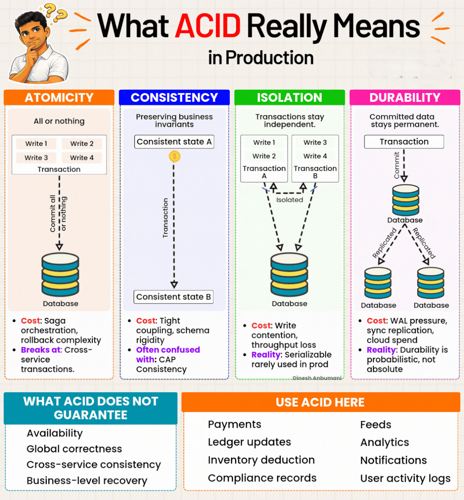

# Databases & SQL

> 📌 **Visual Reference:** [](../assets/images/acid-properties-in-prod.gif)

---

## Q1: How do you optimize slow SQL queries?

**Answer:**

SQL query optimization is the process of making slow database queries faster by identifying and fixing the root bottleneck. The approach is always layered — fix the query first, then add indexes, then caching, then infrastructure. Each layer targets a different cause at increasing cost and complexity.

**Systematic approach:**

1. **EXPLAIN / EXPLAIN ANALYZE** — Always start here. Check the execution plan for full table scans, missing indexes, and sort operations.

2. **Indexing:**
   - Add indexes on columns used in `WHERE`, `JOIN`, `ORDER BY`
   - Composite indexes — column order matters. Put high-cardinality columns first.
   - Covering indexes — include all `SELECT` columns in the index to avoid table lookups.

3. **Query rewriting:**
   - Avoid `SELECT *` — fetch only needed columns
   - Replace subqueries with `JOIN` where possible
   - Use `EXISTS` instead of `IN` for large subquery results
   - Avoid functions on indexed columns in `WHERE` (`WHERE YEAR(date) = 2024` → can't use index)

4. **Pagination:**
   - Offset-based pagination (`LIMIT 100 OFFSET 10000`) is slow at large offsets
   - Use cursor-based / keyset pagination: `WHERE id > last_seen_id LIMIT 100`

5. **Connection pooling:**
   - Use HikariCP (Spring Boot default). Tune `maximumPoolSize` based on DB connection limits and service instance count.

---

## Q2: Explain database indexing. When should you NOT add an index?

**Answer:**

A database index is a separate sorted data structure (B-tree by default) that allows the database to find rows without scanning the entire table — O(log n) instead of O(n). The index is automatically maintained on every INSERT, UPDATE, and DELETE. Indexes speed up reads but add write overhead and storage cost, so they should only be added on high-selectivity, frequently queried columns.

**How indexes work:**
- B-tree index (default in MySQL/PostgreSQL) — sorted data structure that enables binary search (O(log n) lookup instead of O(n) full scan).
- The database maintains the index on every INSERT/UPDATE/DELETE.

**When to add:**
- Columns in `WHERE` clauses with high selectivity
- `JOIN` columns (foreign keys)
- `ORDER BY` / `GROUP BY` columns

**When NOT to add:**
- **Low-cardinality columns** — Boolean, status fields with 2-3 values. Index doesn't help.
- **Small tables** — Full scan is faster than index lookup for < ~1000 rows.
- **Write-heavy tables** — Each index slows down INSERT/UPDATE/DELETE. More indexes = more write overhead.
- **Columns rarely queried** — Indexes consume storage and maintenance cost.

**Monitoring:**
- Check `slow_query_log` (MySQL) or `pg_stat_statements` (PostgreSQL) for slow queries
- Review unused indexes periodically and drop them

---

## Q3: What is connection pooling and why is it critical in microservices?

**Answer:**

Connection pooling reuses a fixed set of pre-established database connections instead of creating and destroying one per request. HikariCP (Spring Boot default) manages a pool that threads borrow, use, and return. It eliminates per-request overhead (~20–50ms for TCP + auth + SSL) and prevents connection exhaustion — critical in microservices where many autoscaled instances all share the same database.

**Problem:** Opening a DB connection is expensive (~20-50ms for TCP + auth + SSL). In microservices with autoscaling, hundreds of service instances can exhaust DB connection limits.

**Solution: Connection Pool (HikariCP)**
- Maintains a pool of pre-established connections
- Application borrows a connection, uses it, returns it
- Connections are reused, not created/destroyed per request

**Key configuration:**

| Parameter | Purpose | Guideline |
|-----------|---------|-----------|
| `maximumPoolSize` | Max connections per instance | `(2 * CPU cores) + effective_spindle_count` ≈ 10-20 |
| `minimumIdle` | Connections kept ready | Same as max for steady-state services |
| `connectionTimeout` | Wait time if pool is full | 30s (default). Lower for fast-fail. |
| `maxLifetime` | Max age before recycling | < DB's `wait_timeout`. Typically 30 min. |
| `idleTimeout` | How long unused connections live | 10 min |

**Microservice consideration:** If you have 10 service instances with `poolSize=10` each, that's 100 connections. RDS default max is ~150 (for db.t3.micro). Plan pool sizes against total instance count.

---

## Q4: Explain ACID properties with real-world examples.

**Answer:**

ACID defines the four guarantees every reliable database transaction must satisfy — **Atomicity** (all-or-nothing), **Consistency** (valid state transitions), **Isolation** (concurrent transaction safety), and **Durability** (crash-proof commits via write-ahead logging). Isolation level is the primary trade-off knob between correctness and throughput.

| Property | Meaning | Example |
|----------|---------|---------|
| **Atomicity** | All or nothing. Transaction succeeds completely or rolls back entirely. | Saving an export request + audit record in one transaction. If audit insert fails, request insert rolls back too. |
| **Consistency** | DB moves from one valid state to another. Constraints are always satisfied. | Foreign key constraint ensures an export request always references a valid user. |
| **Isolation** | Concurrent transactions don't interfere with each other. | Two users submitting exports simultaneously don't see each other's in-progress data. |
| **Durability** | Once committed, data survives crashes. | After a successful commit, the export request is persisted even if the server crashes immediately after. |

**Isolation levels (MySQL InnoDB default: REPEATABLE READ):**

| Level | Dirty Read | Non-Repeatable Read | Phantom Read |
|-------|-----------|-------------------|-------------|
| READ UNCOMMITTED | Yes | Yes | Yes |
| READ COMMITTED | No | Yes | Yes |
| REPEATABLE READ | No | No | Yes (in theory, InnoDB prevents) |
| SERIALIZABLE | No | No | No |

**Trade-off:** Higher isolation = more locking = lower throughput. Use READ COMMITTED for most microservice workloads unless you need stronger guarantees.

---

## Q5: When would you choose NoSQL over SQL?

**Answer:**

SQL and NoSQL are two database paradigms built for different data shapes and access patterns — SQL for structured, relational, ACID-consistent data; NoSQL for flexible schemas, simple access patterns, and horizontal write scaling.

The choice comes down to —
- If your data is relational and correctness is critical, use **SQL**.
- If your schema varies, your access patterns are simple, or you need to scale writes aggressively, **NoSQL** is the better fit.

| Choose SQL When | Choose NoSQL When |
|----------------|------------------|
| Data is structured with clear relationships | Data is semi-structured or schema varies |
| Need ACID transactions | Eventual consistency is acceptable |
| Complex queries with joins | Simple key-value or document lookups |
| Data integrity is critical | High write throughput at scale |
| Reporting and analytics | Caching, session storage, real-time feeds |

**AWS options:**
- **SQL:** RDS (MySQL, PostgreSQL, Aurora)
- **NoSQL:** DynamoDB (key-value), ElastiCache Redis (caching), DocumentDB (document store)

**My approach:** Default to SQL (RDS) for transactional data. Use Redis for caching. Consider DynamoDB only for high-scale, simple-access-pattern workloads where SQL would need heavy sharding.

---

## Q6: DDL vs DML — key SQL command categories

**Answer:**

SQL commands fall into four categories — **DDL** (schema), **DML** (data), **DCL** (permissions), **TCL** (transactions). The critical production rule: DDL is auto-committed and irreversible; DML can always be rolled back within an open transaction.

| Category | Commands | Description |
|----------|----------|-------------|
| **DDL** (Data Definition) | `CREATE`, `ALTER`, `DROP`, `TRUNCATE` | Schema changes. Auto-committed. |
| **DML** (Data Manipulation) | `SELECT`, `INSERT`, `UPDATE`, `DELETE` | Data operations. Transactional. |
| **DCL** (Data Control) | `GRANT`, `REVOKE` | Permissions. |
| **TCL** (Transaction Control) | `COMMIT`, `ROLLBACK`, `SAVEPOINT` | Transaction management. |

---

## Q7: DELETE vs TRUNCATE vs DROP

**Answer:**

**DELETE**, **TRUNCATE**, and **DROP** all remove data but differ critically in reversibility — DELETE is transactional and row-selective, TRUNCATE wipes all rows instantly and cannot be rolled back, DROP removes the entire table structure permanently. Always confirm scope before running TRUNCATE or DROP in production.

| Aspect | DELETE | TRUNCATE | DROP |
|--------|--------|----------|------|
| Type | DML | DDL | DDL |
| What it removes | Specific rows (with WHERE) | All rows | Entire table + data |
| Rollback | Yes (transactional) | No (auto-commit) | No (auto-commit) |
| Triggers | Fires row-level triggers | Does not fire triggers | N/A |
| Auto-increment | Not reset | Reset | N/A |
| Performance | Slower (row-by-row) | Faster (deallocates pages) | Fastest |
| WHERE clause | Supported | Not supported | N/A |

**When to use:** `DELETE` for selective removal. `TRUNCATE` to empty a table fast. `DROP` to remove the table entirely.

---

## Q8: Views, Materialized Views, Triggers, and Stored Procedures

**Answer:**

Views, materialized views, triggers, and stored procedures encapsulate logic at the DB layer — each trades application-side complexity for harder version control and testing. Use them when the performance or consistency benefit clearly outweighs the maintenance cost.

**View:**
```sql
CREATE VIEW active_users AS
SELECT id, name FROM users WHERE status = 'ACTIVE';
```
- Virtual table — query re-executes every time
- Use for: Simplifying complex queries, restricting column access

**Materialized View (PostgreSQL):**
```sql
CREATE MATERIALIZED VIEW report_summary AS
SELECT dept, COUNT(*) FROM employees GROUP BY dept;

REFRESH MATERIALIZED VIEW report_summary; -- must refresh manually
```
- Physically stores result — faster reads, stale until refreshed

**Trigger:**
```sql
CREATE TRIGGER audit_update
AFTER UPDATE ON orders
FOR EACH ROW
INSERT INTO audit_log(table_name, action, timestamp)
VALUES ('orders', 'UPDATE', NOW());
```
- Auto-fires on INSERT/UPDATE/DELETE
- Use for: Audit logging, enforcing business rules

**Stored Procedure:**
```sql
DELIMITER //
CREATE PROCEDURE transfer_funds(IN from_id INT, IN to_id INT, IN amount DECIMAL)
BEGIN
    UPDATE accounts SET balance = balance - amount WHERE id = from_id;
    UPDATE accounts SET balance = balance + amount WHERE id = to_id;
END //
```
- Precompiled, reusable SQL logic
- Reduces network round trips for complex operations

---

## Q9: SQL Joins : Equi, Self, Cross, Natural, and Inner

**Answer:**

SQL has five join types, each controlling which rows appear in the result based on how tables are matched. Always prefer explicit `JOIN ... ON` over Natural Join in production code.

| Join Type | Description | Use Case |
|-----------|-------------|----------|
| **Inner Join** | Default join : only matching rows from both tables | Standard related-data retrieval |
| **Equi Join** | Join on equality condition between columns (includes Inner) | Combine tables via shared key |
| **Self Join** | Table joined with itself using alias | Hierarchical data (employee-->manager) |
| **Cross Join** | Cartesian product : every row × every row | Combinations/permutations, test data |
| **Natural Join** | Auto-matches columns with identical names and types | When column naming is consistent |

```sql
-- Equi Join: orders with customer info
SELECT o.order_id, c.name
FROM Orders o
JOIN Customers c ON o.customer_id = c.customer_id;

-- Self Join: employee with manager name
SELECT e.name AS employee, m.name AS manager
FROM Employees e
JOIN Employees m ON e.manager_id = m.employee_id;

-- Cross Join: all student-course combinations (4 students × 3 courses = 12 rows)
SELECT s.name, c.course_name
FROM Students s
CROSS JOIN Courses c;

-- Natural Join: auto-matches on shared column name (e.g., department_id)
SELECT e.name, d.department_name
FROM Employees e
NATURAL JOIN Departments d;
```

**Trade-offs:** Natural Join is fragile : adding a same-named column to a table silently changes join semantics. Always prefer explicit `JOIN ... ON` in production code. Cross Join produces m×n rows : use `WHERE` filter to limit.

---

## Q10: SQL Indexes : CREATE INDEX and Multi-Column Index Trade-offs

**Answer:**

An index is a B-tree (or hash) structure that stores a sorted copy of one or more columns alongside the table, enabling O(log n) lookups instead of full O(n) scans. Composite indexes follow the leftmost prefix rule — column order in the definition determines which query patterns benefit. Every INSERT, UPDATE, and DELETE must update all affected indexes, so over-indexing adds write overhead, storage cost, and query planner complexity.

```sql
-- Single-column index
CREATE INDEX idx_employee_lastname ON Employees(last_name);

-- Multi-column (composite) index : column order matters!
CREATE INDEX idx_emp_dept_salary ON Employees(department_id, salary);

-- Index on filtered subset (partial index in PostgreSQL)
CREATE INDEX idx_active_users ON Users(email) WHERE active = true;
```

**How it helps:** `SELECT * FROM Employees WHERE last_name = 'Smith'` --> O(log n) via B-tree instead of O(n) full scan.

**Multi-column index rules:** Follows leftmost prefix rule : `idx_emp_dept_salary` accelerates queries on `(department_id)` or `(department_id, salary)` but NOT `(salary)` alone.

**Disadvantages of over-indexing:**
- **Storage overhead** : each index duplicates data in a separate structure
- **Slower writes** : every `INSERT`/`UPDATE`/`DELETE` must update all affected indexes
- **Maintenance** : index fragmentation, more complex query planner decisions
- **Memory pressure** : indexes consume buffer pool space

**Best practice:** Index columns used in `WHERE`, `JOIN ON`, `ORDER BY`, and `GROUP BY`. Avoid indexing low-cardinality columns (e.g., boolean flags).

---

## Q11: Classic SQL Query Problems

**Answer:**

Classic SQL problems test set-based thinking — self join → hierarchy, `GROUP BY`/`MAX` → aggregation, `HAVING` → post-group filter, `LIMIT/OFFSET` → ranking.

```sql
-- 1. Employees earning more than their manager (Self Join)
SELECT e.name, e.salary
FROM Employees e
JOIN Employees m ON e.manager_id = m.employee_id
WHERE e.salary > m.salary;

-- 2. Maximum salary per department
SELECT department_id, MAX(salary) AS max_salary
FROM Employees
GROUP BY department_id;

-- 3. Departments with fewer than 3 employees (headcount < 3)
SELECT department_id, COUNT(*) AS headcount
FROM Employees
GROUP BY department_id
HAVING COUNT(*) < 3;

-- 4. Second highest salary (LIMIT + OFFSET approach)
SELECT DISTINCT salary
FROM Employees
ORDER BY salary DESC
LIMIT 1 OFFSET 1;

-- Alternative with subquery (cross-DB compatible)
SELECT MAX(salary)
FROM Employees
WHERE salary < (SELECT MAX(salary) FROM Employees);

-- 5. Swap column values (single UPDATE, no temp variable)
UPDATE SomeTable
SET col1 = col2, col2 = col1
WHERE id = 1;
```

**Note on LIMIT/OFFSET:** MySQL/PostgreSQL support `LIMIT 1 OFFSET 1`. In SQL Server, use `ORDER BY salary DESC OFFSET 1 ROWS FETCH NEXT 1 ROWS ONLY`.


---

## Q12: Database Query Optimization : Systematic Approach

**Answer:**

Query optimization reduces I/O, CPU, and wait time for slow-running queries.
Always fix the cheapest layer first — a missing WHERE clause or SELECT * must be addressed before adding indexes or infrastructure.

The priority order is:
 query rewrite → indexing → pagination → caching → read replicas.

When a query like `SELECT * FROM orders` causes slowness at scale, address it systematically:

**Step 1 : Analyze before optimizing:**
```sql
EXPLAIN ANALYZE SELECT * FROM orders;
```
Look for: `Seq Scan` (full table scan = problem), high `rows` estimate, high `cost`.

**Step 2 : Fix the query itself (SELECT *):**
```sql
-- ❌ Fetches all 10 columns, all rows : max I/O
SELECT * FROM orders;

-- ✅ Only needed columns : reduced I/O, better cache utilization
SELECT id, status, amount, created_at FROM orders WHERE user_id = ?;
```

**Step 3 : Add indexing on filter/sort columns:**
```sql
-- Single column index
CREATE INDEX idx_orders_user_id ON orders(user_id);

-- Composite index for multi-column filter
CREATE INDEX idx_orders_user_status ON orders(user_id, status);

-- PostgreSQL: check existing indexes
SELECT indexname, indexdef FROM pg_indexes WHERE tablename = 'orders';
```

**When indexes don't help:**
- `SELECT * FROM orders` with NO WHERE clause --> index irrelevant --> full scan anyway
- For unfiltered full-table reads: use caching or pagination

**Step 4 : Pagination (critical at scale):**
```java
// Never fetch all records : always paginate
@Query("SELECT o FROM Order o WHERE o.customerId = :id")
Page<Order> findByCustomerId(@Param("id") String id, Pageable pageable);
```
```sql
-- Offset-based (simple, slower at deep offsets)
SELECT id, status FROM orders LIMIT 50 OFFSET 0;

-- Keyset pagination (fast, scalable)
SELECT id, status FROM orders WHERE id > :lastId ORDER BY id LIMIT 50;
```

**Step 5 : Caching layer for read-heavy data:**
```java
// Service layer cache-aside pattern
@Cacheable(value = "orders", key = "'page:' + #page")
public Page<Order> getOrders(int page, int size) {
    return repo.findAll(PageRequest.of(page, size));
}
```
Cache invalidated on writes: `@CacheEvict(value = "orders", allEntries = true)`

**Step 6 : Read replicas for read scaling:**
```yaml
# application.yml : route reads to replica
spring:
  datasource:
    primary:
      url: jdbc:postgresql://primary.rds.amazonaws.com:5432/ordersdb
    replica:
      url: jdbc:postgresql://replica.rds.amazonaws.com:5432/ordersdb
```
Use `@Transactional(readOnly = true)` --> route to replica.

**Optimization priority order (interview signal):**
> "Query first --> indexing --> caching --> read scaling --> partitioning if dataset is very large."

**Index downsides (interview trap):** Too many indexes --> slower writes + higher storage. Every INSERT/UPDATE/DELETE must update all indexes. Add only indexes that serve real query patterns.

**PostgreSQL-specific index types:**

| Type | Use Case |
|------|----------|
| B-Tree (default) | Equality, range queries, sorting |
| Hash | Exact equality only |
| GIN | Full-text search, JSONB, arrays |
| BRIN | Time-series, append-only large tables |

