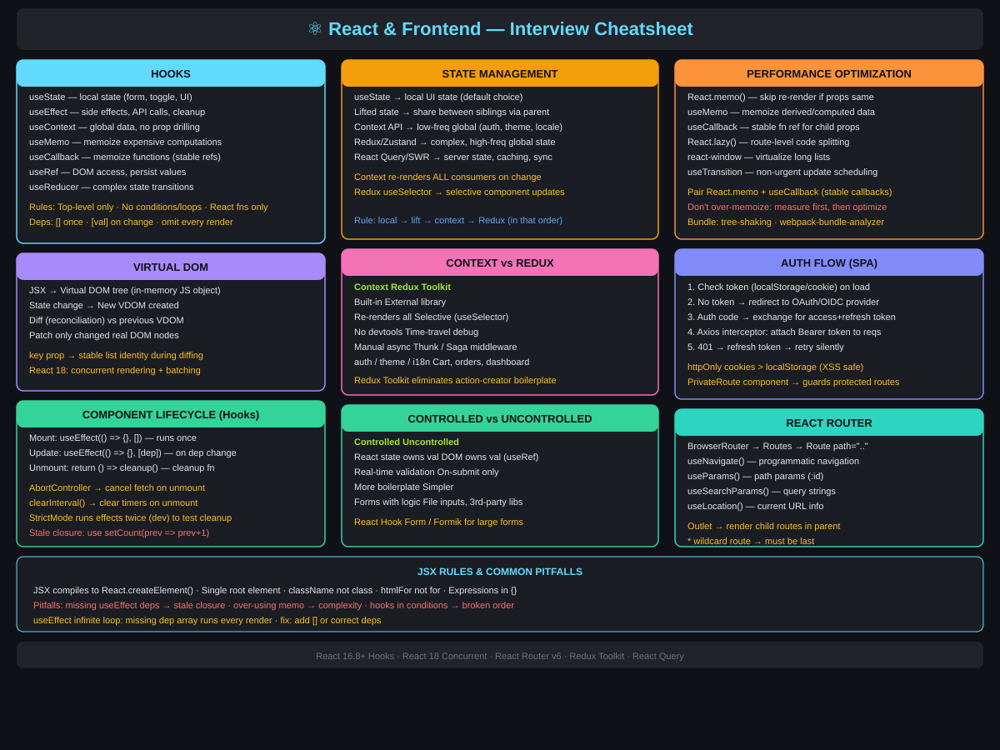

# React & Frontend

---

> 📌 **Visual Reference (Option 1 — SVG Cheatsheet):** [](../assets/images/react-frontend-cheatsheet.svg)

---

> 📌 **Visual Reference (Option 2 — Mermaid Mind Map):**
>
> ```mermaid
> mindmap
>   root((⚛ React))
>     Hooks
>       useState · local state
>       useEffect · side effects / cleanup
>       useContext · global data
>       useMemo · memoize values
>       useCallback · memoize functions
>       useRef · DOM / persist values
>       useReducer · complex state
>     Virtual DOM
>       JSX → VDOM tree
>       Diff reconciliation
>       Patch real DOM only
>       key prop for lists
>     Lifecycle
>       Mount · useEffect with []
>       Update · useEffect with [dep]
>       Unmount · cleanup return fn
>     State Management
>       useState → local
>       Lift → siblings
>       Context → low-freq global
>       Redux Toolkit → high-freq global
>       React Query → server state
>     Performance
>       React.memo · skip re-render
>       useMemo · derived data
>       useCallback · stable refs
>       React.lazy · code splitting
>       react-window · list virtual
>     Routing
>       BrowserRouter / Routes
>       useNavigate · useParams
>       useSearchParams · useLocation
>       Outlet for child routes
>     Auth Flow
>       Token check on load
>       OAuth OIDC redirect
>       Bearer token interceptor
>       httpOnly cookies preferred
> ```

---

## Q1: Explain React hooks. Which ones do you use most frequently?

**Answer:**

Hooks let you use state and lifecycle features in functional components (no class components needed).

| Hook | Purpose | When I Use It |
|------|---------|--------------|
| `useState` | Local state | Form inputs, toggles, UI state |
| `useEffect` | Side effects (API calls, subscriptions) | Fetching data on mount, cleanup on unmount |
| `useContext` | Access context without prop drilling | Theme, auth state, global config |
| `useMemo` | Memoize expensive computations | Filtering/sorting large lists |
| `useCallback` | Memoize functions | Preventing unnecessary re-renders in child components |
| `useRef` | Mutable ref that persists across renders | DOM access, storing previous values |
| `useReducer` | Complex state logic | State with multiple sub-values or complex transitions |

**Common mistakes:**
- Missing dependencies in `useEffect` → stale closures
- Over-using `useMemo`/`useCallback` → premature optimization, adds complexity
- Calling hooks inside conditions/loops → breaks hook ordering rules

---

## Q2: How do you manage state in a large React application?

**Answer:**

**State hierarchy:**

1. **Local state** (`useState`) — Component-specific UI state. Default choice.
2. **Lifted state** — Share state between siblings by lifting to parent.
3. **Context API** (`useContext`) — App-wide state like auth, theme, locale. Avoid for frequently changing data (causes re-renders of all consumers).
4. **External state management** (Redux, Zustand, Jotai) — Complex global state with frequent updates across many components.

**My approach:**
- Start with local state. Lift only when needed.
- Use Context for low-frequency global data (auth user, feature flags).
- Use Redux/Zustand only for genuinely global, frequently changing state.
- Keep server state in a data-fetching library (React Query / SWR) — don't duplicate API responses in Redux.

---

## Q3: How do you optimize React app performance?

**Answer:**

1. **Avoid unnecessary re-renders:**
   - `React.memo()` for pure components
   - `useMemo` / `useCallback` for expensive computations and callback props
   - Split large components into smaller ones with isolated state

2. **Code splitting:**
   - `React.lazy()` + `Suspense` for route-level code splitting
   - Dynamic imports for heavy components (charts, editors)

3. **Virtualization:**
   - Use `react-window` or `react-virtualized` for long lists (render only visible items)

4. **Bundle optimization:**
   - Tree shaking (ES modules)
   - Analyze bundle with `webpack-bundle-analyzer`
   - Lazy load images and non-critical resources

5. **Network:**
   - Debounce search inputs
   - Cache API responses (React Query, SWR)
   - Pagination / infinite scroll instead of loading all data

---

## Q4: Explain the component lifecycle in functional components (using hooks).

**Answer:**

```
Mount:
  → Component renders for the first time
  → useEffect(() => { ... }, [])    ← empty deps = runs once on mount

Update:
  → State or props change → re-render
  → useEffect(() => { ... }, [dep]) ← runs when `dep` changes

Unmount:
  → Component removed from DOM
  → useEffect cleanup: return () => { cleanup() }
```

**Example — API call with cleanup:**
```jsx
useEffect(() => {
    const controller = new AbortController();
    
    fetch('/api/data', { signal: controller.signal })
        .then(res => res.json())
        .then(setData)
        .catch(err => {
            if (err.name !== 'AbortError') setError(err);
        });
    
    return () => controller.abort(); // Cleanup on unmount
}, []);
```

---

## Q5: How do you handle authentication flow in a React SPA?

**Answer:**

**Flow:**
1. User hits the app → check for existing token (localStorage/cookie)
2. No token → redirect to identity provider (OAuth/OIDC login page)
3. Identity provider authenticates → returns authorization code
4. Exchange code for access token + refresh token
5. Store tokens securely → attach access token to API requests
6. Token expiry → use refresh token to get new access token silently

**Implementation pattern:**
- **AuthContext** — Wrap app in `<AuthProvider>` that manages auth state
- **Protected routes** — `<PrivateRoute>` component checks auth before rendering
- **HTTP interceptor** — Axios interceptor attaches `Authorization: Bearer <token>` to every request and handles 401 by refreshing token

**Security:**
- Store tokens in `httpOnly` cookies (preferred) or memory (not localStorage for sensitive apps)
- Validate token expiry client-side before API calls
- Clear tokens on logout

---

## Q6: What is JSX? Can React work without it?

**Answer:**

JSX is a syntax extension that lets you write HTML-like code in JavaScript. It compiles to `React.createElement()` calls.

```jsx
// JSX
const element = <h1 className="title">Hello</h1>;

// Compiles to
const element = React.createElement('h1', {className: 'title'}, 'Hello');
```

Yes, React can work without JSX — you'd use `React.createElement()` directly. But JSX is more readable and is the standard in practice.

**Key rules:** Must return single root element, use `className` not `class`, `htmlFor` not `for`, expressions in `{}`.

---

## Q7: Controlled vs Uncontrolled Components

**Answer:**

| Aspect | Controlled | Uncontrolled |
|--------|-----------|-------------|
| State managed by | React state (`useState`) | DOM (ref) |
| Value access | `value` prop | `ref.current.value` |
| Validation | On every change | On submit |
| Re-renders | On every keystroke | None until submit |

```jsx
// Controlled
const [name, setName] = useState('');
<input value={name} onChange={e => setName(e.target.value)} />

// Uncontrolled
const nameRef = useRef();
<input ref={nameRef} defaultValue="" />
// Access: nameRef.current.value
```

**Best practice:** Prefer controlled for forms that need real-time validation or dynamic behavior. Uncontrolled for simple forms or integrating with non-React libraries.

---

## Q8: React Router — client-side routing

**Answer:**

```jsx
import { BrowserRouter, Routes, Route, Navigate } from 'react-router-dom';

function App() {
    return (
        <BrowserRouter>
            <Routes>
                <Route path="/" element={<Home />} />
                <Route path="/users/:id" element={<UserDetail />} />
                <Route path="/admin" element={
                    <ProtectedRoute><Admin /></ProtectedRoute>
                } />
                <Route path="*" element={<Navigate to="/" />} />
            </Routes>
        </BrowserRouter>
    );
}
```

**Key hooks:** `useNavigate()` for programmatic navigation, `useParams()` for path params, `useSearchParams()` for query strings, `useLocation()` for current URL info.

**Nested routes:** Use `<Outlet />` in parent component to render child routes.

---

<!-- Source: react-interview-questions.txt, react-interview-answers.txt -->

## Q9: Virtual DOM : How React Minimizes Expensive DOM Operations

**Answer:**

**Virtual DOM** : an in-memory JavaScript representation of the real DOM tree --> React renders changes to the Virtual DOM first, diffs it against the previous snapshot (reconciliation), and only patches the real DOM where changes occurred --> eliminates unnecessary full re-renders.

Real DOM operations (adding/removing nodes, reflow, repaint) are expensive. Virtual DOM batches and minimizes these by computing the minimum diff needed.

```jsx
// React creates a Virtual DOM tree from JSX
function ProductCard({ name, price }) {
  return (
    <div className="card">
      <h2>{name}</h2>
      <span>${price}</span>
    </div>
  );
}

// When price changes, React:
// 1. Creates new VDOM: <span>$29</span>
// 2. Diffs against old VDOM: <span>$25</span>
// 3. Only patches: document.querySelector('span').textContent = '$29'
// Real DOM update is minimal : only the text node changed

// key prop: helps React identify list items during diffing
function OrderList({ orders }) {
  return (
    <ul>
      {orders.map(order => (
        <li key={order.id}>{order.name}</li> // key must be stable and unique
      ))}
    </ul>
  );
}
// Without key, React re-renders entire list on insert/delete
// With key, React identifies which items changed and only updates those
```

**Benefits / Trade-offs:** Virtual DOM batches updates and avoids full DOM rebuilds : significant for complex UIs. Trade-off: VDOM computation overhead is non-zero; for very simple apps, it adds cost without significant DOM savings. React 18 adds **concurrent rendering** which further improves scheduling of updates.

---

## Q10: React Hooks : useState, useEffect, useCallback, useMemo

**Answer:**

**React Hooks** : functions that let functional components use state and lifecycle features --> introduced in React 16.8 to replace class component boilerplate --> key hooks: `useState` (state), `useEffect` (side effects), `useCallback` (memoize functions), `useMemo` (memoize values).

```jsx
import { useState, useEffect, useCallback, useMemo, useRef } from 'react';

function OrderDashboard({ userId }) {
  // useState: local component state
  const [orders, setOrders] = useState([]);
  const [loading, setLoading] = useState(false);
  const [filter, setFilter] = useState('all');

  // useEffect: side effects : API calls, subscriptions, DOM manipulation
  useEffect(() => {
    setLoading(true);
    fetch(`/api/orders/${userId}`)
      .then(r => r.json())
      .then(data => { setOrders(data); setLoading(false); });
    
    return () => { /* cleanup: cancel pending request */ };
  }, [userId]); // re-run when userId changes

  // useMemo: expensive computation memoized by deps
  const filteredOrders = useMemo(() => {
    return filter === 'all'
      ? orders
      : orders.filter(o => o.status === filter);
  }, [orders, filter]); // only recomputes when orders or filter changes

  // useCallback: memoize event handler to prevent child re-renders
  const handleStatusChange = useCallback((orderId, newStatus) => {
    setOrders(prev => prev.map(o =>
      o.id === orderId ? { ...o, status: newStatus } : o
    ));
  }, []); // stable reference across renders

  // useRef: mutable ref that doesn't trigger re-render
  const inputRef = useRef(null);

  return loading ? <Spinner /> : (
    <OrderTable orders={filteredOrders} onStatusChange={handleStatusChange} />
  );
}
```

**Hook rules:**
- Only call hooks at the top level (not inside conditions/loops)
- Only call hooks from React functions or custom hooks
- Dependency arrays: empty `[]` = run once; `[value]` = run when value changes; omit = run every render

**Benefits / Trade-offs:** Hooks compose better than class lifecycle methods and enable code reuse via custom hooks. `useCallback`/`useMemo` prevent unnecessary re-renders but add overhead if overused : only memoize when you can measure a performance benefit.

---

## Q11: Redux vs React Context : State Management Comparison

**Answer:**

**React Context** : built-in mechanism for sharing state across component tree without prop drilling --> good for low-frequency, app-wide state (theme, user, language) --> triggers re-render for all consumers when value changes.

**Redux** : external state management library with single immutable store, reducers, and actions --> good for complex, frequently updated state with many components reading/writing --> devtools, time-travel debugging, middleware (redux-thunk, redux-saga).

```jsx
// Context: simple global state (theme, auth user)
const AuthContext = React.createContext(null);

function AuthProvider({ children }) {
  const [user, setUser] = useState(null);
  return (
    <AuthContext.Provider value={{ user, setUser }}>
      {children}
    </AuthContext.Provider>
  );
}

function Header() {
  const { user } = useContext(AuthContext); // reads from context
  return <h1>Welcome, {user?.name}</h1>;
}

// Redux (with Redux Toolkit : modern approach)
import { createSlice, configureStore } from '@reduxjs/toolkit';

const ordersSlice = createSlice({
  name: 'orders',
  initialState: { list: [], loading: false },
  reducers: {
    setOrders: (state, action) => { state.list = action.payload; },
    setLoading: (state, action) => { state.loading = action.payload; }
  }
});

const store = configureStore({ reducer: { orders: ordersSlice.reducer } });

// Component reads from Redux
function OrderCount() {
  const count = useSelector(state => state.orders.list.length);
  return <span>{count} orders</span>;
}
```

| Feature | Context | Redux |
|---------|---------|-------|
| Setup | Built-in | External library |
| Performance | Re-renders all consumers | Selective updates with `useSelector` |
| DevTools | None | Time-travel, action replay |
| Async actions | Manual (useEffect) | Middleware (thunk, saga) |
| Best for | Infrequent global state | Complex, high-frequency state |

**Benefits / Trade-offs:** Use Context for simple scenarios (theme, auth); Redux for large apps with complex state and many updates. Redux Toolkit eliminates old Redux boilerplate (no more action creators + constants).

---

## Q12: React Performance Optimization : React.memo, Code Splitting

**Answer:**

**React.memo** : HOC that memoizes a functional component --> skips re-render if props haven't changed --> uses shallow comparison by default --> pair with `useCallback` for callback props.

**Code Splitting** : lazy-load components with `React.lazy()` + `Suspense` --> reduces initial bundle size --> loads code on-demand.

```jsx
// React.memo: skip re-render if props unchanged
const ProductCard = React.memo(function ProductCard({ product, onBuy }) {
  console.log('ProductCard renders'); // won't log unless product or onBuy changes
  return (
    <div>
      <h3>{product.name}</h3>
      <button onClick={() => onBuy(product.id)}>Buy</button>
    </div>
  );
});

// Parent must stabilize callbacks with useCallback
function ShopPage() {
  const [cart, setCart] = useState([]);
  
  const handleBuy = useCallback((id) => {
    setCart(prev => [...prev, id]);
  }, []); // stable reference : ProductCard won't re-render unnecessarily
  
  return products.map(p => <ProductCard key={p.id} product={p} onBuy={handleBuy} />);
}

// Code Splitting: lazy load heavy components
const Dashboard = React.lazy(() => import('./Dashboard'));
const Reports = React.lazy(() => import('./Reports'));

function App() {
  return (
    <Suspense fallback={<LoadingSpinner />}>
      <Routes>
        <Route path="/dashboard" element={<Dashboard />} />
        <Route path="/reports" element={<Reports />} /> {/* loaded on demand */}
      </Routes>
    </Suspense>
  );
}
```

**Other optimizations:**
- `useMemo` for expensive derived data
- `useTransition` (React 18) for non-urgent updates
- `startTransition` for keeping UI responsive during heavy re-renders
- Virtualization (react-window) for long lists

**Benefits / Trade-offs:** `React.memo` + `useCallback` prevent cascade re-renders in deep component trees. Trade-off: added complexity; shallow comparison misses deep object changes : custom `areEqual` function may be needed.

---

## Q13: Controlled vs Uncontrolled Components in React

**Answer:**

**Controlled component** : form input value is controlled by React state --> single source of truth --> every keystroke updates state --> enables real-time validation, conditional rendering based on input.

**Uncontrolled component** : input maintains its own DOM state --> React reads via `useRef` when needed --> simpler for file inputs and third-party integrations.

```jsx
// Controlled: React owns the value
function LoginForm() {
  const [form, setForm] = useState({ email: '', password: '' });
  const [errors, setErrors] = useState({});

  const handleChange = (e) => {
    const { name, value } = e.target;
    setForm(prev => ({ ...prev, [name]: value }));
    // Real-time validation as user types
    if (name === 'email' && !value.includes('@'))
      setErrors(prev => ({ ...prev, email: 'Invalid email' }));
    else
      setErrors(prev => ({ ...prev, email: '' }));
  };

  return (
    <form>
      <input name="email" value={form.email} onChange={handleChange} />
      {errors.email && <span>{errors.email}</span>}
      <input name="password" type="password" value={form.password} onChange={handleChange} />
    </form>
  );
}

// Uncontrolled: DOM owns the value, React reads when needed
function FileUploader() {
  const fileRef = useRef(null);

  const handleSubmit = () => {
    const file = fileRef.current.files[0]; // read DOM directly
    uploadFile(file);
  };

  return (
    <>
      <input type="file" ref={fileRef} /> {/* uncontrolled : DOM manages value */}
      <button onClick={handleSubmit}>Upload</button>
    </>
  );
}
```

| Feature | Controlled | Uncontrolled |
|---------|-----------|--------------|
| Value source | React state | DOM |
| Validation | Real-time | On submit |
| Boilerplate | More | Less |
| Use for | Forms with validation | File inputs, simple forms |

**Benefits / Trade-offs:** Controlled components are predictable and testable : always reflects state. Uncontrolled is simpler for non-interactive inputs. Use React Hook Form or Formik for large forms to reduce boilerplate while keeping controlled behavior.

---

## Q14: useEffect Cleanup and Common Pitfalls

**Answer:**

**`useEffect` cleanup** : the function returned from useEffect runs before the next effect execution and on component unmount --> prevents memory leaks from subscriptions, timers, and pending requests.

Common pitfalls: infinite loops (missing/wrong deps), stale closures (closure captures old state), missing cleanup (memory leaks), running effects unnecessarily.

```jsx
function DataTable({ endpoint, refreshInterval }) {

  const [data, setData] = useState([]);

  // Pitfall: infinite loop : no dependency array
  // useEffect(() => { fetch(endpoint).then(...); }); // runs every render!

  // Correct: with cleanup for abort + interval
  useEffect(() => {
    const controller = new AbortController();
    let intervalId;

    const fetchData = async () => {
      try {
        const res = await fetch(endpoint, { signal: controller.signal });
        setData(await res.json());
      } catch (e) {
        if (e.name !== 'AbortError') console.error(e);
      }
    };

    fetchData(); // initial fetch
    if (refreshInterval) {
      intervalId = setInterval(fetchData, refreshInterval);
    }

    return () => {
      controller.abort();           // cancel pending fetch
      clearInterval(intervalId);    // clear interval
      // Cleanup prevents: memory leaks, setState on unmounted component
    };
  }, [endpoint, refreshInterval]); // re-run when these change

  // Stale closure pitfall
  const [count, setCount] = useState(0);
  useEffect(() => {
    const id = setInterval(() => {
      // setCount(count + 1); // STALE: always uses initial count (0)
      setCount(prev => prev + 1); // CORRECT: functional update avoids staleness
    }, 1000);
    return () => clearInterval(id);
  }, []); // intentionally empty : functional update handles stale state

  return <Table data={data} />;
}
```

**Benefits / Trade-offs:** Cleanup prevents memory leaks and ghost state updates. Use `AbortController` for fetch cancellation. React StrictMode runs effects twice in development to expose cleanup issues.

---

## Q15: Angular AuthGuard : Route Protection and Role-Based Access

**Answer:**

An `AuthGuard` implements `CanActivate` to protect routes. If the guard returns `false`, navigation is blocked and user can be redirected to login.

```typescript
// auth.guard.ts
import { Injectable } from '@angular/core';
import { CanActivate, ActivatedRouteSnapshot, RouterStateSnapshot, Router } from '@angular/router';
import { AuthService } from './auth.service';

@Injectable({ providedIn: 'root' })
export class AuthGuard implements CanActivate {
  constructor(private auth: AuthService, private router: Router) {}

  canActivate(route: ActivatedRouteSnapshot, state: RouterStateSnapshot): boolean {
    if (this.auth.isLoggedIn()) {
      // Role-based check
      const requiredRole = route.data['role'];
      if (requiredRole && !this.auth.hasRole(requiredRole)) {
        this.router.navigate(['/unauthorized']);
        return false;
      }
      return true;
    }
    // Preserve attempted URL for post-login redirect
    this.router.navigate(['/login'], { queryParams: { returnUrl: state.url } });
    return false;
  }
}
```

```typescript
// app-routing.module.ts : apply guard to routes
const routes: Routes = [
  {
    path: 'admin',
    component: AdminComponent,
    canActivate: [AuthGuard],
    data: { role: 'ADMIN' }
  },
  { path: 'dashboard', component: DashboardComponent, canActivate: [AuthGuard] }
];
```

**Benefits:** Declarative route protection, reusable, role metadata on route config. Trade-off: Guard checks are client-side only : always enforce authorization server-side as well.

---

## Q16: Custom Angular Pipe

**Answer:**

Pipes transform displayed values in templates. Create custom pipes by implementing `PipeTransform`.

```bash
ng generate pipe truncate  # creates truncate.pipe.ts
```

```typescript
// truncate.pipe.ts
import { Pipe, PipeTransform } from '@angular/core';

@Pipe({ name: 'truncate' })
export class TruncatePipe implements PipeTransform {
  transform(value: string, maxLength: number = 50, suffix: string = '...'): string {
    if (!value) return '';
    return value.length <= maxLength ? value : value.substring(0, maxLength) + suffix;
  }
}
```

```typescript
// app.module.ts : register in declarations
@NgModule({
  declarations: [AppComponent, TruncatePipe],
  ...
})
export class AppModule {}
```

```html
<!-- template usage -->
<p>{{ longDescription | truncate:100:'...' }}</p>
<p>{{ name | truncate }}</p>  <!-- uses defaults: 50 chars -->
```

**Benefits:** Reusable, declarative transformations in templates. Pure pipes (default) are only re-evaluated when input reference changes : efficient for performance.

---

## Q17: Observable vs Promise : 7 Key Differences

**Answer:**

| Feature | Observable (RxJS) | Promise |
|---------|-------------------|---------|
| **Values** | Multiple values over time (stream) | Single value (one-time) |
| **Execution** | Lazy : only runs on subscribe | Eager : runs immediately on creation |
| **Cancellation** | Cancellable via `unsubscribe()` | Cannot be cancelled |
| **Operators** | Rich: `map`, `filter`, `switchMap`, `debounce`, `retry`, etc. | None built-in |
| **Error handling** | `catchError()` operator, `error` callback, `retry()` | `.catch()` / `try-catch` with async/await |
| **Backpressure** | Supports via `throttle`, `debounce`, `buffer` | No built-in support |
| **Dependency** | Requires RxJS library | Built into JavaScript (ES6+) |

```typescript
// Promise : single value, eager
const promise = fetch('/api/user').then(r => r.json()); // starts immediately

// Observable : lazy, cancellable, operators
const user$ = this.http.get('/api/user').pipe(
  map(r => r as User),
  catchError(err => of(null))
);
const sub = user$.subscribe(user => this.user = user);
// Later: sub.unsubscribe();

// Sequential API calls with switchMap (response 1 feeds into call 2)
this.http.get('/api/order/1').pipe(
  switchMap((order: any) => this.http.get(`/api/user/${order.userId}`))
).subscribe(user => console.log(user));
```

**Rule of thumb:** Use Observable in Angular (HTTP, forms, events). Use Promise for simple one-off async work or when integrating with non-RxJS libraries.

---

## Q18: Angular @Input and @Output : Parent-Child Communication

**Answer:**

Angular uses unidirectional data flow: parent --> child via `@Input`, child --> parent via `@Output` + `EventEmitter`.

```typescript
// child.component.ts
import { Component, Input, Output, EventEmitter } from '@angular/core';

@Component({
  selector: 'app-child',
  template: `
    <p>Hello {{ name }}!</p>
    <button (click)="sendMessage()">Send to Parent</button>
  `
})
export class ChildComponent {
  @Input() name: string = '';          // parent passes data in
  @Output() messageSent = new EventEmitter<string>(); // child emits event out

  sendMessage() {
    this.messageSent.emit('Hello from child!');
  }
}
```

```typescript
// parent.component.ts
@Component({
  selector: 'app-parent',
  template: `
    <app-child [name]="parentName" (messageSent)="onMessage($event)"></app-child>
    <p>Child said: {{ childMessage }}</p>
  `
})
export class ParentComponent {
  parentName = 'Alice';
  childMessage = '';

  onMessage(msg: string) { this.childMessage = msg; }
}
```

**Benefits:** Explicit, traceable data flow. Prevents accidental parent state mutation. Trade-off: Deep component trees require state management (NgRx/Signals) to avoid prop-drilling.

---

## Q19: Angular Routing : Router Setup, RouterLink, and Child Routes

**Answer:**

```typescript
// app-routing.module.ts
import { NgModule } from '@angular/core';
import { RouterModule, Routes } from '@angular/router';

const routes: Routes = [
  { path: '', component: HomeComponent },
  { path: 'about', component: AboutComponent },
  {
    path: 'dashboard',
    component: DashboardComponent,
    canActivate: [AuthGuard],
    children: [
      { path: 'profile', component: ProfileComponent },
      { path: 'settings', component: SettingsComponent },
      { path: '', redirectTo: 'profile', pathMatch: 'full' }
    ]
  },
  { path: '**', component: NotFoundComponent }  // wildcard fallback
];

@NgModule({
  imports: [RouterModule.forRoot(routes)],
  exports: [RouterModule]
})
export class AppRoutingModule {}
```

```html
<!-- app.component.html : root outlet -->
<nav>
  <a routerLink="/">Home</a>
  <a routerLink="/about" routerLinkActive="active">About</a>
  <a routerLink="/dashboard">Dashboard</a>
</nav>
<router-outlet></router-outlet>

<!-- dashboard.component.html : nested outlet for child routes -->
<nav>
  <a routerLink="profile">Profile</a>
  <a routerLink="settings">Settings</a>
</nav>
<router-outlet></router-outlet>  <!-- child components render here -->
```

**Key points:** `RouterModule.forRoot()` for root; `RouterModule.forChild()` in feature modules. `routerLinkActive` adds CSS class on active route. `**` wildcard must be last. Child routes render inside the parent component's `<router-outlet>`.

