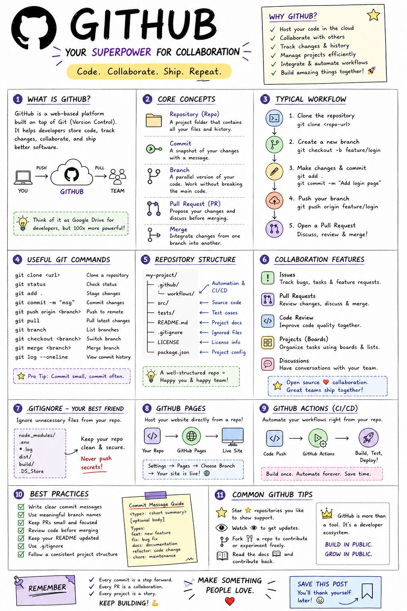

# DevOps, CI/CD & Containers

> 📌 **Visual Reference:** [](../assets/images/github-deep-dive.jpg)

---

## Q1: Describe your CI/CD pipeline. What are the key stages?

**Answer:**

**Typical pipeline:**

```
Code Push → Build → Test → Security Scan → Deploy to Staging → Integration Test → Deploy to Prod
```

**Stages in detail:**

| Stage | What Happens | Tools |
|-------|-------------|-------|
| **Build** | Compile, resolve dependencies, create artifact (JAR/Docker image) | Maven/Gradle, Docker |
| **Unit Tests** | Run unit tests, check coverage threshold | JUnit, Jest, JaCoCo |
| **Static Analysis** | Code quality, linting, style checks | SonarQube, ESLint, Checkstyle |
| **Security Scan** | Dependency CVE scan, SAST | Dependabot, Snyk, Veracode |
| **Artifact Publish** | Push Docker image to registry, JAR to artifact repo | ECR, Nexus, JFrog |
| **Deploy to Staging** | Deploy to staging/CERT environment | CloudFormation, Terraform, CDK |
| **Integration Tests** | End-to-end tests against staging | Custom test suites, Postman |
| **Deploy to Prod** | Blue-green or rolling deployment to production | ECS rolling update, CodeDeploy |

**Key principles:**
- **Fast feedback** — Unit tests and static analysis run first (< 5 min). Slow tests run later.
- **Immutable artifacts** — Same Docker image promoted from staging to prod. No rebuilding.
- **Automated rollback** — If health checks fail post-deploy, auto-rollback to previous version.
- **No manual gates for non-breaking changes** — Manual approval only for breaking changes or infra modifications.

---

## Q2: Explain Docker containerization. How do you write a production-grade Dockerfile?

**Answer:**

**Why containers:**
- Consistent environment (dev = staging = prod)
- Isolation between services
- Fast startup, lightweight (vs. VMs)
- Works with orchestrators (ECS, Kubernetes) for scaling

**Production Dockerfile best practices:**

```dockerfile
# Multi-stage build — keep final image small
FROM maven:3.9-eclipse-temurin-21 AS build
WORKDIR /app
COPY pom.xml .
RUN mvn dependency:go-offline          # Cache dependencies
COPY src ./src
RUN mvn package -DskipTests

FROM eclipse-temurin:21-jre-alpine     # Minimal JRE base image
WORKDIR /app
COPY --from=build /app/target/*.jar app.jar

# Non-root user for security
RUN addgroup -S appgroup && adduser -S appuser -G appgroup
USER appuser

EXPOSE 8080
ENTRYPOINT ["java", "-jar", "app.jar"]
```

**Key practices:**
- **Multi-stage builds** — Build in one stage, run in a minimal image. Reduces image size 5-10x.
- **Non-root user** — Never run as root in production.
- **Layer caching** — `COPY pom.xml` before `COPY src` so dependency download is cached.
- **Minimal base image** — Use `alpine` or `distroless` variants.
- **No secrets in image** — Use environment variables or secrets manager at runtime.

---

## Q3: What deployment strategies do you use? Explain trade-offs.

**Answer:**

| Strategy | How It Works | Pros | Cons |
|----------|-------------|------|------|
| **Rolling** | Replace instances one by one | Zero downtime, simple | Both versions run simultaneously during deploy |
| **Blue-Green** | Two identical environments. Switch traffic atomically. | Instant rollback (switch back) | 2x infrastructure cost during deploy |
| **Canary** | Route small % of traffic to new version, gradually increase | Early detection of issues | Complex routing setup |
| **Recreate** | Kill all old, deploy all new | Simple, no version mixing | Downtime |

**What I use:**
- **ECS rolling update** for API services — minimumHealthyPercent=100, maximumPercent=200. New tasks start before old ones stop.
- **Blue-Green via ALB** for critical services — Two target groups, weighted routing. Instant cutover.
- **Canary** for high-risk changes — Route 5% traffic to new version, monitor error rates, then scale up.

---

## Q4: How do you handle infrastructure as code?

**Answer:**

**Tools:**
- **CloudFormation / CDK** — AWS-native. CDK lets you write infra in Java/TypeScript instead of YAML.
- **Terraform** — Cloud-agnostic. HCL syntax. Good for multi-cloud or complex setups.

**Principles:**
- **Everything in version control** — Infra changes go through PR review, same as code.
- **Environment parity** — Same templates for dev, staging, prod with parameter overrides.
- **State management** — Terraform state in S3 with DynamoDB locking. Never local state in production.
- **Modularity** — Reusable modules for common patterns (ECS service, SQS queue, RDS instance).
- **Drift detection** — Periodic checks that actual infra matches declared state.

---

## Q5: How do you monitor containerized applications in production?

**Answer:**

**Three pillars of observability:**

| Pillar | What It Answers | Tools |
|--------|----------------|-------|
| **Logs** | What happened? | CloudWatch Logs, ELK Stack |
| **Metrics** | How is the system performing? | CloudWatch Metrics, Prometheus + Grafana |
| **Traces** | Where is the bottleneck in a request? | AWS X-Ray, OpenTelemetry |

**Key metrics to monitor:**
- **Application:** Error rate, latency (p50, p95, p99), request count
- **Container:** CPU %, memory %, task count, restarts
- **Queue:** SQS queue depth, age of oldest message, DLQ count
- **Database:** Connection count, query latency, replication lag
- **Cache:** Hit ratio, evictions, connection count

**Alerting strategy:**
- Alert on **symptoms** (error rate > 1%, p99 > 5s), not causes
- Use **runbooks** linked in alerts — when alert fires, engineer knows what to check
- Avoid alert fatigue — every alert should be actionable

---

<!-- Source: github-action-java-tests.txt, cloudformation-to-terraform.txt -->

## Q6: GitHub Actions : CI/CD Pipeline for Java Spring Boot Projects

**Answer:**

**GitHub Actions** : native CI/CD built into GitHub repositories --> workflows defined as YAML files in `.github/workflows/` --> triggered by events (push, PR, schedule, manual) --> runs in GitHub-hosted or self-hosted runners --> free for public repos, usage-based for private.

```yaml
# .github/workflows/ci.yml : Java Spring Boot CI pipeline
name: CI - Build and Test

on:
  push:
    branches: [main, develop]
  pull_request:
    branches: [main]

jobs:
  build-and-test:
    runs-on: ubuntu-latest
    
    services:
      # Spin up PostgreSQL for integration tests
      postgres:
        image: postgres:15
        env:
          POSTGRES_USER: testuser
          POSTGRES_PASSWORD: testpass
          POSTGRES_DB: testdb
        ports:
          - 5432:5432
        options: >-
          --health-cmd pg_isready
          --health-interval 10s
          --health-timeout 5s
          --health-retries 5

    steps:
      - name: Checkout code
        uses: actions/checkout@v4

      - name: Set up Java 21
        uses: actions/setup-java@v4
        with:
          java-version: '21'
          distribution: 'temurin'
          cache: maven    # caches ~/.m2 between runs

      - name: Build and test
        run: mvn clean verify
        env:
          SPRING_DATASOURCE_URL: jdbc:postgresql://localhost:5432/testdb
          SPRING_DATASOURCE_USERNAME: testuser
          SPRING_DATASOURCE_PASSWORD: testpass

      - name: Publish test results
        uses: dorny/test-reporter@v1
        if: always()
        with:
          name: JUnit Tests
          path: target/surefire-reports/*.xml
          reporter: java-junit

      - name: Build Docker image
        if: github.ref == 'refs/heads/main'
        run: |
          docker build -t myapp:${{ github.sha }} .
          
      - name: Push to ECR
        if: github.ref == 'refs/heads/main'
        env:
          AWS_ACCESS_KEY_ID: ${{ secrets.AWS_ACCESS_KEY_ID }}
          AWS_SECRET_ACCESS_KEY: ${{ secrets.AWS_SECRET_ACCESS_KEY }}
        run: |
          aws ecr get-login-password --region us-east-1 | \
            docker login --username AWS --password-stdin 123456789.dkr.ecr.us-east-1.amazonaws.com
          docker tag myapp:${{ github.sha }} 123456789.dkr.ecr.us-east-1.amazonaws.com/myapp:${{ github.sha }}
          docker push 123456789.dkr.ecr.us-east-1.amazonaws.com/myapp:${{ github.sha }}
```

**Key concepts:**
- **Workflow** : YAML file defining the automation (`on:` trigger + `jobs:`)
- **Job** : a unit of work that runs on a runner (`runs-on:`)
- **Step** : individual task within a job (actions or shell commands)
- **Secrets** : encrypted config (`${{ secrets.NAME }}`) : never hardcode credentials
- **Actions** : reusable components from GitHub Marketplace (`actions/setup-java@v4`)

**Benefits / Trade-offs:** Native Git integration, no separate CI server to maintain, free for open source. Trade-off: 2000 free minutes/month for private repos; complex pipelines can be slower than Jenkins due to cold start; limited build matrix parallelism on free tier.

---

## Q7: GitHub Actions : Advanced Patterns (Matrix, Caching, Environments)

**Answer:**

**Matrix strategy** : runs same job across multiple configurations (Java versions, OS, environments) in parallel --> `strategy.matrix` defines variables --> GitHub creates N jobs automatically.

```yaml
# Matrix: test across multiple Java versions + OS
jobs:
  test:
    strategy:
      matrix:
        java-version: [17, 21]
        os: [ubuntu-latest, windows-latest]
      fail-fast: false   # all matrix runs complete even if one fails

    runs-on: ${{ matrix.os }}
    
    steps:
      - uses: actions/checkout@v4
      - name: Set up Java ${{ matrix.java-version }}
        uses: actions/setup-java@v4
        with:
          java-version: ${{ matrix.java-version }}
          distribution: 'temurin'

      - name: Test
        run: mvn test
        
# Environments (for deployment approvals)
  deploy-prod:
    needs: [build-and-test]
    environment:
      name: production       # requires manual approval in GitHub UI
      url: https://myapp.com
    runs-on: ubuntu-latest
    steps:
      - name: Deploy
        run: ./deploy.sh
        
# Reusable workflow : call from other repos
  call-shared-pipeline:
    uses: my-org/shared-workflows/.github/workflows/java-build.yml@main
    with:
      java-version: '21'
    secrets: inherit
```

**Dependency between jobs:**
```yaml
jobs:
  build:   { ... }
  test:
    needs: build   # waits for build to complete
  deploy:
    needs: [build, test]   # waits for both
```

**Benefits / Trade-offs:** Matrix builds catch cross-environment issues early. Reusable workflows enforce standards across teams. Trade-off: matrix increases runner consumption; complex dependency graphs can be hard to debug.

---

## Q8: Infrastructure as Code : Terraform Workflow and AWS Integration

**Answer:**

**Terraform** : HashiCorp IaC tool using HCL (HashiCorp Configuration Language) --> declarative: describe desired state, Terraform figures out how to reach it --> plan/apply workflow: preview changes before applying --> state file tracks what's deployed.

**Core workflow:** `init` --> `plan` --> `apply` --> `destroy`

```hcl
# main.tf : AWS ECS Fargate service
terraform {
  required_version = ">= 1.5"
  required_providers {
    aws = { source = "hashicorp/aws", version = "~> 5.0" }
  }
  # Remote state: team collaboration + state locking
  backend "s3" {
    bucket         = "my-terraform-state"
    key            = "prod/main.tfstate"
    region         = "us-east-1"
    dynamodb_table = "terraform-state-lock"  # prevents concurrent applies
    encrypt        = true
  }
}

provider "aws" { region = "us-east-1" }

# Variables
variable "environment" { default = "production" }
variable "app_image"   { type = string }

# ECS Cluster
resource "aws_ecs_cluster" "main" {
  name = "app-cluster-${var.environment}"
}

# ECS Task Definition
resource "aws_ecs_task_definition" "app" {
  family                   = "app-${var.environment}"
  network_mode             = "awsvpc"
  requires_compatibilities = ["FARGATE"]
  cpu                      = "512"
  memory                   = "1024"
  
  container_definitions = jsonencode([{
    name  = "app"
    image = var.app_image
    portMappings = [{ containerPort = 8080 }]
    environment = [
      { name = "SPRING_PROFILES_ACTIVE", value = var.environment }
    ]
  }])
}

# Output: share values between modules
output "cluster_arn" {
  value = aws_ecs_cluster.main.arn
}
```

```bash
# Terraform workflow
terraform init                    # download providers, initialize backend
terraform plan -var="app_image=myapp:v2.0"  # preview changes
terraform apply -auto-approve     # apply (auto-approve in CI/CD)
terraform destroy                 # tear down (careful in prod!)
```

**Terraform in CI/CD (GitHub Actions):**
```yaml
- name: Terraform Plan
  run: terraform plan -out=tfplan
  
- name: Terraform Apply (main branch only)
  if: github.ref == 'refs/heads/main'
  run: terraform apply tfplan
```

**Benefits / Trade-offs:** Terraform provides reproducible infrastructure, state tracking, and multi-cloud support. Trade-off: state management complexity (remote backend + locking required for teams); drift detection (resources modified outside Terraform break sync); plan must be reviewed carefully before apply.

---

## Q9: Docker + Kubernetes : Containerization for Java Spring Boot

**Answer:**

**Docker** : packages application + dependencies into a portable container image --> runs consistently across any environment (dev, staging, prod) --> `Dockerfile` defines the build recipe.

**Kubernetes (K8s)** : orchestrates containers across a cluster --> handles deployment, scaling, self-healing, load balancing, rolling updates.

```dockerfile
# Multi-stage Dockerfile: build + lean runtime image
# Stage 1: Build
FROM eclipse-temurin:21-jdk AS builder
WORKDIR /app
COPY pom.xml .
RUN mvn dependency:resolve -q    # cache deps layer
COPY src ./src
RUN mvn package -DskipTests -q

# Stage 2: Lean runtime (no JDK, just JRE)
FROM eclipse-temurin:21-jre
WORKDIR /app
COPY --from=builder /app/target/app.jar ./app.jar
EXPOSE 8080
# Run as non-root user (security best practice)
RUN addgroup --system appgroup && adduser --system appuser --ingroup appgroup
USER appuser
ENTRYPOINT ["java", "-XX:+UseContainerSupport", "-jar", "app.jar"]
```

```yaml
# Kubernetes Deployment + Service
apiVersion: apps/v1
kind: Deployment
metadata:
  name: order-service
spec:
  replicas: 3
  selector:
    matchLabels:
      app: order-service
  template:
    metadata:
      labels:
        app: order-service
    spec:
      containers:
        - name: order-service
          image: 123456789.dkr.ecr.us-east-1.amazonaws.com/order-service:v2.0
          ports:
            - containerPort: 8080
          resources:
            requests: { cpu: "250m", memory: "512Mi" }
            limits:   { cpu: "500m", memory: "1Gi" }
          readinessProbe:
            httpGet: { path: /actuator/health, port: 8080 }
            initialDelaySeconds: 30
          livenessProbe:
            httpGet: { path: /actuator/health/liveness, port: 8080 }
            
---
apiVersion: v1
kind: Service
metadata:
  name: order-service
spec:
  selector:
    app: order-service
  ports:
    - port: 80
      targetPort: 8080
  type: ClusterIP
```

**Benefits / Trade-offs:** Docker ensures environment consistency and fast reproducible builds. K8s provides resilience, auto-scaling, and zero-downtime deployments. Trade-off: K8s has steep learning curve; resource overhead; local dev complexity (use Minikube/Kind); debugging distributed failures in K8s requires expertise.

---

<!-- Source: github-action-java-tests.txt, cloudformation-to-terraform.txt -->

## Q6: GitHub Actions : CI/CD Pipeline for Java Spring Boot Projects

**Answer:**

**GitHub Actions** : native CI/CD built into GitHub repositories --> workflows defined as YAML files in `.github/workflows/` --> triggered by events (push, PR, schedule, manual) --> runs in GitHub-hosted or self-hosted runners --> free for public repos, usage-based for private.

```yaml
# .github/workflows/ci.yml : Java Spring Boot CI pipeline
name: CI - Build and Test

on:
  push:
    branches: [main, develop]
  pull_request:
    branches: [main]

jobs:
  build-and-test:
    runs-on: ubuntu-latest
    
    services:
      # Spin up PostgreSQL for integration tests
      postgres:
        image: postgres:15
        env:
          POSTGRES_USER: testuser
          POSTGRES_PASSWORD: testpass
          POSTGRES_DB: testdb
        ports:
          - 5432:5432
        options: >-
          --health-cmd pg_isready
          --health-interval 10s
          --health-timeout 5s
          --health-retries 5

    steps:
      - name: Checkout code
        uses: actions/checkout@v4

      - name: Set up Java 21
        uses: actions/setup-java@v4
        with:
          java-version: '21'
          distribution: 'temurin'
          cache: maven    # caches ~/.m2 between runs

      - name: Build and test
        run: mvn clean verify
        env:
          SPRING_DATASOURCE_URL: jdbc:postgresql://localhost:5432/testdb
          SPRING_DATASOURCE_USERNAME: testuser
          SPRING_DATASOURCE_PASSWORD: testpass

      - name: Publish test results
        uses: dorny/test-reporter@v1
        if: always()
        with:
          name: JUnit Tests
          path: target/surefire-reports/*.xml
          reporter: java-junit

      - name: Build Docker image
        if: github.ref == 'refs/heads/main'
        run: |
          docker build -t myapp:${{ github.sha }} .
          
      - name: Push to ECR
        if: github.ref == 'refs/heads/main'
        env:
          AWS_ACCESS_KEY_ID: ${{ secrets.AWS_ACCESS_KEY_ID }}
          AWS_SECRET_ACCESS_KEY: ${{ secrets.AWS_SECRET_ACCESS_KEY }}
        run: |
          aws ecr get-login-password --region us-east-1 | \
            docker login --username AWS --password-stdin 123456789.dkr.ecr.us-east-1.amazonaws.com
          docker tag myapp:${{ github.sha }} 123456789.dkr.ecr.us-east-1.amazonaws.com/myapp:${{ github.sha }}
          docker push 123456789.dkr.ecr.us-east-1.amazonaws.com/myapp:${{ github.sha }}
```

**Key concepts:**
- **Workflow** : YAML file defining the automation (`on:` trigger + `jobs:`)
- **Job** : a unit of work that runs on a runner (`runs-on:`)
- **Step** : individual task within a job (actions or shell commands)
- **Secrets** : encrypted config (`${{ secrets.NAME }}`) : never hardcode credentials
- **Actions** : reusable components from GitHub Marketplace (`actions/setup-java@v4`)

**Benefits / Trade-offs:** Native Git integration, no separate CI server to maintain, free for open source. Trade-off: 2000 free minutes/month for private repos; complex pipelines can be slower than Jenkins due to cold start; limited build matrix parallelism on free tier.

---

## Q7: GitHub Actions : Advanced Patterns (Matrix, Caching, Environments)

**Answer:**

**Matrix strategy** : runs same job across multiple configurations (Java versions, OS, environments) in parallel --> `strategy.matrix` defines variables --> GitHub creates N jobs automatically.

```yaml
# Matrix: test across multiple Java versions + OS
jobs:
  test:
    strategy:
      matrix:
        java-version: [17, 21]
        os: [ubuntu-latest, windows-latest]
      fail-fast: false   # all matrix runs complete even if one fails

    runs-on: ${{ matrix.os }}
    
    steps:
      - uses: actions/checkout@v4
      - name: Set up Java ${{ matrix.java-version }}
        uses: actions/setup-java@v4
        with:
          java-version: ${{ matrix.java-version }}
          distribution: 'temurin'

      - name: Test
        run: mvn test
        
# Environments (for deployment approvals)
  deploy-prod:
    needs: [build-and-test]
    environment:
      name: production       # requires manual approval in GitHub UI
      url: https://myapp.com
    runs-on: ubuntu-latest
    steps:
      - name: Deploy
        run: ./deploy.sh
        
# Reusable workflow : call from other repos
  call-shared-pipeline:
    uses: my-org/shared-workflows/.github/workflows/java-build.yml@main
    with:
      java-version: '21'
    secrets: inherit
```

**Dependency between jobs:**
```yaml
jobs:
  build:   { ... }
  test:
    needs: build   # waits for build to complete
  deploy:
    needs: [build, test]   # waits for both
```

**Benefits / Trade-offs:** Matrix builds catch cross-environment issues early. Reusable workflows enforce standards across teams. Trade-off: matrix increases runner consumption; complex dependency graphs can be hard to debug.

---

## Q8: Infrastructure as Code : Terraform Workflow and AWS Integration

**Answer:**

**Terraform** : HashiCorp IaC tool using HCL (HashiCorp Configuration Language) --> declarative: describe desired state, Terraform figures out how to reach it --> plan/apply workflow: preview changes before applying --> state file tracks what's deployed.

**Core workflow:** `init` --> `plan` --> `apply` --> `destroy`

```hcl
# main.tf : AWS ECS Fargate service
terraform {
  required_version = ">= 1.5"
  required_providers {
    aws = { source = "hashicorp/aws", version = "~> 5.0" }
  }
  # Remote state: team collaboration + state locking
  backend "s3" {
    bucket         = "my-terraform-state"
    key            = "prod/main.tfstate"
    region         = "us-east-1"
    dynamodb_table = "terraform-state-lock"  # prevents concurrent applies
    encrypt        = true
  }
}

provider "aws" { region = "us-east-1" }

# Variables
variable "environment" { default = "production" }
variable "app_image"   { type = string }

# ECS Cluster
resource "aws_ecs_cluster" "main" {
  name = "app-cluster-${var.environment}"
}

# ECS Task Definition
resource "aws_ecs_task_definition" "app" {
  family                   = "app-${var.environment}"
  network_mode             = "awsvpc"
  requires_compatibilities = ["FARGATE"]
  cpu                      = "512"
  memory                   = "1024"
  
  container_definitions = jsonencode([{
    name  = "app"
    image = var.app_image
    portMappings = [{ containerPort = 8080 }]
    environment = [
      { name = "SPRING_PROFILES_ACTIVE", value = var.environment }
    ]
  }])
}

# Output: share values between modules
output "cluster_arn" {
  value = aws_ecs_cluster.main.arn
}
```

```bash
# Terraform workflow
terraform init                    # download providers, initialize backend
terraform plan -var="app_image=myapp:v2.0"  # preview changes
terraform apply -auto-approve     # apply (auto-approve in CI/CD)
terraform destroy                 # tear down (careful in prod!)
```

**Terraform in CI/CD (GitHub Actions):**
```yaml
- name: Terraform Plan
  run: terraform plan -out=tfplan
  
- name: Terraform Apply (main branch only)
  if: github.ref == 'refs/heads/main'
  run: terraform apply tfplan
```

**Benefits / Trade-offs:** Terraform provides reproducible infrastructure, state tracking, and multi-cloud support. Trade-off: state management complexity (remote backend + locking required for teams); drift detection (resources modified outside Terraform break sync); plan must be reviewed carefully before apply.

---

## Q9: Docker + Kubernetes : Containerization for Java Spring Boot

**Answer:**

**Docker** : packages application + dependencies into a portable container image --> runs consistently across any environment (dev, staging, prod) --> `Dockerfile` defines the build recipe.

**Kubernetes (K8s)** : orchestrates containers across a cluster --> handles deployment, scaling, self-healing, load balancing, rolling updates.

```dockerfile
# Multi-stage Dockerfile: build + lean runtime image
# Stage 1: Build
FROM eclipse-temurin:21-jdk AS builder
WORKDIR /app
COPY pom.xml .
RUN mvn dependency:resolve -q    # cache deps layer
COPY src ./src
RUN mvn package -DskipTests -q

# Stage 2: Lean runtime (no JDK, just JRE)
FROM eclipse-temurin:21-jre
WORKDIR /app
COPY --from=builder /app/target/app.jar ./app.jar
EXPOSE 8080
# Run as non-root user (security best practice)
RUN addgroup --system appgroup && adduser --system appuser --ingroup appgroup
USER appuser
ENTRYPOINT ["java", "-XX:+UseContainerSupport", "-jar", "app.jar"]
```

```yaml
# Kubernetes Deployment + Service
apiVersion: apps/v1
kind: Deployment
metadata:
  name: order-service
spec:
  replicas: 3
  selector:
    matchLabels:
      app: order-service
  template:
    metadata:
      labels:
        app: order-service
    spec:
      containers:
        - name: order-service
          image: 123456789.dkr.ecr.us-east-1.amazonaws.com/order-service:v2.0
          ports:
            - containerPort: 8080
          resources:
            requests: { cpu: "250m", memory: "512Mi" }
            limits:   { cpu: "500m", memory: "1Gi" }
          readinessProbe:
            httpGet: { path: /actuator/health, port: 8080 }
            initialDelaySeconds: 30
          livenessProbe:
            httpGet: { path: /actuator/health/liveness, port: 8080 }
            
---
apiVersion: v1
kind: Service
metadata:
  name: order-service
spec:
  selector:
    app: order-service
  ports:
    - port: 80
      targetPort: 8080
  type: ClusterIP
```

**Benefits / Trade-offs:** Docker ensures environment consistency and fast reproducible builds. K8s provides resilience, auto-scaling, and zero-downtime deployments. Trade-off: K8s has steep learning curve; resource overhead; local dev complexity (use Minikube/Kind); debugging distributed failures in K8s requires expertise.

