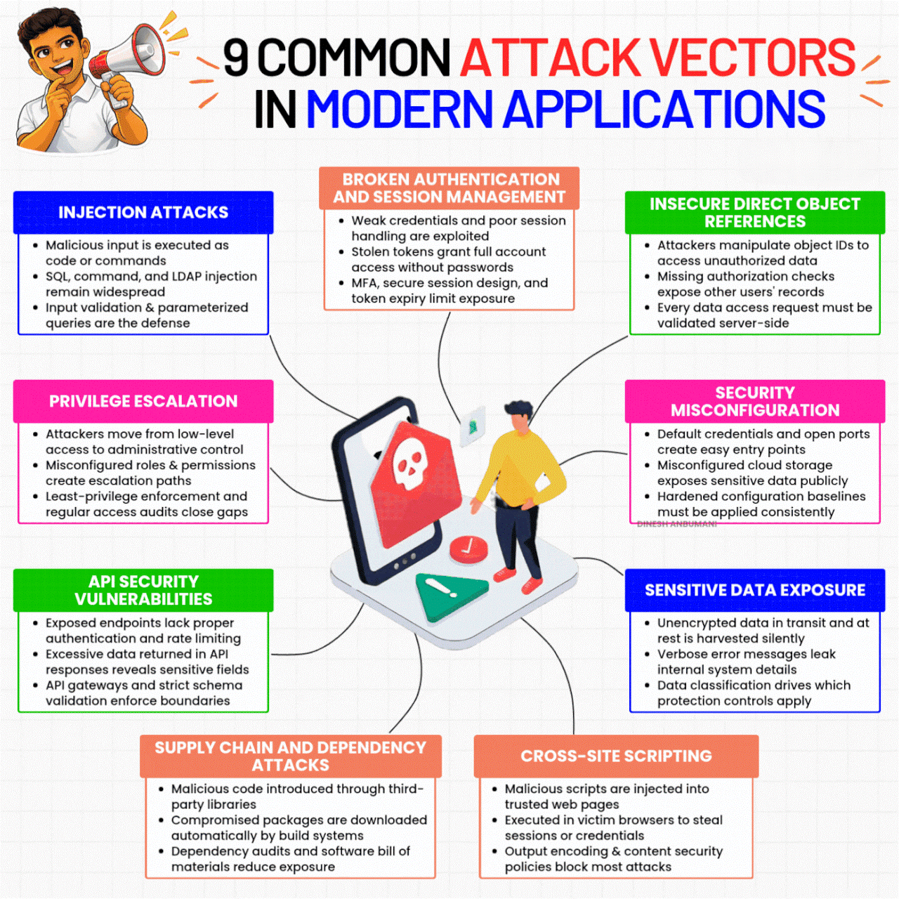

# Security

> 📌 **Visual Reference:** 

---

## Q1: How do you approach security in a microservices architecture?

**Answer:**

Security is layered (defense in depth):

1. **Edge layer** — WAF (Web Application Firewall) at the API Gateway/ALB level. Blocks common attacks (SQL injection, XSS, bad bots, rate limiting).
2. **Authentication** — OAuth 2.0 / OpenID Connect via identity provider (e.g., Okta). Every API call is authenticated with a JWT token.
3. **Authorization** — Role-based or attribute-based access control at the service level. Check org-level permissions (e.g., can this user access this org's data?).
4. **Service-to-service** — Mutual TLS or IAM-based auth for internal service calls. No service trusts another implicitly.
5. **Data** — Encrypt at rest (S3 SSE, RDS encryption) and in transit (TLS everywhere). Sensitive data is never logged.
6. **Network** — VPC isolation, security groups with least-privilege rules, private subnets for backend services.
7. **Secrets management** — AWS Secrets Manager or Parameter Store. No hardcoded credentials.

---

## Q2: Tell me about a security issue you identified and fixed.

**Answer (STAR):**

- **Situation:** An internal support tool was experiencing authentication failures after an identity provider upgrade. Users couldn't log in, and the tool was critical for the support team.
- **Task:** Diagnose the authentication issue and ensure it doesn't recur.
- **Action:** 
  - Initial hypothesis was token refresh — investigated and ruled out
  - Widened scope to the identity provider integration — discovered the tool's OAuth configuration had drifted after the provider upgrade (redirect URIs, token endpoint changes)
  - Fixed the OAuth configuration
  - Additionally, implemented a WAF in front of the tool to add rate limiting, IP-based filtering, and protection against common web attacks
- **Result:** Authentication restored. WAF added a security layer that the tool previously lacked. The WAF also provided visibility into traffic patterns and potential attack attempts.

---

## Q3: What is OWASP Top 10 and how do you address the key risks?

**Answer:**

| # | Risk | How I Address It |
|---|------|-----------------|
| 1 | Broken Access Control | Org-level authorization checks on every API. Users can only access their org's data. |
| 2 | Cryptographic Failures | TLS everywhere, encryption at rest, no secrets in code or logs |
| 3 | Injection | Parameterized queries (JPA/Hibernate), input validation at API boundary |
| 4 | Insecure Design | Threat modeling in design phase, security reviews in PR process |
| 5 | Security Misconfiguration | WAF rules, least-privilege IAM policies, security group audits |
| 6 | Vulnerable Components | Dependency scanning (Dependabot/Snyk), regular updates |
| 7 | Auth Failures | OAuth 2.0 + Okta, token validation, session management |
| 8 | Data Integrity Failures | Signed artifacts, CI/CD pipeline integrity, code review |
| 9 | Logging & Monitoring | Centralized logging, alerting on auth failures, audit trails |
| 10 | SSRF | Allowlist for outbound calls, network segmentation, no user-controlled URLs in server-side requests |

---

## Q4: How do you handle secrets management in your applications?

**Answer:**

- **Never in code** — No credentials, API keys, or tokens in source code. Ever.
- **AWS Secrets Manager / Parameter Store** — Secrets are stored encrypted, accessed at runtime via IAM role-based access.
- **Rotation** — Automated secret rotation where supported (DB passwords, API keys).
- **Environment-specific** — Different secrets per environment (dev/staging/prod). No shared credentials.
- **Audit** — CloudTrail logs every secret access. Alert on unusual access patterns.
- **Application-level** — Secrets loaded once at startup, cached in memory. Not logged, not included in error responses.
