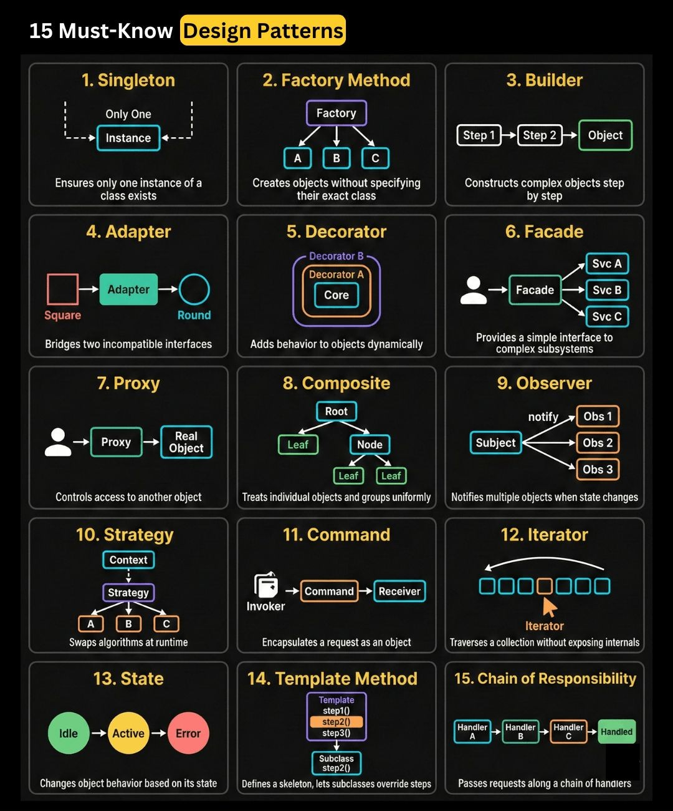

# Design Patterns — Interview Q&A

> 📌 **Visual Reference:** [](../assets/images/design-patterns.jpg)

> Format: Definition → Mechanism → Benefits/Trade-offs with Java code examples.
> Covers all 23 GoF patterns grouped by category, with deep-dive on most interview-critical ones.

---

## Q1: What are the GoF Design Patterns and how are they categorized?

**Answer:**

**GoF (Gang of Four) Design Patterns** — 23 patterns documented in "Design Patterns: Elements of Reusable Object-Oriented Software" (1994) → solutions to recurring OOP design problems → categorized into 3 groups based on purpose.

| Category | Purpose | Patterns |
|----------|---------|---------|
| **Creational** | Object creation | Singleton, Factory Method, Abstract Factory, Builder, Prototype |
| **Structural** | Class/object composition | Adapter, Bridge, Composite, Decorator, Facade, Flyweight, Proxy |
| **Behavioral** | Object communication | Strategy, Observer, Command, Template Method, Iterator, State, Chain of Responsibility, Mediator, Memento, Visitor, Interpreter |

**Key identification clues:**
- **Adapter** → interface mismatch, legacy integration
- **Decorator** → behavior added dynamically without subclassing
- **Facade** → simplified interface over complex subsystem
- **Proxy** → controlled access, lazy loading, security
- **Strategy** → swappable algorithms at runtime
- **Observer** → event-driven, pub/sub notifications
- **Composite** → tree structures, part-whole hierarchy
- **Flyweight** → object sharing to save memory

**Benefits / Trade-offs:** Patterns provide shared vocabulary and proven solutions. Trade-off: over-applying patterns adds unnecessary complexity ("pattern for pattern's sake").

---

## Q2: Singleton Pattern — Implementation and Pitfalls

**Answer:**

**Singleton** — ensures a class has exactly one instance and provides a global access point → commonly used for: DB connection pools, config managers, loggers, caches.

```java
// Thread-safe Singleton: Double-checked locking (Java 5+)
public class ConfigManager {
    // volatile: prevents instruction reordering (Java memory model)
    private static volatile ConfigManager instance;
    private final Map<String, String> config = new HashMap<>();

    private ConfigManager() {
        // Load config from file/env
        config.put("db.url", System.getenv("DB_URL"));
    }

    public static ConfigManager getInstance() {
        if (instance == null) {                    // First check (no lock)
            synchronized (ConfigManager.class) {
                if (instance == null) {            // Second check (with lock)
                    instance = new ConfigManager();
                }
            }
        }
        return instance;
    }

    public String get(String key) { return config.get(key); }
}

// Enum Singleton — simplest thread-safe approach (Joshua Bloch recommended)
public enum AppConfig {
    INSTANCE;
    
    private final String dbUrl = System.getenv("DB_URL");
    public String getDbUrl() { return dbUrl; }
}

// Usage
AppConfig.INSTANCE.getDbUrl();
```

**Pitfalls:**
1. **Not thread-safe** without `volatile` + `synchronized` (or enum)
2. **Breaks with multiple ClassLoaders** (each loads its own instance)
3. **Hard to unit test** — global state, can't mock easily → prefer DI containers (Spring `@Bean` is singleton by default)
4. **Serialization** — implement `readResolve()` to prevent new instance on deserialization

**Benefits / Trade-offs:** Controls single instance, lazy initialization. Trade-off: global state = tight coupling; difficult to test in isolation; concurrency bugs if implemented incorrectly.

---

## Q3: Factory Method vs Abstract Factory

**Answer:**

**Factory Method** — defines an interface for creating an object but lets subclasses decide which class to instantiate → single product, one creation method.

**Abstract Factory** — creates families of related objects without specifying concrete classes → multiple products, multiple creation methods.

```java
// Factory Method: Notification factory
public interface Notification {
    void send(String message);
}

public class EmailNotification implements Notification {
    public void send(String message) { System.out.println("Email: " + message); }
}

public class SMSNotification implements Notification {
    public void send(String message) { System.out.println("SMS: " + message); }
}

// Factory with conditional logic
public class NotificationFactory {
    public static Notification create(String type) {
        return switch (type) {
            case "EMAIL" -> new EmailNotification();
            case "SMS"   -> new SMSNotification();
            default -> throw new IllegalArgumentException("Unknown type: " + type);
        };
    }
}

// Abstract Factory: UI component family (Web vs Mobile)
public interface Button  { void render(); }
public interface TextBox { void render(); }

// Web family
public class WebButton  implements Button  { public void render() { System.out.println("<button>"); } }
public class WebTextBox implements TextBox { public void render() { System.out.println("<input>"); } }

// Mobile family
public class MobileButton  implements Button  { public void render() { System.out.println("UIButton"); } }
public class MobileTextBox implements TextBox { public void render() { System.out.println("UITextField"); } }

public interface UIFactory {
    Button  createButton();
    TextBox createTextBox();
}

public class WebUIFactory implements UIFactory {
    public Button  createButton()  { return new WebButton(); }
    public TextBox createTextBox() { return new WebTextBox(); }
}

// Client uses factory without knowing concrete types
public class Application {
    private final Button button;
    private final TextBox textBox;
    
    public Application(UIFactory factory) {
        this.button  = factory.createButton();
        this.textBox = factory.createTextBox();
    }
}
```

**Benefits / Trade-offs:** Factory Method — easy to extend with new types. Abstract Factory — ensures product family consistency. Trade-off: adding new product types requires changing all factory implementations.

---

## Q4: Builder Pattern — Complex Object Construction

**Answer:**

**Builder** — separates the construction of a complex object from its representation → allows step-by-step construction → avoids telescoping constructors (constructors with many parameters).

```java
// Builder for HTTP Request
public class HttpRequest {
    private final String url;           // required
    private final String method;        // required
    private final Map<String, String> headers;
    private final String body;
    private final int timeoutMs;

    private HttpRequest(Builder builder) {
        this.url       = builder.url;
        this.method    = builder.method;
        this.headers   = Collections.unmodifiableMap(builder.headers);
        this.body      = builder.body;
        this.timeoutMs = builder.timeoutMs;
    }

    public static class Builder {
        private final String url;       // required
        private final String method;    // required
        private Map<String, String> headers = new HashMap<>();
        private String body;
        private int timeoutMs = 5000;   // default

        public Builder(String url, String method) {
            this.url    = Objects.requireNonNull(url);
            this.method = Objects.requireNonNull(method);
        }

        public Builder header(String key, String value) {
            this.headers.put(key, value);
            return this;   // fluent API
        }

        public Builder body(String body) {
            this.body = body;
            return this;
        }

        public Builder timeout(int ms) {
            this.timeoutMs = ms;
            return this;
        }

        public HttpRequest build() {
            // validate before building
            if ("POST".equals(method) && body == null) {
                throw new IllegalStateException("POST requires a body");
            }
            return new HttpRequest(this);
        }
    }
}

// Usage — readable, no telescoping constructor
HttpRequest request = new HttpRequest.Builder("https://api.example.com/orders", "POST")
    .header("Authorization", "Bearer token123")
    .header("Content-Type", "application/json")
    .body("{\"orderId\": 42}")
    .timeout(3000)
    .build();
```

**Lombok shortcut in Spring Boot:**
```java
@Builder
@Getter
public class OrderDto {
    private Long id;
    private String status;
    private BigDecimal amount;
}

// Usage: OrderDto.builder().id(1L).status("PENDING").amount(new BigDecimal("99.99")).build();
```

**Benefits / Trade-offs:** Eliminates telescoping constructors, immutable objects, validation on `build()`. Trade-off: more boilerplate than POJO; Lombok `@Builder` can hide immutability issues.

---

## Q5: Adapter Pattern — Interface Bridge

**Answer:**

**Adapter** — converts the interface of a class into another interface that clients expect → resolves incompatibility between existing code and a new/third-party component → "wrapper" that translates calls.

```java
// Scenario: New payment processor has different interface than expected

// Expected interface (what our system calls)
public interface PaymentProcessor {
    boolean processPayment(double amount, String currency);
}

// Third-party Stripe SDK (incompatible interface)
public class StripeSDK {
    public StripeResponse charge(StripeRequest request) {
        // Stripe-specific implementation
        return new StripeResponse(true, "ch_123");
    }
}

// Adapter: wraps StripeSDK, implements PaymentProcessor
public class StripePaymentAdapter implements PaymentProcessor {
    private final StripeSDK stripeSDK;

    public StripePaymentAdapter(StripeSDK stripeSDK) {
        this.stripeSDK = stripeSDK;
    }

    @Override
    public boolean processPayment(double amount, String currency) {
        // Translate: our interface → Stripe interface
        StripeRequest request = new StripeRequest(
            (long)(amount * 100),   // Stripe uses cents
            currency.toLowerCase()
        );
        StripeResponse response = stripeSDK.charge(request);
        return response.isSuccess();
    }
}

// Client code: unaware of Stripe details
public class OrderService {
    private final PaymentProcessor paymentProcessor;  // injected

    public void checkout(Order order) {
        boolean paid = paymentProcessor.processPayment(order.getTotal(), "USD");
        if (!paid) throw new PaymentException("Payment failed");
    }
}
```

**Real-world examples:** `Arrays.asList()` adapts array to List; `InputStreamReader` adapts `InputStream` to `Reader`; Spring's `HandlerAdapter` adapts different controller types.

**Benefits / Trade-offs:** Open/Closed Principle — add new integrations without changing client code. Trade-off: adds indirection; multiple adapters can become complex to manage.

---

## Q6: Decorator Pattern — Dynamic Behavior Addition

**Answer:**

**Decorator** — attaches additional responsibilities to an object dynamically → alternative to subclassing → wraps the object and adds behavior before/after delegation → implements the same interface as the wrapped component.

```java
// Coffee ordering system
public interface Coffee {
    String getDescription();
    double getCost();
}

public class SimpleCoffee implements Coffee {
    public String getDescription() { return "Coffee"; }
    public double getCost()        { return 1.00; }
}

// Base decorator
public abstract class CoffeeDecorator implements Coffee {
    protected final Coffee wrapped;
    public CoffeeDecorator(Coffee coffee) { this.wrapped = coffee; }
    public String getDescription() { return wrapped.getDescription(); }
    public double getCost()        { return wrapped.getCost(); }
}

// Concrete decorators
public class MilkDecorator extends CoffeeDecorator {
    public MilkDecorator(Coffee coffee) { super(coffee); }
    public String getDescription() { return wrapped.getDescription() + ", Milk"; }
    public double getCost()        { return wrapped.getCost() + 0.25; }
}

public class SugarDecorator extends CoffeeDecorator {
    public SugarDecorator(Coffee coffee) { super(coffee); }
    public String getDescription() { return wrapped.getDescription() + ", Sugar"; }
    public double getCost()        { return wrapped.getCost() + 0.10; }
}

// Usage: compose at runtime
Coffee order = new SugarDecorator(new MilkDecorator(new SimpleCoffee()));
System.out.println(order.getDescription()); // Coffee, Milk, Sugar
System.out.println(order.getCost());        // 1.35
```

**Java standard library examples:** `BufferedInputStream(new FileInputStream(...))`, `Collections.unmodifiableList(list)`, `Collections.synchronizedList(list)`.

**Decorator vs Inheritance:** Inheritance is static (compile-time), Decorator is dynamic (runtime). Decorator avoids class explosion (MilkCoffee, SugarCoffee, MilkSugarCoffee...).

**Benefits / Trade-offs:** Open/Closed Principle, composable, no class explosion. Trade-off: many small wrapper objects; order of decoration matters; harder to debug stack of decorators.

---

## Q7: Proxy Pattern — Controlled Access

**Answer:**

**Proxy** — provides a surrogate or placeholder for another object to control access → same interface as real object → client unaware it's talking to a proxy.

**Types:** Virtual Proxy (lazy init), Protection Proxy (auth), Remote Proxy (network), Caching Proxy, Logging/Monitoring Proxy.

```java
// Protection Proxy: access control
public interface DataService {
    String fetchSensitiveData(String userId);
}

public class RealDataService implements DataService {
    public String fetchSensitiveData(String userId) {
        return "SECRET_DATA_FOR_" + userId;
    }
}

public class DataServiceProxy implements DataService {
    private final RealDataService realService = new RealDataService();
    private final Set<String> authorizedUsers;

    public DataServiceProxy(Set<String> authorizedUsers) {
        this.authorizedUsers = authorizedUsers;
    }

    @Override
    public String fetchSensitiveData(String userId) {
        if (!authorizedUsers.contains(userId)) {
            throw new SecurityException("Access denied for user: " + userId);
        }
        // Logging
        System.out.println("Audit: " + userId + " accessed sensitive data at " + Instant.now());
        return realService.fetchSensitiveData(userId);
    }
}

// Virtual Proxy: lazy initialization (heavy resource)
public class ImageProxy implements Image {
    private RealImage realImage;    // null until needed
    private final String filename;

    public ImageProxy(String filename) { this.filename = filename; }

    @Override
    public void display() {
        if (realImage == null) {
            realImage = new RealImage(filename);  // load only when needed
        }
        realImage.display();
    }
}
```

**Spring AOP** is a dynamic proxy — `@Transactional`, `@Cacheable`, `@Async` all work via JDK dynamic proxy or CGLIB proxy wrapping your beans.

**Proxy vs Decorator:** Proxy controls *access* to the subject; Decorator adds *behavior* to the subject. Proxy often manages lifecycle; Decorator is transparent to client.

**Benefits / Trade-offs:** Separation of cross-cutting concerns (security, logging, caching). Trade-off: adds indirection; JDK proxy only works on interfaces; CGLIB can't proxy final classes.

---

## Q8: Strategy Pattern — Swappable Algorithms

**Answer:**

**Strategy** — defines a family of algorithms, encapsulates each one, and makes them interchangeable → lets the algorithm vary independently from clients that use it → replaces conditionals with polymorphism.

```java
// Sorting strategy example
@FunctionalInterface
public interface SortStrategy<T extends Comparable<T>> {
    void sort(List<T> data);
}

// Concrete strategies
public class BubbleSort<T extends Comparable<T>> implements SortStrategy<T> {
    public void sort(List<T> data) { /* bubble sort impl */ }
}

public class QuickSort<T extends Comparable<T>> implements SortStrategy<T> {
    public void sort(List<T> data) { Collections.sort(data); }  // simplified
}

// Context: uses strategy
public class DataProcessor<T extends Comparable<T>> {
    private SortStrategy<T> strategy;

    public DataProcessor(SortStrategy<T> strategy) {
        this.strategy = strategy;
    }

    // Switch strategy at runtime
    public void setStrategy(SortStrategy<T> strategy) {
        this.strategy = strategy;
    }

    public List<T> process(List<T> data) {
        strategy.sort(data);
        return data;
    }
}

// Java 8+: Strategy as lambda (since it's @FunctionalInterface)
DataProcessor<Integer> processor = new DataProcessor<>(
    data -> data.sort(Comparator.reverseOrder())  // lambda IS a strategy
);

// Real-world: Payment strategy
public interface PaymentStrategy {
    void pay(BigDecimal amount);
}

public class CreditCardStrategy implements PaymentStrategy {
    public void pay(BigDecimal amount) { /* charge card */ }
}

public class PayPalStrategy implements PaymentStrategy {
    public void pay(BigDecimal amount) { /* PayPal API */ }
}
```

**Replaces this anti-pattern:**
```java
// BAD: if/else ladder — violates Open/Closed
if (type.equals("CREDIT")) { /* ... */ }
else if (type.equals("PAYPAL")) { /* ... */ }
else if (type.equals("CRYPTO")) { /* ... */ }
```

**Benefits / Trade-offs:** Open/Closed Principle, eliminates conditionals, easily testable. Trade-off: client must be aware of different strategies; slight overhead from extra class per strategy (mitigated by lambdas in Java 8+).

---

## Q9: Observer Pattern — Event-Driven Notifications

**Answer:**

**Observer** — defines a one-to-many dependency → when subject state changes, all registered observers are notified automatically → foundation of event-driven and pub/sub systems.

```java
// Event-driven order notification system
public interface OrderObserver {
    void onOrderEvent(OrderEvent event);
}

public record OrderEvent(Long orderId, String status, Instant timestamp) {}

public class OrderService {
    private final List<OrderObserver> observers = new CopyOnWriteArrayList<>();

    public void addObserver(OrderObserver observer) {
        observers.add(observer);
    }

    public void removeObserver(OrderObserver observer) {
        observers.remove(observer);
    }

    public void placeOrder(Order order) {
        // business logic...
        order.setStatus("PLACED");
        notifyObservers(new OrderEvent(order.getId(), "PLACED", Instant.now()));
    }

    private void notifyObservers(OrderEvent event) {
        observers.forEach(obs -> obs.onOrderEvent(event));
    }
}

// Observers: each reacts independently
public class EmailNotificationObserver implements OrderObserver {
    public void onOrderEvent(OrderEvent event) {
        System.out.println("Email sent for order " + event.orderId() + " status: " + event.status());
    }
}

public class InventoryObserver implements OrderObserver {
    public void onOrderEvent(OrderEvent event) {
        if ("PLACED".equals(event.status())) {
            System.out.println("Reserving inventory for order " + event.orderId());
        }
    }
}

// Spring equivalent: ApplicationEvent + @EventListener
@Component
public class OrderPlacedEvent extends ApplicationEvent {
    public OrderPlacedEvent(Object source) { super(source); }
}

@EventListener
public void handleOrderPlaced(OrderPlacedEvent event) { /* ... */ }
```

**Real-world Observer:** Java's `java.util.Observer` (deprecated), `PropertyChangeListener`, Spring `@EventListener`, RxJava/Project Reactor observables, Kafka consumers.

**Benefits / Trade-offs:** Loose coupling — subject doesn't know observer types; easy to add/remove listeners. Trade-off: unexpected update order; memory leaks if observers aren't removed; can cause cascading updates.

---

## Q10: Facade Pattern — Simplified Interface

**Answer:**

**Facade** — provides a simplified, unified interface to a complex subsystem → clients interact with one entry point instead of multiple complex APIs → does not add new functionality, only simplifies access.

```java
// E-commerce order placement: coordinates multiple subsystems
public class OrderFacade {
    private final InventoryService inventory;
    private final PaymentService payment;
    private final ShippingService shipping;
    private final NotificationService notification;

    public OrderFacade(InventoryService inventory, PaymentService payment,
                       ShippingService shipping, NotificationService notification) {
        this.inventory    = inventory;
        this.payment      = payment;
        this.shipping     = shipping;
        this.notification = notification;
    }

    // One method replaces 4+ subsystem calls
    public OrderResult placeOrder(OrderRequest request) {
        // Step 1: Check stock
        if (!inventory.checkStock(request.getProductId(), request.getQuantity())) {
            return OrderResult.failure("Out of stock");
        }

        // Step 2: Charge payment
        PaymentResult payResult = payment.charge(request.getCustomerId(), request.getAmount());
        if (!payResult.isSuccess()) {
            return OrderResult.failure("Payment failed: " + payResult.getMessage());
        }

        // Step 3: Reserve and ship
        inventory.reserve(request.getProductId(), request.getQuantity());
        String trackingId = shipping.scheduleDelivery(request.getShippingAddress());

        // Step 4: Notify customer
        notification.sendConfirmation(request.getCustomerId(), trackingId);

        return OrderResult.success(trackingId);
    }
}

// Client: one clean call instead of orchestrating 4 services
OrderResult result = orderFacade.placeOrder(request);
```

**Facade vs Adapter:** Adapter translates one interface to another (incompatibility fix). Facade simplifies multiple interfaces into one (complexity hiding). Facade can use multiple Adapters internally.

**Benefits / Trade-offs:** Reduces coupling between clients and subsystems; easy to swap subsystem implementations. Trade-off: can become a "God object" if overloaded; doesn't prevent direct access to subsystems if needed.

---

## Q11: Composite Pattern : Hierarchical Object Structures

**Answer:**

The **Composite Pattern** allows you to treat individual objects and compositions of objects uniformly. It composes objects into tree structures to represent part-whole hierarchies : e.g., organizational charts, file systems, UI components.

**Key roles:**
- **Component** (interface/abstract) : common interface for both leaves and composites
- **Leaf** : individual object, no children (e.g., individual employee)
- **Composite** : has children, implements component, delegates to children

```java
// Component interface : uniform treatment
interface Employee {
    void showDetails(String indent);
    double getSalary();
}

// Leaf : individual contributor
class Developer implements Employee {
    private final String name;
    private final double salary;

    public Developer(String name, double salary) {
        this.name = name; this.salary = salary;
    }

    @Override
    public void showDetails(String indent) {
        System.out.println(indent + "Developer: " + name + " ($" + salary + ")");
    }

    @Override
    public double getSalary() { return salary; }
}

// Composite : contains children (team/department)
class Manager implements Employee {
    private final String name;
    private final double salary;
    private final List<Employee> reports = new ArrayList<>();

    public Manager(String name, double salary) {
        this.name = name; this.salary = salary;
    }

    public void add(Employee e) { reports.add(e); }

    @Override
    public void showDetails(String indent) {
        System.out.println(indent + "Manager: " + name);
        reports.forEach(e -> e.showDetails(indent + "  "));
    }

    @Override
    public double getSalary() {
        return salary + reports.stream().mapToDouble(Employee::getSalary).sum();
    }
}

// Usage
Developer alice = new Developer("Alice", 90_000);
Developer bob = new Developer("Bob", 85_000);
Manager charlie = new Manager("Charlie", 120_000);
charlie.add(alice); charlie.add(bob);

Developer david = new Developer("David", 110_000);
Manager cto = new Manager("Eve (CTO)", 200_000);
cto.add(charlie); cto.add(david);

cto.showDetails("");
System.out.println("Total payroll: $" + cto.getSalary());
```

**Output:**
```
Manager: Eve (CTO)
  Manager: Charlie
    Developer: Alice ($90000.0)
    Developer: Bob ($85000.0)
  Developer: David ($110000.0)
Total payroll: $605000.0
```

**When to use:** Tree/hierarchy structures (org charts, file systems, XML/JSON trees, UI component hierarchies). Operations should propagate recursively through the hierarchy.

**Trade-offs:** Overly general : hard to restrict which components can be added to composites. Type safety requires runtime checks if leaf/composite behavior must differ.

---

## Q12: Chain of Responsibility Pattern : Decoupled Request Handling

**Answer:**

The **Chain of Responsibility (CoR)** passes a request along a chain of handlers, where each handler either processes it or forwards it to the next. Decouples sender from receiver : the sender doesn't know which handler will process the request.

```java
// Abstract handler
abstract class SupportHandler {
    protected SupportHandler next;

    public SupportHandler setNext(SupportHandler next) {
        this.next = next;
        return next; // enables fluent chaining
    }

    public abstract void handle(String request, int priority);
}

// Concrete handlers (sorted by responsibility level)
class L1Support extends SupportHandler {
    @Override
    public void handle(String request, int priority) {
        if (priority <= 1) {
            System.out.println("L1 Support handling: " + request);
        } else if (next != null) {
            next.handle(request, priority);
        }
    }
}

class L2Support extends SupportHandler {
    @Override
    public void handle(String request, int priority) {
        if (priority <= 2) {
            System.out.println("L2 Support handling: " + request);
        } else if (next != null) {
            next.handle(request, priority);
        }
    }
}

class ManagerSupport extends SupportHandler {
    @Override
    public void handle(String request, int priority) {
        System.out.println("Manager handling: " + request + " (priority=" + priority + ")");
    }
}

// Wire the chain
SupportHandler l1 = new L1Support();
SupportHandler l2 = new L2Support();
SupportHandler manager = new ManagerSupport();
l1.setNext(l2).setNext(manager);

l1.handle("password reset", 1);  // --> L1
l1.handle("network issue", 2);    // --> L2
l1.handle("security breach", 3);  // --> Manager
```

**Real-world uses:** HTTP filter chains (javax.servlet.Filter), logging frameworks (Logback appenders), Spring Security filter chain, event bubbling in UI frameworks, middleware pipelines.

**When CoR is difficult:**
- **Debugging** : hard to trace which handler processed a request
- **Handler ordering** : wrong order = wrong handler (or no handler) processes the request
- **Unhandled requests** : if no handler matches, request falls through silently. Always add a catch-all default handler.
- **Unit testing** : testing one handler in isolation requires mocking the rest of the chain.

**Comparison with similar patterns:**
| Pattern | Key Difference |
|---------|---------------|
| **Chain of Responsibility** | Any handler can process the request; passes until one handles it |
| **Command** | Encapsulates a request as an object; target is known |
| **Mediator** | All objects communicate through a central mediator |


---

## Q13: Facade Pattern : Application Orchestration Layer

**Answer:**

The **Facade** pattern provides a single simplified entry point over a complex subsystem or workflow. In Spring Boot, it is implemented as an orchestration service class, not an interface.

**Where Facade lives:**
```
Controller --> Facade --> Service A / Service B / Service C --> Repositories / External APIs
```
- Controller: thin, HTTP mapping only
- Facade: business orchestration, transaction boundary
- Services: individual domain logic

**Wrong design (God Controller):**
```java
@RestController
public class OrderController {
    @PostMapping("/order")
    public void placeOrder(OrderRequest req) {
        inventoryService.reserve(req);    // ❌ controller doing orchestration
        paymentService.charge(req);
        shippingService.schedule(req);
        notificationService.send(req);
    }
}
```

**Correct design with Facade (John Deere : parts order):**
```java
@Service
public class PartsOrderFacade {
    private final InventoryService inventoryService;
    private final PaymentService paymentService;
    private final ShippingService shippingService;
    private final NotificationService notificationService;

    @Transactional
    public OrderResult placePartsOrder(PartsOrderRequest request) {
        inventoryService.reserveParts(request);       // check parts availability
        paymentService.chargeDealer(request);         // process payment
        shippingService.scheduleDelivery(request);    // dispatch from warehouse
        notificationService.sendConfirmation(request);// notify dealer

        return OrderResult.success();
    }
}

@RestController
@RequestMapping("/parts/orders")
public class PartsOrderController {
    private final PartsOrderFacade partsOrderFacade;

    @PostMapping
    public ResponseEntity<OrderResult> placeOrder(@RequestBody PartsOrderRequest req) {
        return ResponseEntity.ok(partsOrderFacade.placePartsOrder(req));
    }
}
```

**Why Facade matters (multi-entry-point benefit):**
```java
// Same facade used from REST, Kafka consumer, and scheduled job
@KafkaListener(topics = "bulk-orders")
public void processKafkaOrder(PartsOrderEvent event) {
    partsOrderFacade.placePartsOrder(event.toRequest()); // same orchestration
}

@Scheduled(cron = "0 0 6 * * *")
public void processScheduledOrders() {
    pendingOrders.forEach(o -> partsOrderFacade.placePartsOrder(o)); // same orchestration
}
```

**Facade vs Adapter vs Proxy:**

| Pattern | Location | Purpose |
|---------|----------|---------|
| Facade | Application service layer | Simplify orchestration, single entry point |
| Adapter | Integration layer | Convert external API to internal interface |
| Proxy | Infrastructure layer | Access control, lazy loading, AOP |
| Decorator | Cross-cutting layer | Add behavior dynamically |

**Benefits/Trade-offs:**
- ✅ Thin controllers, centralized orchestration
- ✅ Transaction boundary in one place
- ✅ Reusable across REST/Kafka/scheduled triggers
- ❌ Can become a large "God Facade" if not bounded properly (apply SRP : one facade per workflow domain)

---

## Q14: Adapter Pattern : Vendor Integration Layer

**Answer:**

The **Adapter** pattern converts an incompatible external interface into the interface your domain expects, protecting business code from third-party API changes.

**Where Adapter lives:**
```
Service --> Domain Interface --> Adapter --> External SDK/API
```

**Wrong design (tight coupling to vendor):**
```java
@Service
public class CheckoutService {
    private final RazorpayClient razorpayClient; // ❌ domain depends on vendor

    public void checkout(Order order) {
        razorpayClient.charge(order.getAmount() * 100, "INR"); // different contract
    }
}
```

**Correct design with Adapter (John Deere : dealer equipment purchase):**
```java
// Step 1: Define clean domain interface
public interface PaymentGateway {
    PaymentResult pay(PaymentRequest request);
}

// Step 2: Adapter for Razorpay
@Component
public class RazorpayAdapter implements PaymentGateway {
    private final RazorpayClient razorpayClient;

    @Override
    public PaymentResult pay(PaymentRequest request) {
        // Translate domain contract --> vendor contract
        String txnId = razorpayClient.charge(request.getAmount() * 100, "INR");
        return new PaymentResult(txnId, "SUCCESS");
    }
}

// Step 3: Adapter for Stripe (switch without touching CheckoutService)
@Component
public class StripeAdapter implements PaymentGateway {
    private final StripeClient stripeClient;

    @Override
    public PaymentResult pay(PaymentRequest request) {
        Charge charge = stripeClient.charges().create(Map.of(
            "amount", request.getAmount(),
            "currency", "usd"
        ));
        return new PaymentResult(charge.getId(), charge.getStatus());
    }
}

// Domain service : only knows PaymentGateway (SOLID DIP)
@Service
public class CheckoutService {
    private final PaymentGateway paymentGateway; // ✅ depends on abstraction

    public void checkout(Order order) {
        paymentGateway.pay(new PaymentRequest(order.totalAmount()));
    }
}
```

**AWS context : S3 Adapter:**
```java
public interface StorageService {
    String store(String key, byte[] data);
    byte[] retrieve(String key);
}

@Component
public class S3StorageAdapter implements StorageService {
    private final S3Client s3Client;
    private final String bucket;

    @Override
    public String store(String key, byte[] data) {
        s3Client.putObject(PutObjectRequest.builder().bucket(bucket).key(key).build(),
                           RequestBody.fromBytes(data));
        return key;
    }

    @Override
    public byte[] retrieve(String key) {
        return s3Client.getObjectAsBytes(GetObjectRequest.builder().bucket(bucket).key(key).build()).asByteArray();
    }
}
```

**Benefits/Trade-offs:**
- ✅ Vendor independence : swap Razorpay --> Stripe without touching business logic
- ✅ Testability : mock `PaymentGateway` easily in unit tests
- ✅ Enforces SOLID DIP (depend on abstraction, not vendor SDK)
- ❌ Added indirection layer
- ❌ More classes to maintain (one adapter per vendor)

**Interview one-liner:** "Adapter wraps an incompatible external interface behind your domain interface, enabling vendor independence, testability, and SOLID DIP."

