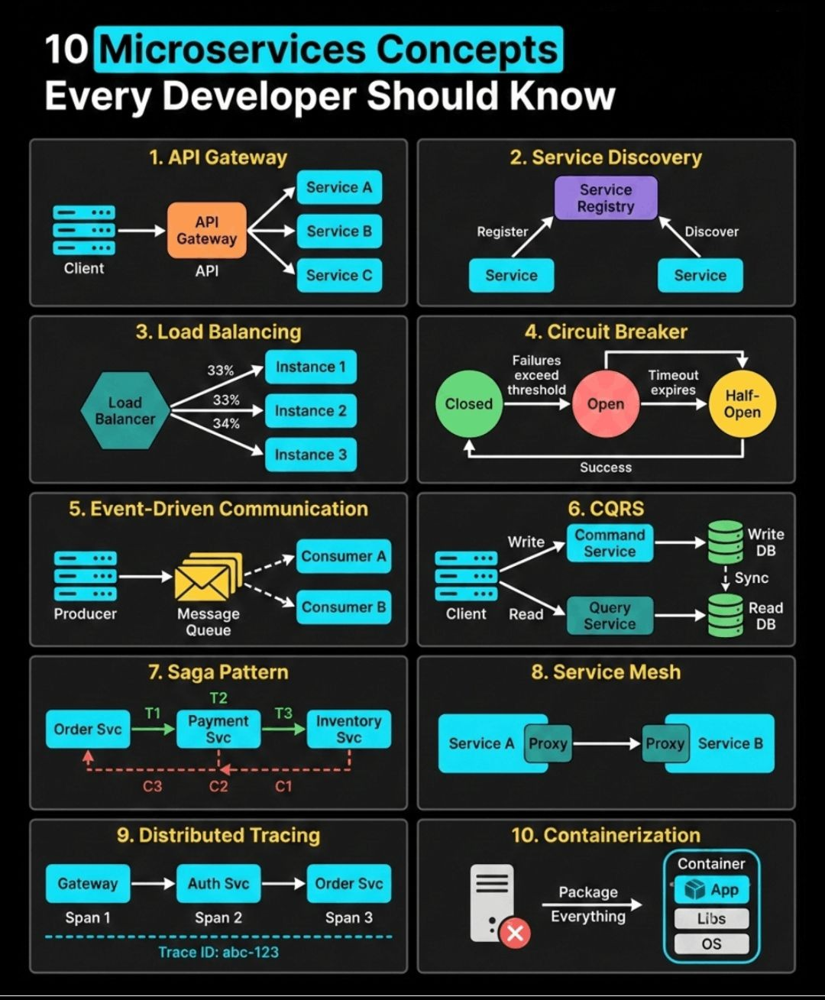
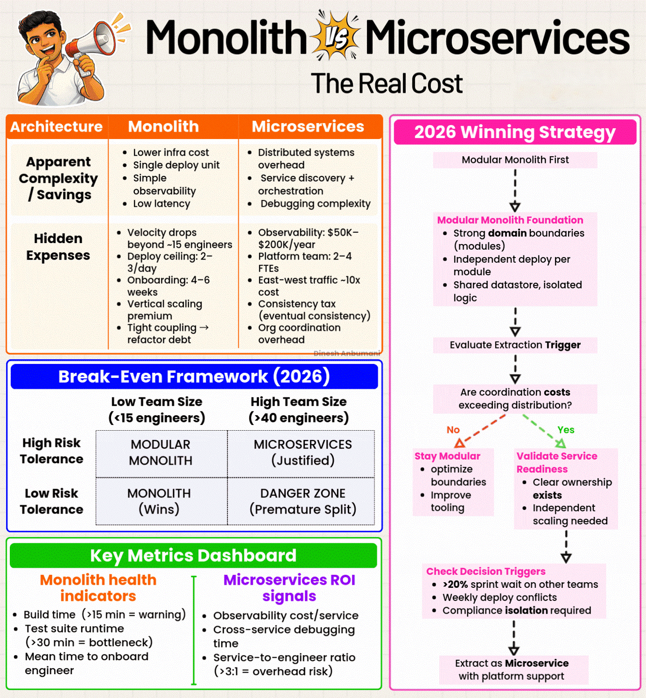
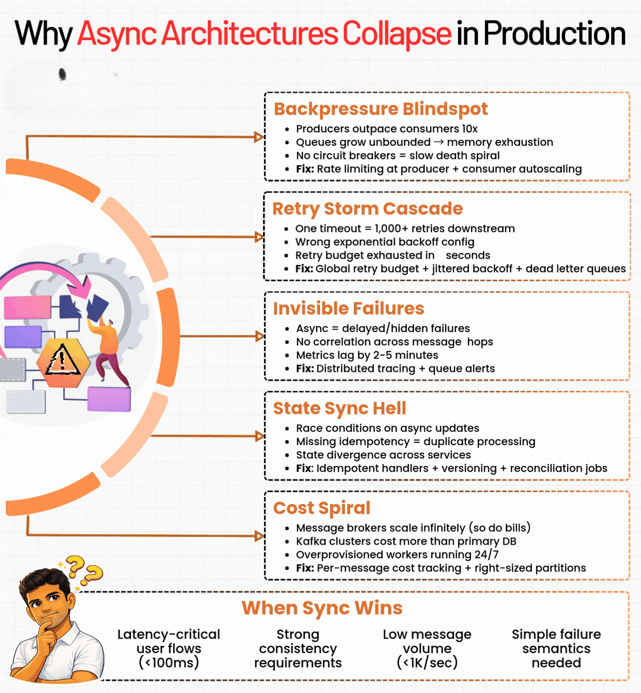

# 10 Microservices Concepts Every Developer Should Know

> 📌 **Visual References:**
>
> [](../assets/images/10-microservices-concepts-should-known.jpg)
>
> [](../assets/images/monolith-vs-microservices.gif)
>
> [](../assets/images/why-async-architectures-collapse-in-prod.gif)

---

## Q1: What is an API Gateway? Why do microservices need one?

**Answer:**

An API Gateway is a single entry point that sits between clients and all backend microservices → it receives all incoming requests and routes them to the appropriate service → it also handles cross-cutting concerns like authentication, rate limiting, SSL termination, and logging in one place, so individual services don't have to.

**Without API Gateway:**
```
Client → directly calls Service A (port 8081)
Client → directly calls Service B (port 8082)
Client → directly calls Service C (port 8083)
→ Client must know every service URL
→ Auth/logging logic duplicated in every service
```

**With API Gateway:**
```
Client → API Gateway → routes to Service A / B / C
→ Single URL for client
→ Auth, logging, rate limiting handled once at gateway
```

**What it handles:**
- **Routing** — maps `/api/orders` → Order Service, `/api/users` → User Service
- **Authentication** — validates JWT token before forwarding request
- **Rate Limiting** — throttles clients to prevent abuse
- **SSL Termination** — handles HTTPS, services communicate over HTTP internally
- **Load Balancing** — distributes traffic across service instances
- **Request Aggregation** — combines responses from multiple services into one

**Tools:** Spring Cloud Gateway, Kong, AWS API Gateway, Nginx

**Benefits / Trade-offs:** Simplifies client, centralizes cross-cutting concerns, reduces duplication → trade-off: single point of failure (mitigate with redundancy), can become a bottleneck if overloaded with business logic.

---

### Follow-up: What is the difference between API Gateway and Load Balancer?

**Answer:**

A Load Balancer distributes traffic across multiple instances of the **same** service (horizontal scaling). An API Gateway routes traffic to **different** services based on the request path, and also applies auth, rate limiting, and other cross-cutting logic.

| Concern | Load Balancer | API Gateway |
|---------|--------------|-------------|
| Routes to | Same service, different instances | Different services |
| Auth/Rate limit | No | Yes |
| SSL termination | Yes | Yes |
| Example | Nginx, AWS ALB | Kong, Spring Cloud Gateway |

In practice, both are used together: API Gateway handles routing + auth, Load Balancer handles scaling per service.

---

### Follow-up: What happens if the API Gateway goes down?

**Answer:**

The entire system becomes unreachable from clients — it's a single point of failure. Mitigation:
- Deploy multiple Gateway instances behind a Load Balancer
- Use health checks and auto-restart (Kubernetes)
- Circuit breaker on the gateway itself for downstream failures
- Keep gateway stateless so any instance can handle any request

---

## Q2: What is Service Discovery? How do services find each other?

**Answer:**

Service Discovery is a mechanism that allows microservices to find the network locations (IP + port) of other services dynamically, without hardcoding addresses → services register themselves with a central Service Registry when they start → when Service A wants to call Service B, it queries the registry to get B's current address.

**Why needed:** In modern deployments, services run on dynamic IPs (containers, auto-scaling). Hardcoding `http://192.168.1.5:8080` breaks when the service restarts on a different IP.

**Two patterns:**

**Client-side discovery (e.g., Netflix Eureka + Ribbon):**
```
Service B registers → Registry (Eureka)
Service A → asks Registry: "where is B?" → gets IP:port → calls B directly
Service A is responsible for load balancing across instances
```

**Server-side discovery (e.g., AWS ALB, Kubernetes DNS):**
```
Service A → calls load balancer/proxy
Load balancer → queries registry → routes to Service B
Service A doesn't know about registry at all
```

**Spring Boot + Eureka example:**
```java
// Service B registers itself
@SpringBootApplication
@EnableEurekaClient
public class OrderServiceApplication { ... }

// application.yml
eureka:
  client:
    serviceUrl:
      defaultZone: http://eureka-server:8761/eureka/

// Service A calls Service B by name (not hardcoded IP)
@LoadBalanced  // uses Ribbon/Spring Cloud LoadBalancer
RestTemplate restTemplate = new RestTemplate();
restTemplate.getForObject("http://ORDER-SERVICE/api/orders", List.class);
```

**Benefits / Trade-offs:** Enables dynamic scaling and deployment without config changes → trade-off: registry itself must be highly available; adds network hop for discovery; stale registrations can occur if services crash without deregistering (use health check TTL).

---

### Follow-up: What is the difference between client-side and server-side discovery?

**Answer:**

| Aspect | Client-side | Server-side |
|--------|------------|-------------|
| Who queries registry | The calling service | Load balancer / proxy |
| Client complexity | Higher (needs discovery logic) | Lower (just calls one address) |
| Examples | Eureka + Ribbon | AWS ALB, Kubernetes DNS |
| Language coupling | Client needs registry SDK | Language-agnostic |

Kubernetes uses server-side discovery — services call each other by DNS name (`http://order-service`), and Kubernetes routes to the right pod automatically.

---

## Q3: What is Load Balancing in microservices?

**Answer:**

Load Balancing distributes incoming requests across multiple instances of the same service to avoid overloading a single instance → ensures high availability and horizontal scalability → if one instance is slow or down, traffic continues to flow to healthy instances.

**Algorithms:**
- **Round Robin** — requests go to Instance 1, 2, 3, 1, 2, 3... (default)
- **Least Connections** — sends to instance with fewest active connections
- **Weighted** — sends more traffic to more powerful instances
- **Random** — picks instance randomly (simple, works well at scale)

```
Client → Load Balancer
                ├── 33% → Instance 1 (healthy)
                ├── 33% → Instance 2 (healthy)
                └── 34% → Instance 3 (healthy)

If Instance 2 fails:
                ├── 50% → Instance 1
                └── 50% → Instance 3  (auto-adjusts)
```

**Client-side (Spring Cloud + Ribbon/Spring Cloud LB):**
```java
@Bean
@LoadBalanced
public RestTemplate restTemplate() {
    return new RestTemplate();
}
// Calls are load-balanced across all registered instances of "payment-service"
restTemplate.getForObject("http://payment-service/api/pay", Response.class);
```

**Benefits / Trade-offs:** Horizontal scalability, fault tolerance, no single point of failure → trade-off: sticky sessions needed for stateful apps (session affinity); health checks must be reliable to avoid routing to dead instances.

---

### Follow-up: What is the difference between L4 and L7 load balancing?

**Answer:**

- **L4 (Transport layer)** — routes based on IP and TCP port. Fast, no inspection of content. Example: AWS NLB.
- **L7 (Application layer)** — routes based on HTTP headers, URL path, cookies. Smarter routing. Example: AWS ALB, Nginx, API Gateway.

For microservices, L7 is standard — you route `/api/orders` to Order Service and `/api/users` to User Service based on the URL path.

---

## Q4: What is a Circuit Breaker? Explain the three states.

**Answer:**

A Circuit Breaker is a resilience pattern that prevents cascading failures in microservices → it wraps calls to a downstream service and monitors for failures → if failures exceed a threshold, it "trips" (opens) and stops sending requests to the failing service, returning a fallback response instead → this protects the system from being brought down by one slow or failing service.

**Three states:**

```
CLOSED → failures exceed threshold → OPEN → timeout expires → HALF-OPEN
  ↑                                                                  |
  └────────────── success ──────────────────────────────────────────┘
```

- **CLOSED** — normal operation. All requests pass through. Failure count tracked.
- **OPEN** — failure threshold exceeded. All requests fail fast (no call to downstream). Returns fallback immediately.
- **HALF-OPEN** — after timeout, allows a small number of test requests. If they succeed → back to CLOSED. If they fail → back to OPEN.

**Spring Boot + Resilience4j:**
```java
@CircuitBreaker(name = "paymentService", fallbackMethod = "paymentFallback")
public PaymentResponse processPayment(PaymentRequest request) {
    return paymentClient.process(request); // if this fails repeatedly → circuit opens
}

public PaymentResponse paymentFallback(PaymentRequest request, Exception e) {
    // Return cached response or queued for retry
    return PaymentResponse.pending("Payment queued, will retry");
}
```

```yaml
# application.yml
resilience4j:
  circuitbreaker:
    instances:
      paymentService:
        failure-rate-threshold: 50        # open after 50% failures
        wait-duration-in-open-state: 10s  # stay open for 10s
        sliding-window-size: 10           # track last 10 requests
```

**Benefits / Trade-offs:** Prevents one failing service from cascading failure across the system; gives failing service time to recover → trade-off: requires fallback logic; threshold tuning needed per service; adds complexity.

---

### Follow-up: What is the difference between Circuit Breaker and Retry?

**Answer:**

- **Retry** — automatically retries a failed call N times with delay. Good for transient failures (network blip). Bad if service is truly down — wastes resources and adds latency.
- **Circuit Breaker** — stops calling the service entirely when failures exceed threshold. Gives the service time to recover. Fail fast instead of waiting.

Use both together: Retry for transient glitches, Circuit Breaker to stop hammering a downed service.

---

### Follow-up: What is a fallback in Circuit Breaker?

**Answer:**

A fallback is the response returned when the circuit is OPEN (or call fails). Instead of an error, the caller gets a safe default:
- Return cached/stale data
- Return empty list instead of null
- Queue the request for later processing
- Return a "service unavailable, try again" message

Goal: degrade gracefully — system keeps working partially rather than crashing completely.

---

## Q5: What is Event-Driven Communication in microservices?

**Answer:**

Event-Driven Communication is an asynchronous messaging pattern where services communicate by producing and consuming events via a message broker → the producer publishes an event (e.g., `OrderPlaced`) to a queue/topic and doesn't wait for a response → consumers subscribe and process the event independently → services are fully decoupled: the producer doesn't know who consumes its events.

**Synchronous vs Asynchronous:**
```
Synchronous (REST/gRPC):
Order Svc → HTTP → Payment Svc → HTTP → Inventory Svc
(tight coupling, all must be up at the same time)

Asynchronous (Event-Driven):
Order Svc → publishes "OrderPlaced" → Message Queue
                                           ├── Payment Svc consumes → processes payment
                                           └── Inventory Svc consumes → reserves stock
(loose coupling, services independent, can process at own pace)
```

**Spring Boot + Kafka example:**
```java
// Producer: Order Service publishes event
@Service
public class OrderService {
    @Autowired
    private KafkaTemplate<String, OrderEvent> kafkaTemplate;

    public void placeOrder(Order order) {
        orderRepository.save(order);
        kafkaTemplate.send("order-events", new OrderEvent(order.getId(), "PLACED"));
    }
}

// Consumer: Payment Service subscribes
@KafkaListener(topics = "order-events", groupId = "payment-group")
public void handleOrderEvent(OrderEvent event) {
    if ("PLACED".equals(event.getStatus())) {
        paymentService.processPayment(event.getOrderId());
    }
}
```

**Benefits / Trade-offs:** Loose coupling, high scalability, services can process independently, fault tolerant (messages persist in queue even if consumer is down) → trade-off: eventual consistency (not immediately consistent), harder to debug, message ordering challenges, need idempotent consumers (same message may be delivered twice).

---

### Follow-up: What is the difference between Kafka and RabbitMQ?

**Answer:**

| Feature | Kafka | RabbitMQ |
|---------|-------|---------|
| Model | Log-based pub/sub (topics, partitions) | Queue-based (push to consumer) |
| Message retention | Retained for configurable period | Deleted after consumption |
| Ordering | Per partition | Per queue |
| Throughput | Very high (millions/sec) | High (thousands/sec) |
| Replay | Yes (rewind offset) | No |
| Best for | Event streaming, audit log, high throughput | Task queues, RPC-style messaging |

Use Kafka for event streaming at scale. Use RabbitMQ for simpler task queues or request-reply patterns.

---

### Follow-up: What does "idempotent consumer" mean?

**Answer:**

An idempotent consumer produces the same result whether it processes a message once or multiple times. This is critical because message brokers may deliver the same message more than once (at-least-once delivery).

Example: before processing a payment, check if `payment_id` already exists in DB. If yes, skip. This prevents charging a customer twice if the message is delivered twice.

---

## Q6: What is CQRS (Command Query Responsibility Segregation)?

**Answer:**

CQRS is a pattern that separates the write model (Commands — create, update, delete) from the read model (Queries — fetch data) into two distinct paths → the Command side handles writes to the primary (write) database → changes are synced to the read database (read replica or separate denormalized store) → the Query side serves reads from the read-optimized database.

**Why:** In most applications, reads vastly outnumber writes. A single model optimized for both leads to compromises. CQRS lets you optimize each independently.

```
Client
  ├── Write → Command Service → Write DB (normalized, strong consistency)
  │                                  ↓ sync (events / replication)
  └── Read  → Query Service  → Read DB (denormalized, optimized for queries)
```

**Spring Boot example:**
```java
// Command side: handles write
@PostMapping("/orders")
public void placeOrder(@RequestBody PlaceOrderCommand cmd) {
    Order order = new Order(cmd.getProductId(), cmd.getQuantity());
    orderRepository.save(order);                           // write to primary DB
    eventPublisher.publish(new OrderPlacedEvent(order));   // sync to read side
}

// Query side: handles read (from denormalized read store)
@GetMapping("/orders/{id}")
public OrderSummaryDTO getOrder(@PathVariable Long id) {
    return orderReadRepository.findSummaryById(id);        // fast read from read DB
}
```

**Benefits / Trade-offs:** Independently scalable reads and writes, read DB can be heavily optimized (no joins needed), write DB stays clean → trade-off: eventual consistency between write and read DB, more complex architecture, two data stores to maintain.

---

### Follow-up: What is Event Sourcing and how does it relate to CQRS?

**Answer:**

Event Sourcing stores every state change as an immutable event in an event log, instead of overwriting the current state. The current state is rebuilt by replaying events.

- CQRS: separates read and write **models**
- Event Sourcing: stores state as **events** instead of snapshots

They're often used together: Command side appends events to event store → events are replayed to build read models on the query side. But they're independent patterns — you can use CQRS without Event Sourcing and vice versa.

---

## Q7: What is the Saga Pattern? How does it handle distributed transactions?

**Answer:**

The Saga Pattern manages distributed transactions across multiple microservices by breaking them into a sequence of local transactions, each with a compensating transaction for rollback → there is no global 2PC lock; instead, each service completes its local transaction and publishes an event → if any step fails, compensating transactions are triggered in reverse order to undo completed steps.

**Example — Order placement:**
```
T1: Order Svc creates order (PENDING)
T2: Payment Svc charges customer
T3: Inventory Svc reserves stock

If T3 fails:
C1: Inventory Svc → nothing to undo
C2: Payment Svc → refund customer       ← compensating transaction
C3: Order Svc → cancel order             ← compensating transaction
```

**Two implementation styles:**

**Choreography (event-based):**
```
Order Svc → "OrderCreated" event
Payment Svc listens → charges → "PaymentDone" event
Inventory Svc listens → reserves → "StockReserved" event
(no central coordinator — services react to each other's events)
```

**Orchestration (saga controller):**
```
Saga Orchestrator → calls Payment Svc → calls Inventory Svc → tracks state
(central coordinator drives the flow; easier to visualize and debug)
```

**Benefits / Trade-offs:** Enables distributed transactions without 2PC locking, highly available, loosely coupled → trade-off: eventual consistency (not immediate), compensating transactions must be carefully designed, harder to debug than a single DB transaction, idempotency required.

---

### Follow-up: What is the difference between Choreography and Orchestration in Saga?

**Answer:**

| Aspect | Choreography | Orchestration |
|--------|-------------|--------------|
| Coordinator | No central coordinator | Central Saga Orchestrator |
| Coupling | Services react to events | Services called by orchestrator |
| Visibility | Hard to see overall flow | Easy to trace in orchestrator |
| Failure handling | Each service handles own failures | Orchestrator handles all rollbacks |
| Best for | Simple flows, few services | Complex flows, many services |

For complex business flows (5+ services), orchestration is easier to maintain and debug.

---

### Follow-up: How is Saga different from 2PC (Two-Phase Commit)?

**Answer:**

2PC uses a distributed lock — all services lock their resources and wait for a coordinator to commit or abort. This is synchronous, blocking, and fails if the coordinator crashes.

Saga uses no global lock — each service commits locally and publishes events. Rollback via compensating transactions. Asynchronous, non-blocking, fault tolerant. Trade-off: eventually consistent (not immediately consistent like 2PC).

---

## Q8: What is a Service Mesh?

**Answer:**

A Service Mesh is an infrastructure layer that handles all service-to-service communication concerns (load balancing, retries, circuit breaking, mTLS security, observability) transparently via sidecar proxies, without changing application code → each service gets a lightweight proxy (sidecar) deployed alongside it → all traffic goes through the sidecar, which handles the communication logic.

```
Service A → [Proxy sidecar] → network → [Proxy sidecar] → Service B
             (handles mTLS,              (handles mTLS,
              retries, metrics)           circuit break, metrics)
```

**What the mesh handles automatically:**
- **mTLS** — encrypts all service-to-service traffic, mutual certificate verification
- **Load balancing** — per-request, fine-grained
- **Circuit breaking** — automatic without code changes
- **Retries / timeouts** — configured via mesh policy, not in code
- **Observability** — distributed traces, metrics, logs for every service call
- **Traffic control** — canary deployments, A/B testing via traffic splitting

**Tools:** Istio, Linkerd, AWS App Mesh

**Benefits / Trade-offs:** Solves cross-cutting concerns at infrastructure level without touching service code; consistent policy across all services; deep observability → trade-off: operational complexity, sidecar adds latency overhead, steep learning curve, Istio is notoriously complex to configure.

---

### Follow-up: When would you NOT use a Service Mesh?

**Answer:**

- Small number of services (2–5) — overhead not justified, use API Gateway instead
- Team unfamiliar with Kubernetes/Istio — operational burden too high
- Non-containerized environment — service mesh is designed for Kubernetes
- Simple internal communication — direct HTTP with Resilience4j is simpler and sufficient

Service Mesh shines at 10+ services with strict security and observability requirements.

---

## Q9: What is Distributed Tracing?

**Answer:**

Distributed Tracing tracks a single request as it flows through multiple microservices, giving you end-to-end visibility → each service adds a span (a unit of work with start/end time) and they are all linked by a shared Trace ID → you can visualize the full request journey, find bottlenecks, and pinpoint which service caused a failure.

```
Client → Gateway (Span 1) → Auth Svc (Span 2) → Order Svc (Span 3)
         |___________________ Trace ID: abc-123 __________________|
```

**Key concepts:**
- **Trace** — the entire journey of one request across all services
- **Span** — one unit of work in one service (includes start time, end time, metadata)
- **Trace ID** — unique ID propagated in HTTP headers across all services
- **Parent Span ID** — links child span to its parent (builds the call tree)

**Spring Boot + Micrometer + Zipkin:**
```java
// Dependency: spring-boot-starter-actuator + micrometer-tracing-bridge-otel

// Trace ID is automatically propagated via HTTP headers: traceparent / X-B3-TraceId
// No code changes needed — Spring Boot auto-instruments RestTemplate, WebClient, Feign

// application.yml
management:
  tracing:
    sampling:
      probability: 1.0  # trace 100% of requests (use 0.1 in production)
spring:
  zipkin:
    base-url: http://zipkin:9411
```

**What you can see in Zipkin/Jaeger:**
- Full request timeline across services
- Which service took longest (bottleneck detection)
- Errors and which span they occurred in
- Service dependency graph

**Tools:** Zipkin, Jaeger, AWS X-Ray, Datadog APM, OpenTelemetry (standard)

**Benefits / Trade-offs:** Essential for debugging production issues in microservices; impossible to diagnose without it → trade-off: sampling needed in high-traffic systems (tracing every request is expensive), adds slight overhead per request, requires all services to propagate trace headers.

---

### Follow-up: What is OpenTelemetry?

**Answer:**

OpenTelemetry (OTel) is a vendor-neutral, open standard for collecting traces, metrics, and logs. Instead of using Zipkin SDK or Datadog SDK directly (vendor lock-in), you instrument with OTel and send data to any backend (Zipkin, Jaeger, Datadog, Grafana Tempo).

It's the modern standard: instrument once, switch backends freely.

---

### Follow-up: What is the difference between logging, metrics, and tracing?

**Answer:**

| Signal | What it is | Tool |
|--------|-----------|------|
| **Logging** | Discrete event records with context ("Order 123 placed") | ELK, CloudWatch Logs |
| **Metrics** | Aggregated numeric measurements (request rate, error %, latency p99) | Prometheus + Grafana |
| **Tracing** | End-to-end request journey across services | Zipkin, Jaeger, X-Ray |

Together called **Observability** (the three pillars). You need all three for effective production monitoring.

---

## Q10: What is Containerization? Why is it used in microservices?

**Answer:**

Containerization packages an application with all its dependencies (code, runtime, libraries, config) into a single, self-contained unit called a container → the container runs identically on any machine regardless of OS differences → Docker is the standard tool; Kubernetes orchestrates containers at scale.

```
Without containers:
App runs on Dev machine (Java 17, lib v1.2)
Fails on Prod server (Java 11, lib v1.5) → "works on my machine" problem

With containers:
Docker image = App + Java 17 + lib v1.2 + everything it needs
Runs identically on Dev, CI, Staging, Prod
```

**Container vs VM:**
```
VM:         [App | Libs | Guest OS] on top of Hypervisor
Container:  [App | Libs] sharing Host OS kernel (lighter, faster startup)
```

**Basic Dockerfile for Spring Boot:**
```dockerfile
FROM eclipse-temurin:21-jre-alpine
WORKDIR /app
COPY target/order-service.jar app.jar
EXPOSE 8080
ENTRYPOINT ["java", "-jar", "app.jar"]
```

**Why microservices need containers:**
- Each microservice has its own dependencies (no conflict between services)
- Consistent environment across all stages (dev/test/prod)
- Fast startup (seconds vs minutes for VMs)
- Kubernetes can auto-scale, restart, and place containers across nodes
- CI/CD pipelines build once, deploy anywhere

**Benefits / Trade-offs:** Environment consistency, fast deployment, efficient resource usage, enables Kubernetes orchestration → trade-off: container security (image vulnerabilities must be scanned), storage/networking more complex than bare metal, learning curve for Kubernetes.

---

### Follow-up: What is the difference between a Docker image and a Docker container?

**Answer:**

- **Image** — a read-only blueprint (template) built from a Dockerfile. Like a class in OOP.
- **Container** — a running instance of an image. Like an object created from a class.

One image can run as many containers (instances) simultaneously — the basis of horizontal scaling.

---

### Follow-up: What is Kubernetes and how does it relate to Docker?

**Answer:**

Docker creates and runs containers. Kubernetes (K8s) **orchestrates** them at scale — it handles:
- **Scheduling** — decides which node to run a container on
- **Auto-scaling** — adds/removes pods based on load (HPA)
- **Self-healing** — restarts crashed containers automatically
- **Service discovery** — DNS-based discovery between pods
- **Rolling updates** — deploys new versions without downtime

Docker = container runtime. Kubernetes = container management platform. They work together: Docker builds the image, Kubernetes runs and manages the containers.

---
