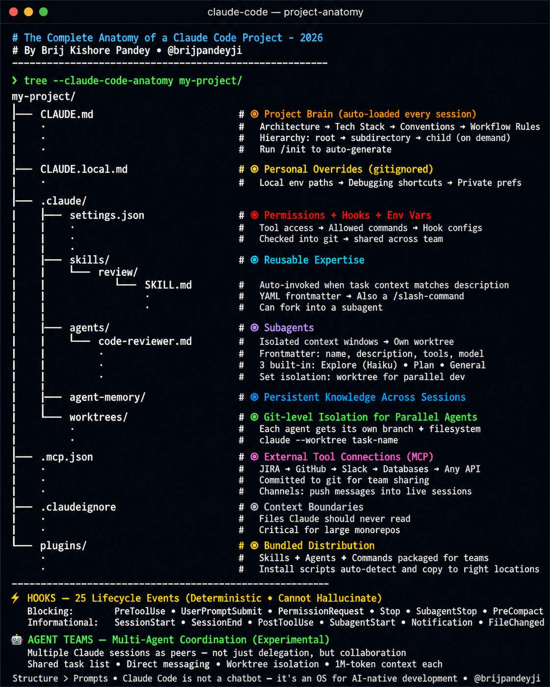

# AI & Tooling Innovation

> 📌 **Visual Reference:** 

---

## Q1: How have you leveraged AI tools to improve engineering productivity?

**Answer:**

Three concrete initiatives:

1. **GitHub Copilot Adoption** — I was an early adopter on the team. I demonstrated the productivity gains (faster boilerplate generation, test writing, code review assistance), then helped team members integrate it into their workflow. This reduced development time for routine coding tasks significantly.

2. **AI Agent for Integration Testing** — I built a custom AI agent that helps developers generate and run integration tests. Instead of manually writing test boilerplate, developers describe the scenario and the agent generates test code, sets up test data, and validates results. This reduced the barrier to writing integration tests.

3. **AI Agent for Team Onboarding** — I created an onboarding agent that new team members can interact with to understand the codebase, architecture, deployment workflows, and team processes. It uses the team's documentation and codebase as its knowledge base. This reduced onboarding time and freed senior engineers from repetitive Q&A.

---

## Q2: What's your approach to evaluating and adopting new technologies?

**Answer:**

1. **Problem-first** — Start with the problem, not the technology. "We have slow onboarding" not "Let's use AI."
2. **Prototype fast** — Build a minimal prototype (hackathon-style) to validate feasibility and value.
3. **Measure impact** — Quantify the improvement: time saved, errors reduced, adoption rate.
4. **Lower the barrier** — Make adoption easy. Templates, documentation, pair sessions.
5. **Iterate** — Get feedback from the team, improve, and repeat.

**Anti-pattern:** Adopting tech because it's trendy. Every adoption must solve a real problem.

---

## Q3: Tell me about a hackathon project or innovation initiative you led.

**Answer (STAR):**

- **Situation:** The team wanted a forum to explore new ideas and technologies outside sprint work.
- **Task:** I took the initiative to organize a hackathon event.
- **Action:** I planned the event — defined themes, formed teams, set up judging criteria, coordinated logistics, and secured time allocation from management. I also participated with a project (the integration testing AI agent).
- **Result:** Multiple innovative prototypes emerged. Some (like the testing agent) were adopted into the team's workflow. The event boosted team morale, encouraged experimentation, and became a recurring initiative.

---

## Q4: How do you balance innovation with delivery commitments?

**Answer:**

- **Innovation within delivery** — Many innovations improve delivery speed (Copilot, testing agent). Frame them as productivity investments, not side projects.
- **Hackathons as structured innovation** — Dedicated, time-boxed events for exploration. Clear start/end, no impact on sprint commitments.
- **20% rule** — Encourage team members to spend a small portion of time on improvements (tooling, automation, tech debt) within their sprint work.
- **Prove value quickly** — Build a prototype, show results, then get buy-in for further investment. Don't ask for permission to explore — show results and ask for investment to scale.

---

## Q5: How do you see AI changing the software engineering workflow?

**Answer:**

AI is shifting the engineer's role from **writing code** to **designing systems and validating output**:

- **Code generation** — AI handles boilerplate, translations, and pattern-based code. Engineers focus on architecture, edge cases, and business logic.
- **Testing** — AI-assisted test generation increases coverage with less effort. Engineers define test strategies; AI implements them.
- **Debugging** — AI can analyze logs, suggest hypotheses, and even propose fixes. Engineers validate and decide.
- **Documentation** — AI generates docs from code. Engineers review for accuracy.
- **Onboarding** — AI agents can answer routine questions about the codebase. Senior engineers focus on mentoring judgment and design thinking.

The key is treating AI as a **force multiplier**, not a replacement. Engineers who leverage AI effectively will be dramatically more productive than those who don't.
