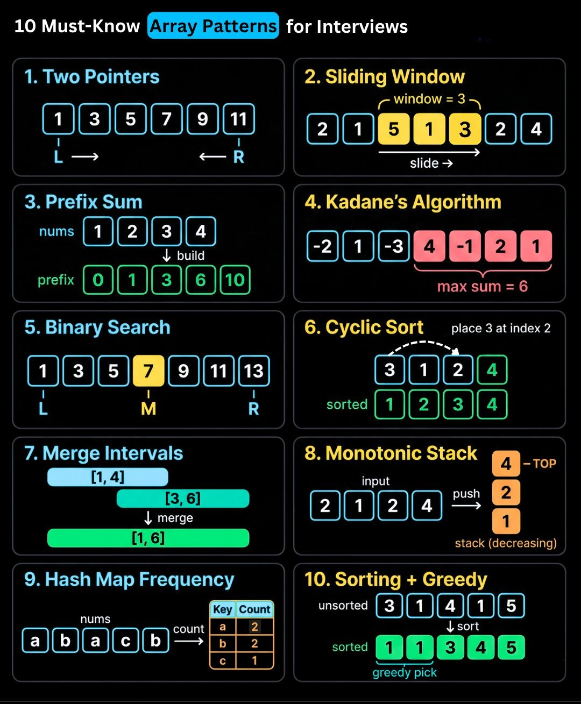
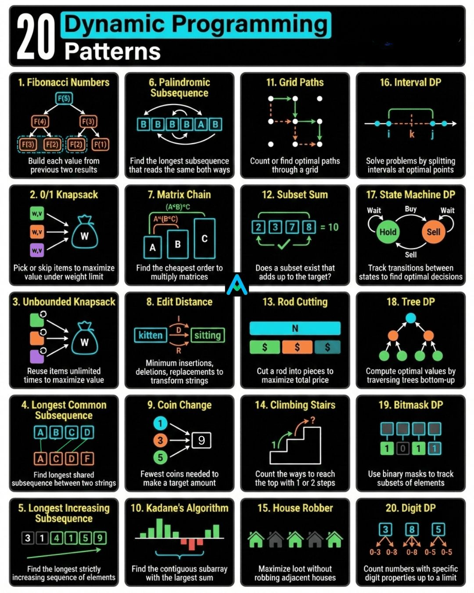

# Job Interview — Coding & Problem Solving

Common coding patterns and problem-solving approaches for technical interview rounds.

> 📌 **Visual References:**
>
> [](../assets/images/array-patterns-for-interviews.jpg)
>
> [](../assets/images/20-dynamic-programming-patterns.jpg)

---

## Q1: What coding patterns do you use most in interviews?

**Answer:**

| Pattern | When to Use | Example Problems |
|---------|-------------|-----------------|
| **Two Pointers** | Sorted arrays, pair finding | Two Sum (sorted), Container with Most Water |
| **Sliding Window** | Subarray/substring problems | Longest Substring Without Repeating Chars |
| **HashMap/Set** | Frequency counting, lookups | Two Sum, Group Anagrams |
| **BFS/DFS** | Tree/graph traversal | Level Order Traversal, Number of Islands |
| **Binary Search** | Sorted data, search space reduction | Search in Rotated Array |
| **Dynamic Programming** | Overlapping subproblems, optimal substructure | Climbing Stairs, Longest Common Subsequence |
| **Stack** | Matching brackets, monotonic problems | Valid Parentheses, Daily Temperatures |
| **Merge Intervals** | Overlapping ranges | Merge Intervals, Meeting Rooms |

---

## Q2: How do you approach a coding problem in an interview?

**Answer:**

**Step-by-step framework:**

1. **Understand** (2-3 min) — Clarify inputs, outputs, constraints, edge cases. Ask questions.
2. **Examples** (2 min) — Walk through 2-3 examples manually. Include an edge case.
3. **Approach** (3-5 min) — Explain your approach before coding. Start brute force, then optimize.
4. **Code** (10-15 min) — Write clean, readable code. Use meaningful variable names.
5. **Test** (3-5 min) — Trace through your code with examples. Check edge cases.
6. **Optimize** (if time) — Discuss time/space complexity. Can you do better?

**Communication throughout:** Think out loud. Explain trade-offs. If stuck, explain what you're thinking.

---

## Q3: Explain time complexity for common operations.

**Answer:**

| Operation | Array | HashMap | Binary Search Tree | Linked List |
|-----------|-------|---------|-------------------|-------------|
| Access by index | O(1) | — | — | O(n) |
| Search | O(n) | O(1) avg | O(log n) | O(n) |
| Insert | O(n) | O(1) avg | O(log n) | O(1) at head |
| Delete | O(n) | O(1) avg | O(log n) | O(1) if node known |

| Sorting Algorithm | Best | Average | Worst | Space |
|-------------------|------|---------|-------|-------|
| Quick Sort | O(n log n) | O(n log n) | O(n²) | O(log n) |
| Merge Sort | O(n log n) | O(n log n) | O(n log n) | O(n) |
| Heap Sort | O(n log n) | O(n log n) | O(n log n) | O(1) |
| Tim Sort (Java default) | O(n) | O(n log n) | O(n log n) | O(n) |

---

---

## Q4: Explain Linear Search vs Binary Search with Java code.

**Answer:**

**Linear Search** scans each element sequentially until a match is found. It works on both sorted and unsorted arrays — time complexity O(n). **Binary Search** uses divide-and-conquer on a sorted array, halving the search space each step — time complexity O(log n); requires sorted input.

```java
// Linear Search — O(n)
public static int linearSearch(int[] arr, int target) {
    for (int i = 0; i < arr.length; i++) {
        if (arr[i] == target) return i;
    }
    return -1;
}

// Binary Search — O(log n), array must be sorted
public static int binarySearch(int[] arr, int target) {
    int left = 0, right = arr.length - 1;
    while (left <= right) {
        int mid = left + (right - left) / 2;
        if (arr[mid] == target)   return mid;
        else if (arr[mid] < target) left = mid + 1;
        else                       right = mid - 1;
    }
    return -1;
}
```

**Trade-offs:** Use linear search for small/unsorted data or when sorting cost isn't worth it. Use binary search when data is already sorted or searched repeatedly — it reduces O(n) to O(log n). Java's `Arrays.binarySearch()` is the built-in alternative.

---

## Q5: Fibonacci series — iterative vs recursive in Java.

**Answer:**

**Fibonacci** is a sequence where each number is the sum of the two preceding ones: 0, 1, 1, 2, 3, 5, 8 ... It demonstrates two core approaches — iteration (O(n) time, O(1) space) and recursion (O(2ⁿ) time, O(n) stack space). Recursion with memoization reduces it to O(n).

```java
// Iterative — O(n) time, O(1) space
public static int fibIterative(int n) {
    if (n <= 1) return n;
    int prev = 0, curr = 1;
    for (int i = 2; i <= n; i++) {
        int temp = prev;
        prev = curr;
        curr = prev + temp;
    }
    return curr;
}

// Recursive — O(2ⁿ) time without memoization
public static int fibRecursive(int n) {
    if (n <= 1) return n;
    return fibRecursive(n - 1) + fibRecursive(n - 2);
}

// Recursive with memoization — O(n) time
public static int fib(int n, int[] memo) {
    if (n <= 1) return n;
    if (memo[n] != 0) return memo[n];
    memo[n] = fib(n - 1, memo) + fib(n - 2, memo);
    return memo[n];
}
```

**Trade-offs:** Iterative is preferred in production — constant space, no stack overflow risk. Recursive is cleaner to read. Use memoization or dynamic programming for interview questions that require optimization.

---

## Q6: Reverse a string in Java — three approaches.

**Answer:**

**String reversal** is a classic warm-up problem that tests knowledge of StringBuilder, loops, and recursion. A string in Java is immutable, so reversing requires building a new character sequence.

```java
// Approach 1: StringBuilder — cleanest, O(n)
String reversed = new StringBuilder("Hello").reverse().toString();

// Approach 2: For loop — explicit control
public static String reverseLoop(String s) {
    StringBuilder sb = new StringBuilder();
    for (int i = s.length() - 1; i >= 0; i--) {
        sb.append(s.charAt(i));
    }
    return sb.toString();
}

// Approach 3: Recursion — elegant but O(n) stack depth
public static String reverseRecursive(String s) {
    if (s.isEmpty()) return s;
    return reverseRecursive(s.substring(1)) + s.charAt(0);
}
```

**Trade-offs:** `StringBuilder.reverse()` is the simplest and most idiomatic. Loop approach is preferred when you need custom logic per character. Recursion risks `StackOverflowError` for large strings — avoid in production.

---

## Q7: Reverse a number in Java.

**Answer:**

**Number reversal** uses modulo arithmetic to extract digits right-to-left and rebuild the number left-to-right. It is O(d) where d is the number of digits.

```java
public static int reverseNumber(int number) {
    int reversed = 0;
    while (number != 0) {
        int digit = number % 10;        // extract last digit
        reversed = reversed * 10 + digit; // shift left and add
        number /= 10;                   // remove last digit
    }
    return reversed;
}
// reverseNumber(1234) → 4321
```

**Trade-offs:** Handle edge cases — negative numbers (preserve sign), trailing zeros in original become leading zeros in reverse (lost). For `int` overflow risk on large numbers, use `long` or validate against `Integer.MAX_VALUE`.

---

## Q8: Sort a list of objects by a field using Java 8 streams.

**Answer:**

**Stream sorting** uses `Comparator` chaining with method references to sort collections without mutating the original list. It produces a new sorted stream, which is more functional and composable than `Collections.sort()`.

```java
List<Employee> employees = List.of(
    new Employee("Alice", 60000),
    new Employee("Bob", 45000),
    new Employee("Carol", 55000)
);

// Sort ascending by salary
List<Employee> sorted = employees.stream()
    .sorted(Comparator.comparingInt(Employee::getSalary))
    .collect(Collectors.toList());

// Sort descending, then by name as tiebreaker
List<Employee> sortedDesc = employees.stream()
    .sorted(Comparator.comparingInt(Employee::getSalary).reversed()
            .thenComparing(Employee::getName))
    .collect(Collectors.toList());
```

**Trade-offs:** Streams are non-destructive (original list unchanged). `Comparator.comparing()` with method references is concise and readable. For in-place sorting, use `list.sort(Comparator...)` instead. Performance is O(n log n) regardless of approach.

---

## Q9: Replace multiple if-else string checks with a Map (Strategy Pattern).

**Answer:**

**The Map-based dispatch pattern** replaces chains of `if-else` or `switch` statements with a `Map<String, Runnable>` or `Map<String, Supplier>`. Each key maps to a lambda, keeping the dispatch table open for extension without modification — aligned with the Open-Closed Principle.

```java
import java.util.HashMap;
import java.util.Map;

public class CommandDispatcher {
    private final Map<String, Runnable> actions = new HashMap<>();

    public CommandDispatcher() {
        actions.put("start",  () -> System.out.println("Starting..."));
        actions.put("stop",   () -> System.out.println("Stopping..."));
        actions.put("status", () -> System.out.println("Checking status..."));
    }

    public void execute(String command) {
        Runnable action = actions.get(command);
        if (action != null) action.run();
        else System.out.println("Unknown command: " + command);
    }
}
```

**Trade-offs:** Adding a new command requires only adding an entry to the map — no `if-else` modification. Use `Map<String, Supplier<T>>` when you need a return value. Drawback: harder to debug than explicit conditionals; null-check still required for unknown keys.

---

## Q10: What happens when `finally` has a `return` statement?

**Answer:**

**`finally` always executes** after `try`/`catch`, even when a `return` statement exists in `try`. However, if `finally` itself contains a `return`, it **overrides** the value returned by `try` or `catch` — this is a well-known Java gotcha.

```java
public static int getValue() {
    try {
        return 1;           // would return 1...
    } finally {
        return 2;           // ...but finally overrides with 2
        // Any code after return here is unreachable (compiler warning)
    }
}
// getValue() returns 2, not 1

// Normal case — finally runs but does NOT override try's return
public static int getNormal() {
    try {
        return 1;
    } finally {
        System.out.println("cleanup"); // prints, then method returns 1
    }
}
```

**Trade-offs:** Never put `return` statements in `finally` blocks — it silently suppresses exceptions and confuses control flow. Use `finally` only for resource cleanup (or better, use try-with-resources). This is a common Java interview trap question.

---

## Q11: LinkedList core algorithms — insert, delete, reverse, detect cycle.

**Answer:**

**LinkedList algorithms** are fundamental interview problems. A singly linked list's O(1) head insertion and O(n) traversal make it the basis for stacks, queues, and many pointer-manipulation problems.

```java
// Reverse a linked list — O(n) time, O(1) space
public static Node reverse(Node head) {
    Node prev = null, curr = head;
    while (curr != null) {
        Node next = curr.next;
        curr.next = prev;
        prev = curr;
        curr = next;
    }
    return prev; // new head
}

// Detect cycle — Floyd's slow/fast pointer — O(n), O(1)
public static boolean hasCycle(Node head) {
    Node slow = head, fast = head;
    while (fast != null && fast.next != null) {
        slow = slow.next;
        fast = fast.next.next;
        if (slow == fast) return true;
    }
    return false;
}

// Find middle node — O(n), O(1)
public static Node findMiddle(Node head) {
    Node slow = head, fast = head;
    while (fast != null && fast.next != null) {
        slow = slow.next;
        fast = fast.next.next;
    }
    return slow;
}
```

**Trade-offs:** All three patterns (reverse, cycle detection, find middle) use the two-pointer technique. Slow/fast pointers are also used for finding the k-th node from end and palindrome checks. Know these patterns cold — they appear in almost every data structures interview.
