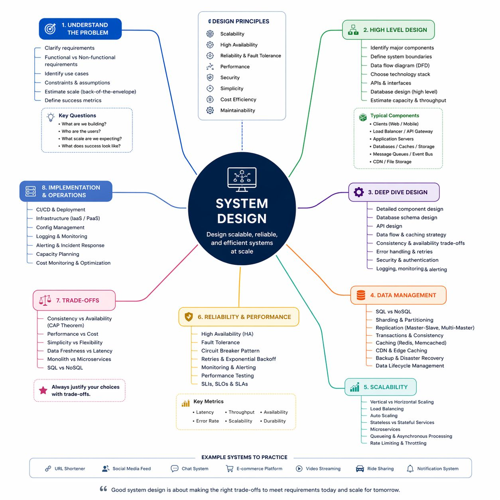
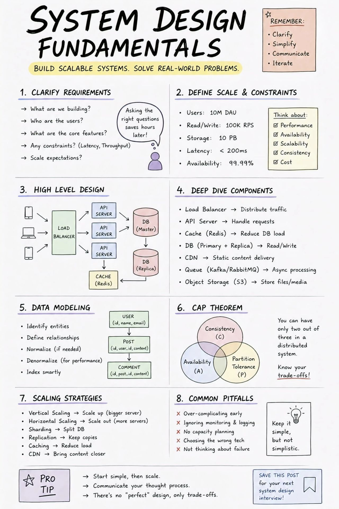
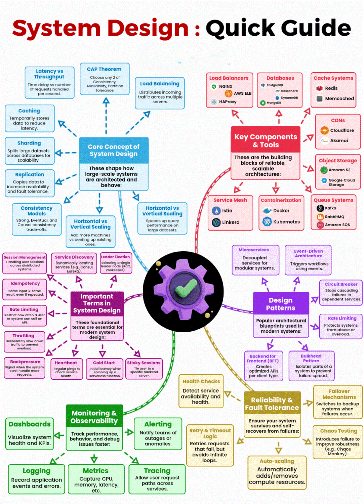
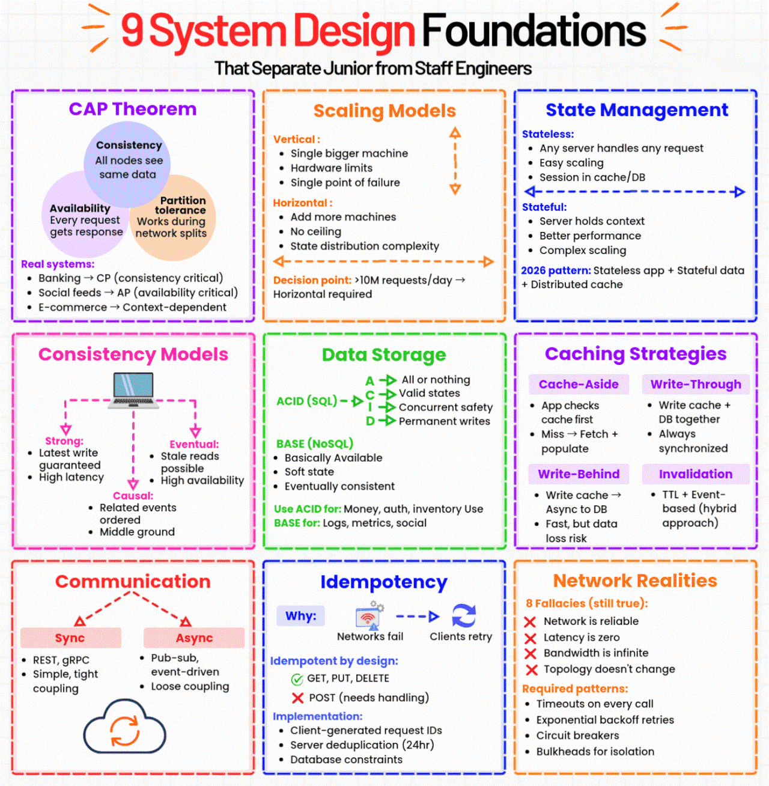

# Job Interview — System Design & HLD/LLD

Questions and answers focused on system design rounds in external job interviews.

> 📌 **Visual References:**
> 
> [](../assets/images/system-design-mindmap.jpg)
> 
> [](../assets/images/system-design-fundamentals.jpg)
>
> [](../assets/images/system-design-quick-guid.gif)
>
> [](../assets/images/system-design-foundations.gif)

---

## Q1: Design a URL Shortener (like bit.ly)

**Answer:**

**Requirements:**
- Shorten long URLs → short code (e.g., `short.ly/abc123`)
- Redirect short URL → original URL
- Analytics (click count, optional)
- High read throughput, low write

**High-Level Design:**

```
Client → API Gateway → URL Service → Database
                                    → Cache (Redis)
         ← 301/302 Redirect ←
```

**Key decisions:**

| Decision | Choice | Rationale |
|----------|--------|-----------|
| ID generation | Base62 encoding of auto-increment ID or pre-generated unique IDs | Short, unique, URL-safe |
| Storage | SQL (PostgreSQL/MySQL) | Simple key-value, ACID for writes |
| Caching | Redis for hot URLs | 80/20 rule — 20% of URLs get 80% of traffic |
| Redirect code | 301 (permanent) vs 302 (temporary) | 301 for SEO, 302 if you need analytics on every click |

**Scale estimation:**
- 100M URLs, 10:1 read:write ratio → 1000 reads/sec
- Each record ~500 bytes → 50GB storage
- Redis cache for top 20% → 10GB

**Database schema:**
```sql
CREATE TABLE urls (
    id BIGINT PRIMARY KEY AUTO_INCREMENT,
    short_code VARCHAR(10) UNIQUE,
    original_url TEXT NOT NULL,
    created_at TIMESTAMP,
    click_count INT DEFAULT 0
);
```

---

## Q2: Design a Rate Limiter

**Answer:**

**Algorithms:**

| Algorithm | How It Works | Pros | Cons |
|-----------|-------------|------|------|
| **Token Bucket** | Bucket fills at fixed rate. Each request takes a token. | Allows bursts, smooth avg rate | Slightly complex |
| **Sliding Window Log** | Store timestamp of each request. Count requests in window. | Accurate | Memory-heavy |
| **Sliding Window Counter** | Combine fixed window counts with weighted overlap | Memory-efficient, accurate enough | Approximate |
| **Fixed Window** | Count requests per time window (e.g., per minute) | Simple | Burst at window boundary |

**Where to implement:**
- **API Gateway level** — AWS API Gateway has built-in throttling. Good for coarse-grained limits.
- **Application level** — More granular (per user, per endpoint). Use Redis for distributed counting.
- **WAF** — Rate limiting by IP for DDoS protection.

**Redis implementation (Sliding Window):**
```
Key: rate_limit:{userId}:{endpoint}
Command: ZADD key timestamp timestamp
         ZREMRANGEBYSCORE key 0 (now - window_size)
         ZCARD key → current count
         If count > limit → reject (429)
```

---

## Q3: Design a Notification System

**Answer:**

**Requirements:** Send notifications via email, SMS, push. Support scheduling. Handle millions of users.

**Architecture:**

```
Event Source → Notification Service → Priority Queue → Worker Pool
                                                         ├── Email (SES)
                                                         ├── SMS (SNS)
                                                         └── Push (FCM/APNs)
              → Template Service (renders message)
              → User Preference Service (opt-in/out, channel preference)
              → DLQ (failed deliveries for retry)
```

**Key design decisions:**
- **Async processing** — Queue-based. Don't block the caller.
- **Priority queues** — OTP/security alerts get priority over marketing notifications.
- **Deduplication** — Idempotency key prevents sending same notification twice.
- **Rate limiting per user** — Prevent notification fatigue.
- **Template engine** — Separate content from delivery logic. Templates with variable substitution.
- **Delivery tracking** — Status per notification: queued → sent → delivered → opened.

---

*Add more system design questions as you practice. Common topics: chat system, file storage, search engine, social media feed, e-commerce.*
