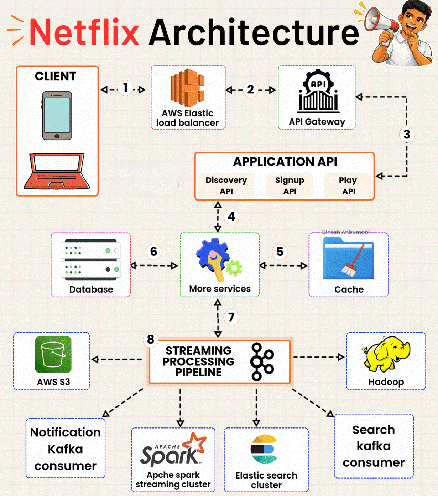
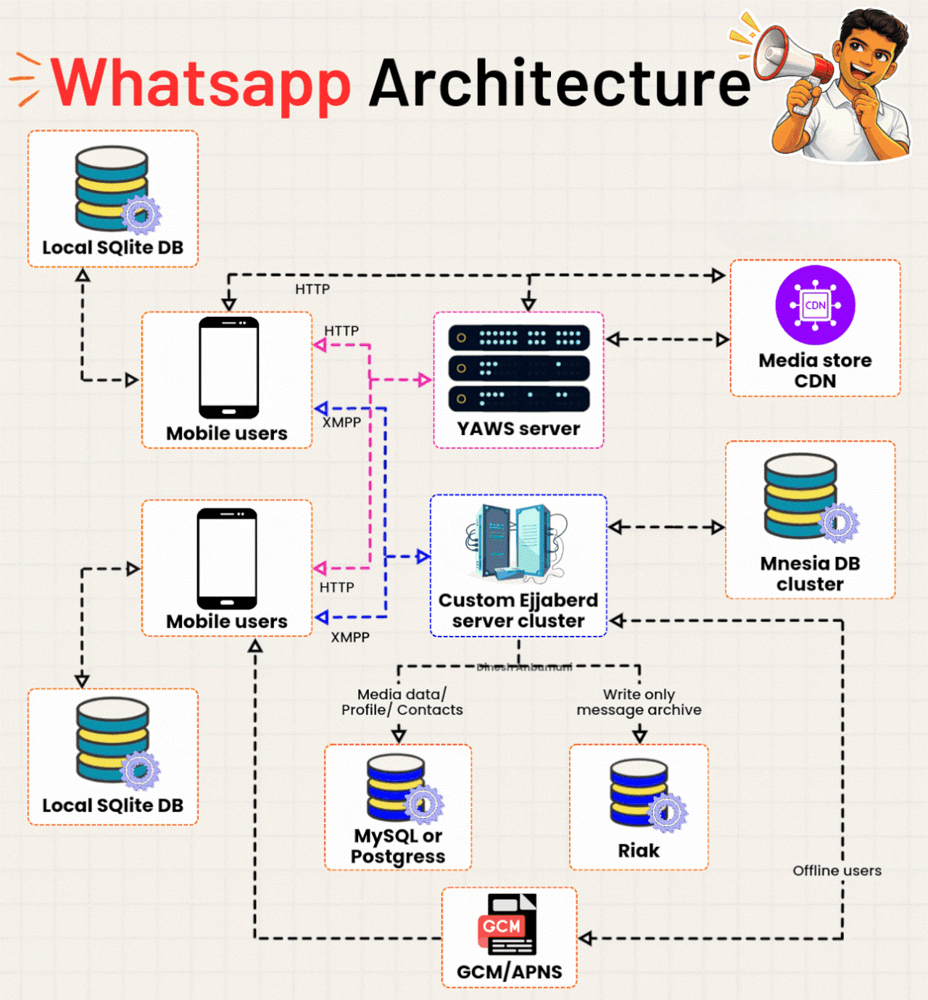

# Real-World System Architectures

> 📌 **Visual References:**
>
> [](../assets/images/system-design-netflix-architecture.gif)
>
> [](../assets/images/system-design-whatsapp-architecture.gif)

---

## Q1: Walk me through the Netflix architecture. How does it handle 200M+ users streaming video?

**Answer:**

Netflix architecture is a microservices system built entirely on AWS → client requests are first handled by AWS Elastic Load Balancer, then routed through an API Gateway to domain-specific APIs (Discovery, Signup, Play) → those APIs call downstream microservices which interact with a Cache layer and Database → a separate Streaming Processing Pipeline handles data processing, analytics, and content delivery via Kafka, Spark, S3, and Hadoop.

**The 8-step request flow (from the diagram):**

```
1. Client ←→ AWS Elastic Load Balancer        — distributes traffic, high availability
2. ELB ←→ API Gateway                          — auth, rate limiting, routing
3. API Gateway ←→ Application API              — routes to Discovery / Signup / Play API
4. Application API ←→ More Services            — fan-out to specialized microservices
5. More Services ←→ Cache (EVCache/Redis)      — fast reads, reduces DB load
6. More Services ←→ Database (Cassandra)       — persistent storage
7. More Services ←→ Streaming Pipeline (Kafka) — async event processing
8. Streaming Pipeline → S3, Hadoop, Spark, Elasticsearch, Notification Kafka consumer
```

**Key technology choices and why:**

| Component | Technology | Why |
|-----------|-----------|-----|
| Load Balancer | AWS ELB | Managed, auto-scaling, multi-AZ |
| API Gateway | Netflix Zuul → Spring Cloud Gateway | Centralized auth, rate limiting |
| Microservices | 1000+ independent services | Independent scaling, deployment |
| Database | Apache Cassandra | Wide-column, high write throughput, no SPOF |
| Cache | EVCache (Netflix's Memcached wrapper) | 30M+ ops/sec, reduces DB load by ~98% |
| Message Queue | Apache Kafka | High-throughput event streaming |
| Batch Processing | Apache Spark + Hadoop | Recommendation engine, analytics |
| Search | Elasticsearch cluster | Fast title/content search |
| Media Storage | AWS S3 | Durable, cheap object storage for video |
| CDN | Netflix Open Connect (custom CDN) | Content served from ISP-embedded servers |
| Service Discovery | Eureka | Services find each other dynamically |
| Circuit Breaker | Hystrix (deprecated) → Resilience4j | Prevents cascading failures |

**How Netflix handles scale:**

1. **Chaos Engineering** — Netflix Chaos Monkey randomly kills services in production to ensure resilience. They expect failures, design for them.
2. **Regional redundancy** — Deployed in multiple AWS regions. If US-East fails, traffic routes to US-West.
3. **Personalization at scale** — Recommendation engine runs on Spark, processes viewing history of 200M+ users, pre-computes recommendations offline.
4. **Adaptive bitrate streaming** — The Play API selects video quality dynamically based on client bandwidth. Video is stored in multiple resolutions in S3.
5. **Open Connect CDN** — Netflix embeds its own servers inside ISPs globally. ~95% of traffic is served from local ISP servers, not Netflix's own data centers.

**Benefits / Trade-offs:** Massively scalable, fault-tolerant, globally distributed → trade-off: extreme operational complexity, requires dedicated platform engineering teams, 1000+ microservices is hard to debug without distributed tracing and advanced observability.

---

### Follow-up: Why does Netflix use Cassandra instead of MySQL?

**Answer:**

Netflix writes billions of events per day (play events, pause, seek, user activity). Cassandra is optimized for this:
- **Write-heavy workloads** — Cassandra uses LSM trees, writes are sequential (very fast)
- **No single point of failure** — peer-to-peer, every node is equal
- **Linear horizontal scaling** — add nodes, capacity grows linearly
- **Multi-datacenter replication** — built-in cross-region replication for global availability

MySQL struggles at Netflix scale: single master bottleneck, joins are expensive, scaling writes requires complex sharding.

---

### Follow-up: What is EVCache and why does Netflix need it?

**Answer:**

EVCache is Netflix's distributed caching system built on top of Memcached. It stores user session data, personalized homepage data, and metadata across multiple AWS regions.

Without cache, every API request would hit Cassandra. At 200M users, that's billions of DB reads per day — impossible to handle. EVCache absorbs ~98% of reads, so only cache misses hit the database. It uses a "replicated cache" model: write to all regional caches simultaneously so any region can serve any user.

---

### Follow-up: How does Netflix achieve zero-downtime deployments?

**Answer:**

Netflix uses **Blue-Green deployments** and **Canary releases**:
- **Canary** — new version deployed to 1% of traffic first, metrics monitored, then rolled out to 100% if healthy
- **Blue-Green** — two identical production environments; switch traffic from Blue (old) to Green (new) instantly; rollback is just switching back
- **Spinnaker** — Netflix's open-source CD platform manages deployments across AWS regions
- All deployments are automated — no manual production changes

---

## Q2: Walk me through the WhatsApp architecture. How does it deliver 100B messages per day?

**Answer:**

WhatsApp architecture is built around XMPP (a messaging protocol) using a custom Erlang/Ejabberd server cluster → mobile clients connect to YAWS (Erlang web server) via HTTP for initial connection and then switch to XMPP for real-time messaging → messages are routed through a custom Ejabberd cluster → media files are served via CDN → offline messages are delivered via GCM/APNS push notifications → data is stored across MySQL/PostgreSQL (profiles, contacts, media metadata) and Riak (message archive).

**Architecture components (from the diagram):**

```
Mobile Client (HTTP) → YAWS Server → routing
Mobile Client (XMPP) ←→ Custom Ejabberd Cluster → message delivery
                              ↓                          ↓
                         MySQL/PostgreSQL         Riak (message archive)
                    (profiles, contacts,          (write-only, append)
                     media metadata)
Mobile Client ←→ Local SQLite DB                 ← messages stored locally
Media files → Media Store CDN                    ← images, video, audio
Offline users ← GCM/APNS                         ← push notifications
Mnesia DB Cluster                                 ← real-time session data (Erlang native)
```

**Key technology choices and why:**

| Component | Technology | Why |
|-----------|-----------|-----|
| Server language | Erlang | Built for telecom: massive concurrency, fault-tolerant, hot code reload |
| Messaging server | Custom Ejabberd (XMPP) | XMPP is designed for real-time messaging; Ejabberd handles millions of concurrent connections |
| Web server | YAWS (Yet Another Web Server) | Erlang-based, handles HTTP long-polling |
| Message protocol | XMPP over TCP | Persistent connection, low overhead, bidirectional |
| Local storage | SQLite on device | Messages stored locally; server just delivers |
| Profile/Contact DB | MySQL / PostgreSQL | Relational, strong consistency for user data |
| Message archive | Riak | Distributed key-value, append-only, high availability |
| Session data | Mnesia | Erlang's built-in distributed DB, in-memory, ultra-fast |
| Media delivery | CDN (Media Store) | Images/videos served from edge servers, not WhatsApp servers |
| Push notifications | GCM (Android) / APNS (iOS) | Deliver messages when app is in background |

**How WhatsApp handles scale (50 engineers, 100B messages/day):**

1. **Erlang's lightweight processes** — Erlang can run millions of concurrent processes with ~300 bytes each (vs ~1MB for OS threads). One server handles 2M+ simultaneous connections.
2. **End-to-end encryption** — Signal Protocol encrypts messages on the device. WhatsApp servers only relay encrypted blobs — they can't read messages, reducing security complexity server-side.
3. **Store-and-forward** — Messages are stored on server only until delivered. Once delivered and acknowledged, they're deleted. This keeps storage lean.
4. **Local-first architecture** — Chat history is stored in SQLite on the device, not in the cloud. Server is a relay, not a storage layer.
5. **No read receipt complexity at scale** — Double-tick (delivered) and blue-tick (read) are handled by client ACK messages back through XMPP, not server-side polling.

**Benefits / Trade-offs:** Extremely efficient per-server (2M+ connections per node), lean storage model (messages not kept server-side), proven Erlang reliability → trade-off: Erlang is a niche language (hard to hire), XMPP is verbose compared to modern binary protocols (e.g., WhatsApp later moved to a custom binary protocol), limited backend features compared to Slack/Teams (no threads, search is device-side).

---

### Follow-up: Why did WhatsApp choose Erlang over Java or Node.js?

**Answer:**

WhatsApp's core requirement was handling millions of simultaneous connections per server with minimal memory. Erlang was designed for exactly this (Ericsson built it for telecom switches):

- **Actor model** — Each connection is a lightweight Erlang process (~300 bytes). 2M processes = ~600MB. Same in Java threads = ~2TB.
- **Fault tolerance** — "Let it crash" philosophy with supervisor trees. Processes crash and restart automatically without affecting others.
- **Hot code reloading** — Deploy new code without restarting the server. Zero downtime by design.
- **Built-in distribution** — Erlang nodes natively communicate across servers (Mnesia, message passing).

At WhatsApp's scale (2M+ connections/server), Java or Node.js would require 10x more servers to handle the same load.

---

### Follow-up: What is the difference between Netflix and WhatsApp architectures?

**Answer:**

| Aspect | Netflix | WhatsApp |
|--------|---------|---------|
| Primary challenge | Video streaming at scale | Real-time messaging at scale |
| Language | Java (microservices) | Erlang (message server) |
| Database | Cassandra (wide-column) | MySQL + Riak + Mnesia |
| Communication | REST / async events (Kafka) | XMPP persistent connections |
| Team size | 1000s of engineers | ~50 engineers (legendary) |
| Storage model | Centralized (S3, Cassandra) | Local-first (SQLite on device) |
| CDN | Custom Open Connect | Standard CDN for media |
| Key insight | Fault tolerance via chaos | Efficiency via Erlang concurrency |

Both are extreme-scale systems but solve fundamentally different problems. Netflix optimizes for bandwidth and personalization. WhatsApp optimizes for connection count and message delivery latency.

---

### Follow-up: How does WhatsApp handle offline message delivery?

**Answer:**

When a recipient is offline:
1. Ejabberd tries to deliver message via XMPP — connection not found
2. Message is stored in Riak (message archive) with recipient's ID
3. Server sends a push notification via GCM (Android) or APNS (iOS) to wake the app
4. App wakes up, re-establishes XMPP connection
5. Server delivers all pending messages from Riak
6. Client ACKs each message → server deletes from Riak

This store-and-forward model keeps the server lean — messages are only stored temporarily until delivered.

---

## Q3: How would you compare Netflix and WhatsApp when asked in a system design interview?

**Answer:**

Both are massive-scale systems but solve opposite ends of the spectrum:

**Netflix = Read-heavy, bandwidth-heavy, personalization-heavy**
- Challenge: Serve massive video files to millions simultaneously
- Key insight: Pre-compute everything (recommendations, transcoded video), use CDN aggressively
- Bottleneck: Storage + bandwidth, not request count
- Technology bet: Cassandra + Kafka + Spark for data at scale

**WhatsApp = Connection-heavy, latency-sensitive, storage-light**
- Challenge: Maintain millions of persistent connections, deliver messages in <1 second
- Key insight: Don't store what you don't need (local-first), use Erlang for efficiency
- Bottleneck: Concurrent connections, not storage
- Technology bet: Erlang for concurrency, XMPP for persistent connections

**Interview answer framework:** When asked to design a system like Netflix or WhatsApp, always start with: "What is the primary bottleneck?" → bandwidth/storage vs connection count → this drives every technology choice downstream.
