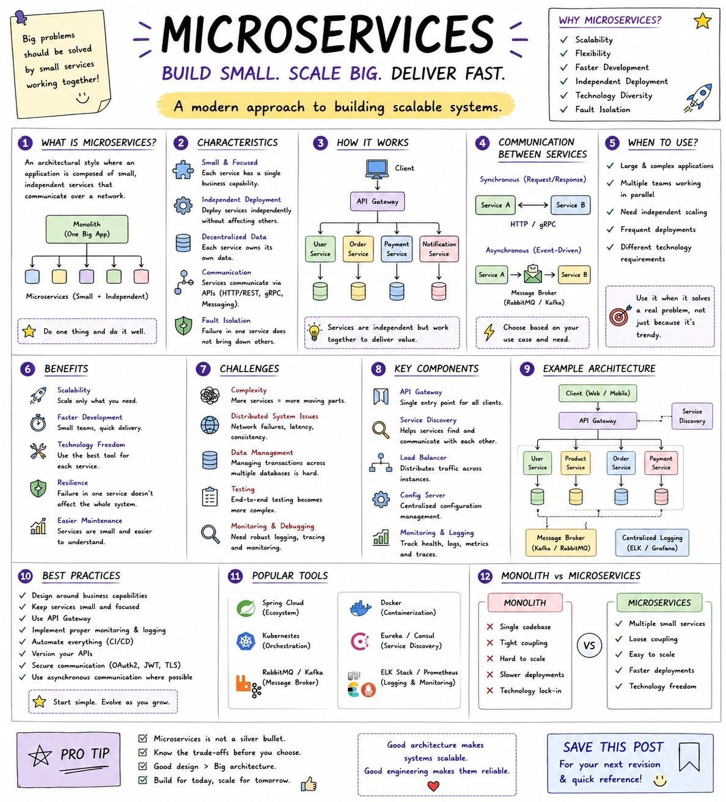
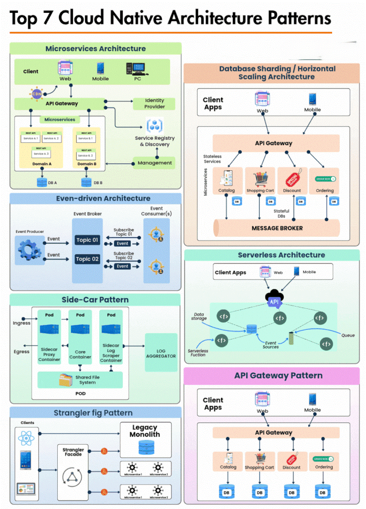
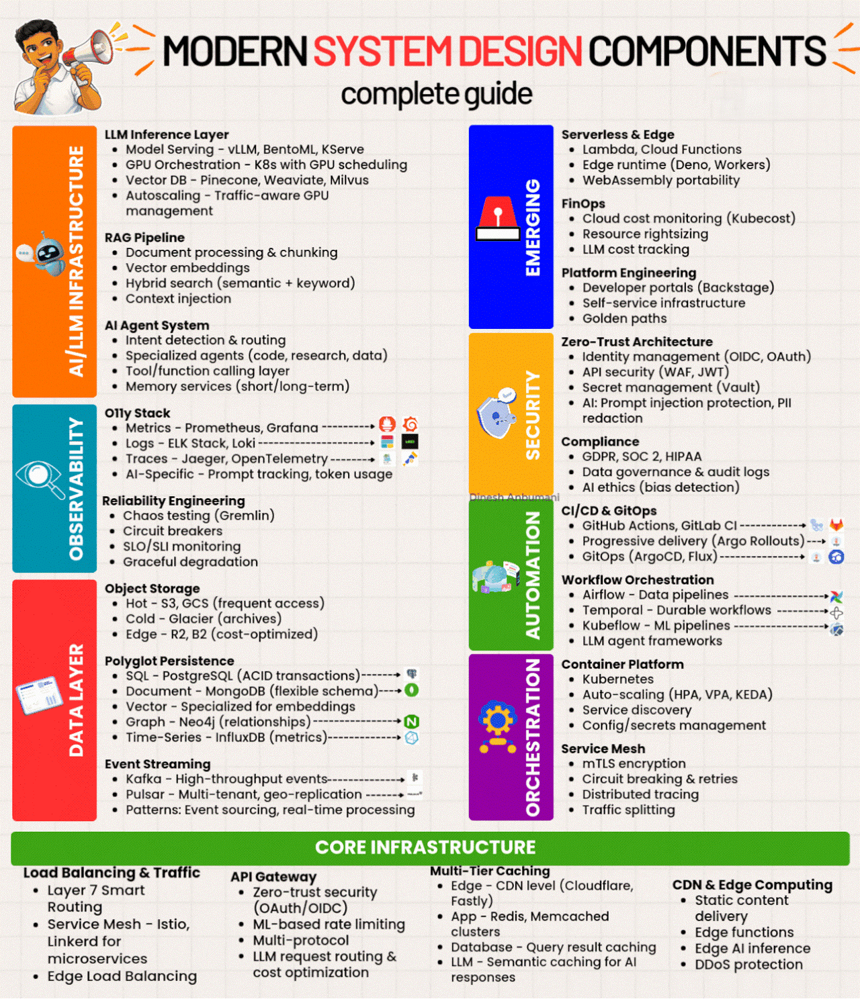
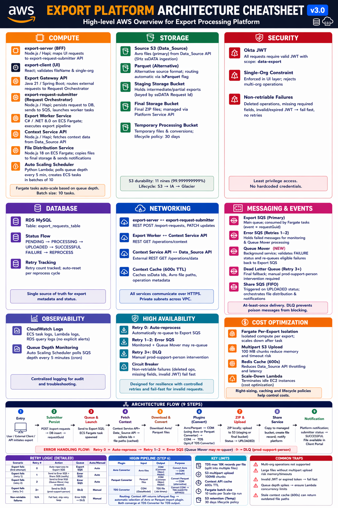

# System Design

> 📌 **Visual References:**
>
> [](../assets/images/microservices-cheatsheet.jpg)
>
> [](../assets/images/cloud-native-architecture-patterns.gif)
>
> [](../assets/images/modern-system-design-components.gif)
> 
> [](../assets/images/Export-service-flow-cheetsheet-sp.png)

---

## Q1: How would you design an asynchronous export pipeline that handles bulk operations?

**Answer:**

**Requirements:** Accept bulk export requests (up to 250 items), process them asynchronously, produce output files (ZIP), and notify the user.

**High-Level Design:**

```
Client → API (accepts request, returns 202)
  → Submitter Service (validates, splits into sub-requests, saves to DB)
    → SQS FIFO Queue (one message per sub-request, grouped by org)
      → Scale-Up Lambda (monitors queue depth, adjusts ECS desired count)
        → Export Worker (ECS Fargate task per message)
          → Fetches metadata from Context API
          → Processes data through plugin chain
          → Uploads result to S3
          → Updates status in DB
            → Merger Service (if partial exports need combining)
              → Notification Service (email/webhook to user)
```

**Key Design Decisions:**
1. **202 Accepted** — Don't block the client. Return immediately.
2. **Chunking** — Bulk request of 250 items is chunked (e.g., 50 per batch) at the API layer.
3. **1 task per message** — Each SQS message gets its own ECS Fargate task. Tasks are isolated — one failure doesn't affect others.
4. **FIFO with message groups** — Ensures order per entity while allowing cross-entity parallelism.
5. **Error handling** — 3-retry strategy: retry 0 (reprocess), retry 1 (error queue + notification), retry 2+ (DLQ).
6. **Idempotency** — Deduplication IDs on SQS messages. Export workers check if output already exists in S3 before reprocessing.
7. **Scale-up Lambda** — Monitors queue depth and triggers additional ECS tasks. Prevents cold-start delays.

---

## Q2: How do you design a caching layer for a high-throughput API?

**Answer:**

**Pattern: Cache-Aside (Lazy Loading)**

```
Request → Check Redis Cache
  → HIT: return cached response (fast path)
  → MISS: fetch from downstream services → cache result → return response
```

**Design Decisions:**

| Concern | Decision |
|---------|----------|
| Cache store | Redis (ElastiCache) — sub-ms latency, cluster mode for HA |
| Key format | `service:{entityId}:{modifiedTimestamp}` — naturally invalidates on update |
| TTL | 2 hours (7200s) — balances freshness vs. hit rate |
| Serialization | JSON (human-debuggable, acceptable overhead) |
| Read distribution | `scaleReads: all` — distribute reads across primary + replicas |
| Burst handling | Connection pooling, command timeout (5s), retry with backoff (max 3) |
| Cluster topology | 1 shard, 1 replica, multi-AZ for HA |
| Failure mode | Cache failure → fallback to source (cache is an optimization, not a dependency) |

**Scaling considerations:**
- If burst traffic exceeds single-shard capacity, add shards (horizontal scaling)
- Monitor cache hit ratio — if below 60%, review key design and TTL
- Monitor eviction rate — if high, increase node memory or add shards

---

## Q3: How do you handle data consistency in a microservices architecture?

**Answer:**

Microservices inherently favor **eventual consistency** over strong consistency. My approach:

1. **Source of truth per service** — Each service owns its data store. No shared databases.
2. **Event-driven sync** — Services publish events on state changes. Consumers update their local view.
3. **Idempotent consumers** — Every event handler is idempotent. Duplicate messages don't cause data corruption.
4. **Reconciliation** — Periodic reconciliation jobs detect and fix drift between services.
5. **Compensating transactions** — If a downstream step fails, the upstream service executes a compensating action (saga pattern).

**Where I use strong consistency:** Within a single service's DB transaction (e.g., save export request + insert audit record in one MySQL transaction).

**Where I accept eventual consistency:** Cross-service state (e.g., export status update propagating from export worker to the status-tracking service via SQS).

---

## Q4: Design a multi-service architecture with shared data needs. How do you avoid a shared database?

**Answer:**

- **API composition** — Services call each other's APIs to fetch needed data at request time. Works for low-latency, low-volume cases.
- **Event-carried state transfer** — Services publish events containing the data consumers need. Consumers maintain a local copy. Works for high-volume reads.
- **Context API pattern** — A dedicated service aggregates data from multiple sources and serves it to consumers. Acts as a read-optimized view. Add caching (Redis) for performance.
- **CQRS** — Separate read and write models. Write model is normalized. Read model is denormalized and optimized for query patterns.

**Real example:** A Context API aggregates data from field operations, equipment, and transform services into a single response. Export workers call this one API instead of calling 4 services individually. Redis caching on the Context API reduces repeated calls.

---

## Q5: Microservices Design Patterns

**Answer:**

The 8 essential patterns for building resilient, scalable microservices:

| Pattern | Problem Solved | Tool Examples |
|---------|---------------|---------------|
| **API Gateway** | Single entry point, cross-cutting concerns | Netflix Zuul, Spring Cloud Gateway, Kong |
| **Circuit Breaker** | Prevents cascading failures on service outage | Resilience4j, Netflix Hystrix (deprecated) |
| **Service Registry & Discovery** | Dynamic service location without hardcoded URLs | Netflix Eureka, HashiCorp Consul |
| **Saga Pattern** | Distributed transactions across multiple services | Choreography (events) or Orchestration (saga controller) |
| **CQRS** | Separate read/write models for performance | Event sourcing + read replicas |
| **Bulkhead** | Isolate failures to prevent resource exhaustion | Thread pool isolation, semaphore |
| **Database per Service** | Loose coupling, independent scaling | Each service owns its schema |
| **Event-Driven Architecture** | Async, decoupled communication | Apache Kafka, RabbitMQ, AWS SNS/SQS |

```java
// Circuit Breaker with Resilience4j
@Service
public class ProductService {
    private final WebClient client;

    @CircuitBreaker(name = "productService", fallbackMethod = "getProductFallback")
    @TimeLimiter(name = "productService")
    public CompletableFuture<Product> getProduct(Long id) {
        return client.get().uri("/products/" + id)
            .retrieve().bodyToMono(Product.class).toFuture();
    }

    public CompletableFuture<Product> getProductFallback(Long id, Throwable t) {
        return CompletableFuture.completedFuture(Product.defaultProduct(id));
    }
}
```

```yaml
# application.yml : Circuit Breaker config
resilience4j.circuitbreaker:
  instances:
    productService:
      slidingWindowSize: 10
      failureRateThreshold: 50
      waitDurationInOpenState: 10s
```

**Most commonly used combination:** API Gateway + Circuit Breaker + Service Discovery + Event-Driven is the foundation of most production microservices architectures. CQRS is added when read scalability is critical. Saga when distributed transactions are needed.

---

## Q6: REST Idempotency

**Answer:**

An operation is **idempotent** if repeating it N times produces the same result as running it once. Critical for retry safety in distributed systems.

| HTTP Method | Idempotent? | Safe? | Behavior |
|-------------|-------------|-------|----------|
| **GET** | ✅ Yes | ✅ Yes | Read-only, no state change |
| **PUT** | ✅ Yes | ❌ No | Full replace : same request = same final state |
| **DELETE** | ✅ Yes | ❌ No | Delete once or ten times = resource is gone |
| **POST** | ❌ No | ❌ No | Creates new resource each time |
| **PATCH** | ❌ No* | ❌ No | Partial update : depends on implementation |

```
# POST is NOT idempotent
POST /orders
--> Creates order #1 first time
--> Creates order #2 second time (duplicate!)

# PUT IS idempotent
PUT /orders/1 { status: "shipped" }
--> Sets order #1 to "shipped" first time
--> Same state after N identical calls

# DELETE IS idempotent
DELETE /orders/1
--> Deletes order #1 first time
--> Returns 404 on subsequent calls, but state is the same (order is gone)
```

**Handling POST idempotency:** Use an `Idempotency-Key` header. Server stores key --> response mapping. If same key arrives again, return cached response without re-processing.

```
POST /payments
Idempotency-Key: abc-123-unique-request-id
{ "amount": 100, "currency": "USD" }
```

**Why it matters:** Network retries, message queue at-least-once delivery, and client timeouts all cause duplicate requests. Idempotent design ensures duplicate calls don't cause duplicate side effects.

---

## Q7: Spring MVC Request Processing Flow

**Answer:**

Complete sequence when a URL is hit in a Spring MVC / Spring Boot application:

```
Client Request
     ↓
1. Filter (Servlet Filter : cross-cutting: auth, CORS, logging)
     ↓
2. DispatcherServlet (Front Controller : receives all requests)
     ↓
3. HandlerMapping (maps URL to controller method)
     ↓
4. Pre-Processor / Interceptor (HandlerInterceptor.preHandle)
     ↓
5. Handler / Controller (executes business logic, returns ModelAndView or ResponseEntity)
     ↓
6. Post-Processor / Interceptor (HandlerInterceptor.postHandle)
     ↓
7. View Resolver (maps logical view name to actual template : skipped for @RestController)
     ↓
8. View Rendering (renders template with model data : Thymeleaf/JSP)
     ↓
9. afterCompletion (HandlerInterceptor : runs even on exception, for cleanup)
     ↓
Client Response
```

**Filters vs Interceptors:**
- **Filters** (javax.servlet.Filter): Servlet-level, run before DispatcherServlet, apply to all requests including static resources. Used for: authentication headers, CORS, GZIP compression.
- **Interceptors** (HandlerInterceptor): Spring MVC-level, run after DispatcherServlet dispatches to a handler, have access to handler object. Used for: logging, authorization checks, request metrics.

```java
// Custom Interceptor example
@Component
public class LoggingInterceptor implements HandlerInterceptor {
    @Override
    public boolean preHandle(HttpServletRequest req, HttpServletResponse res, Object handler) {
        log.info("Request: {} {}", req.getMethod(), req.getRequestURI());
        return true; // false = abort request
    }

    @Override
    public void postHandle(HttpServletRequest req, HttpServletResponse res,
                           Object handler, ModelAndView mav) {
        log.info("Handler completed");
    }
}
```

